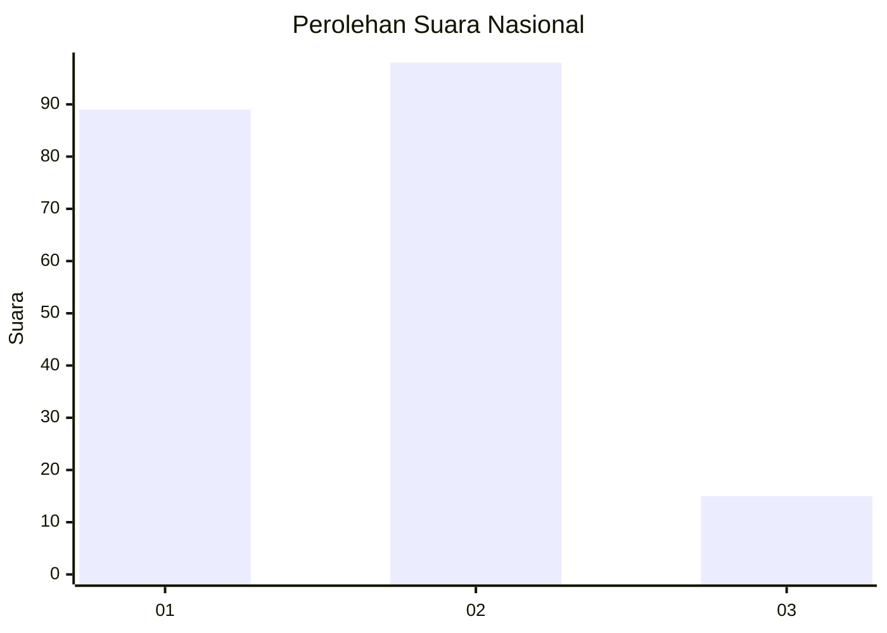
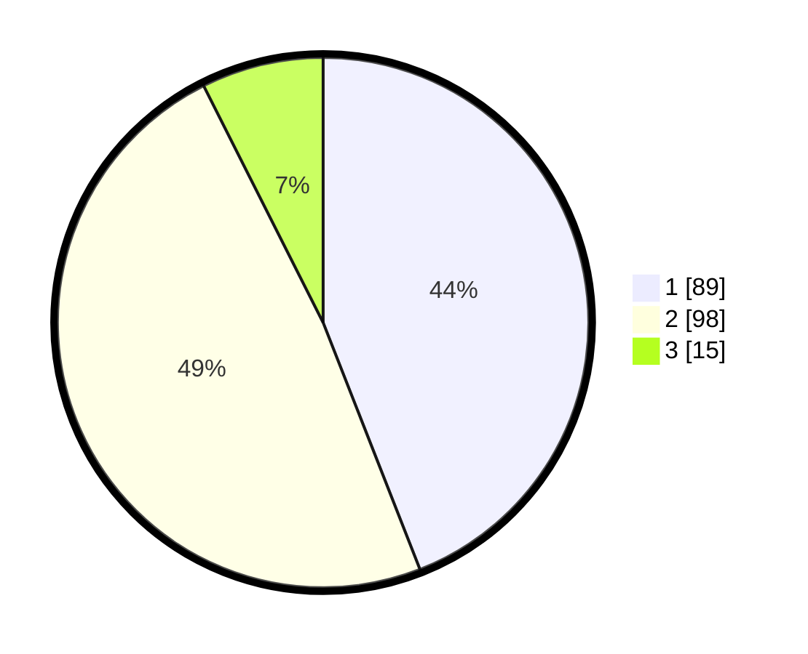

# Hasil

## Grafik

## Tabel

| No.    | Nama Paslon    | Suara | Suara (raw) | Persentase |
|:------ |:-------------- | -----:| -----------:| ----------:|
| 100025 | ANIES MUHAIMIN | 89    | [89][p-1]   | 44,06      |
| 100026 | PRABOWO GIBRAN | 98    | [98][p-2]   | 48,51      |
| 100027 | GANJAR MAHFUD  | 15    | [15][p-3]   | 7,43       |

[p-1]: https://github.com/gigit-pemilu/pemilu-2024/blob/main/pilpres/hitung-suara/sub/31-dki-jakarta/sub/75-jakarta-timur/sub/06-cakung/sub/1004-cakung-timur/sub/051-tps/sub/paslon-1.txt
[p-2]: https://github.com/gigit-pemilu/pemilu-2024/blob/main/pilpres/hitung-suara/sub/31-dki-jakarta/sub/75-jakarta-timur/sub/06-cakung/sub/1004-cakung-timur/sub/051-tps/sub/paslon-2.txt
[p-3]: https://github.com/gigit-pemilu/pemilu-2024/blob/main/pilpres/hitung-suara/sub/31-dki-jakarta/sub/75-jakarta-timur/sub/06-cakung/sub/1004-cakung-timur/sub/051-tps/sub/paslon-3.txt

## Foto C Plano

https://sirekap-obj-formc.kpu.go.id/a977/pemilu/ppwp/31/75/06/10/04/3175061004051-20240214-230054--25674635-61f5-4943-920a-861c3252cc7b.jpg

https://sirekap-obj-formc.kpu.go.id/a977/pemilu/ppwp/31/75/06/10/04/3175061004051-20240214-230248--e7a7a089-3d0a-477c-83e0-679893e2e220.jpg

https://sirekap-obj-formc.kpu.go.id/a977/pemilu/ppwp/31/75/06/10/04/3175061004051-20240214-230326--a6d22788-ba58-4468-8370-6cff80029a6f.jpg

## Metadata

| Key        | Value               |
| ---------- | ------------------- |
| Time Stamp | 2024-02-24 22:31:28 |

