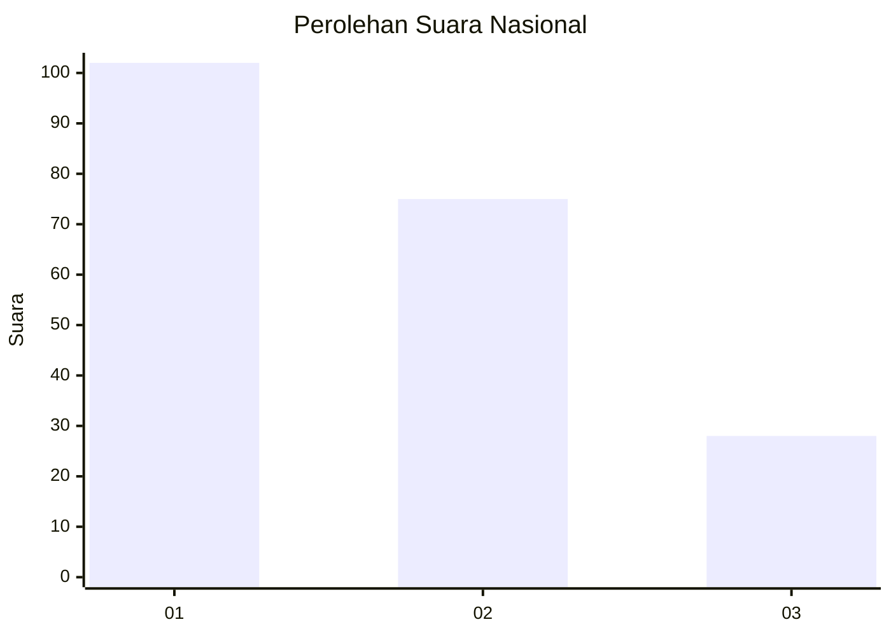
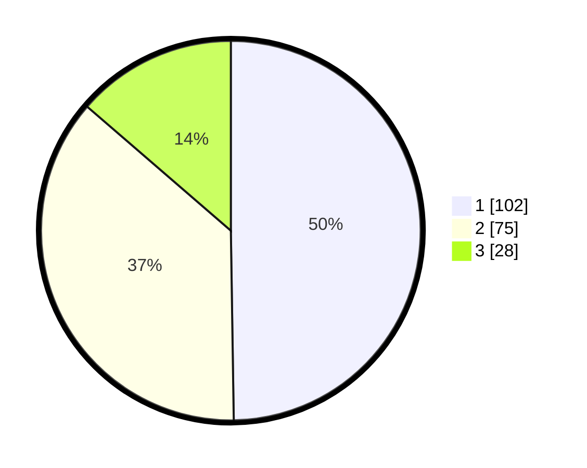

# Hasil

## Grafik

## Tabel

| No.    | Nama Paslon    | Suara | Suara (raw) | Persentase |
|:------ |:-------------- | -----:| -----------:| ----------:|
| 100025 | ANIES MUHAIMIN | 102   | [102][p-1]  | 49,76      |
| 100026 | PRABOWO GIBRAN | 75    | [75][p-2]   | 36,59      |
| 100027 | GANJAR MAHFUD  | 28    | [28][p-3]   | 13,66      |

[p-1]: https://github.com/gigit-pemilu/pemilu-2024/blob/main/pilpres/hitung-suara/sub/31-dki-jakarta/sub/75-jakarta-timur/sub/06-cakung/sub/1004-cakung-timur/sub/060-tps/sub/paslon-1.txt
[p-2]: https://github.com/gigit-pemilu/pemilu-2024/blob/main/pilpres/hitung-suara/sub/31-dki-jakarta/sub/75-jakarta-timur/sub/06-cakung/sub/1004-cakung-timur/sub/060-tps/sub/paslon-2.txt
[p-3]: https://github.com/gigit-pemilu/pemilu-2024/blob/main/pilpres/hitung-suara/sub/31-dki-jakarta/sub/75-jakarta-timur/sub/06-cakung/sub/1004-cakung-timur/sub/060-tps/sub/paslon-3.txt

## Foto C Plano

https://sirekap-obj-formc.kpu.go.id/ced6/pemilu/ppwp/31/75/06/10/04/3175061004060-20240214-212430--5ffa5199-2dd0-4322-ad4f-3705c1fac6f9.jpg

https://sirekap-obj-formc.kpu.go.id/ced6/pemilu/ppwp/31/75/06/10/04/3175061004060-20240214-212358--beee7b81-e132-4678-afc8-cd828557212c.jpg

https://sirekap-obj-formc.kpu.go.id/ced6/pemilu/ppwp/31/75/06/10/04/3175061004060-20240214-212414--7298691e-c63a-4b23-877c-f545ce312480.jpg

## Metadata

| Key        | Value               |
| ---------- | ------------------- |
| Time Stamp | 2024-02-24 22:31:28 |

