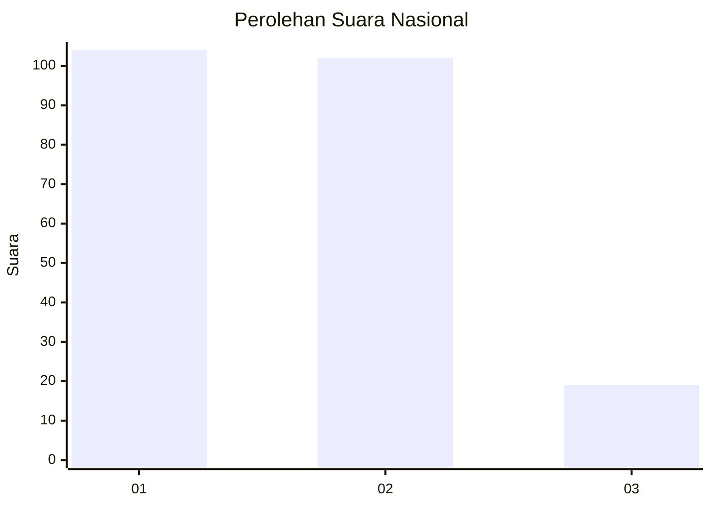
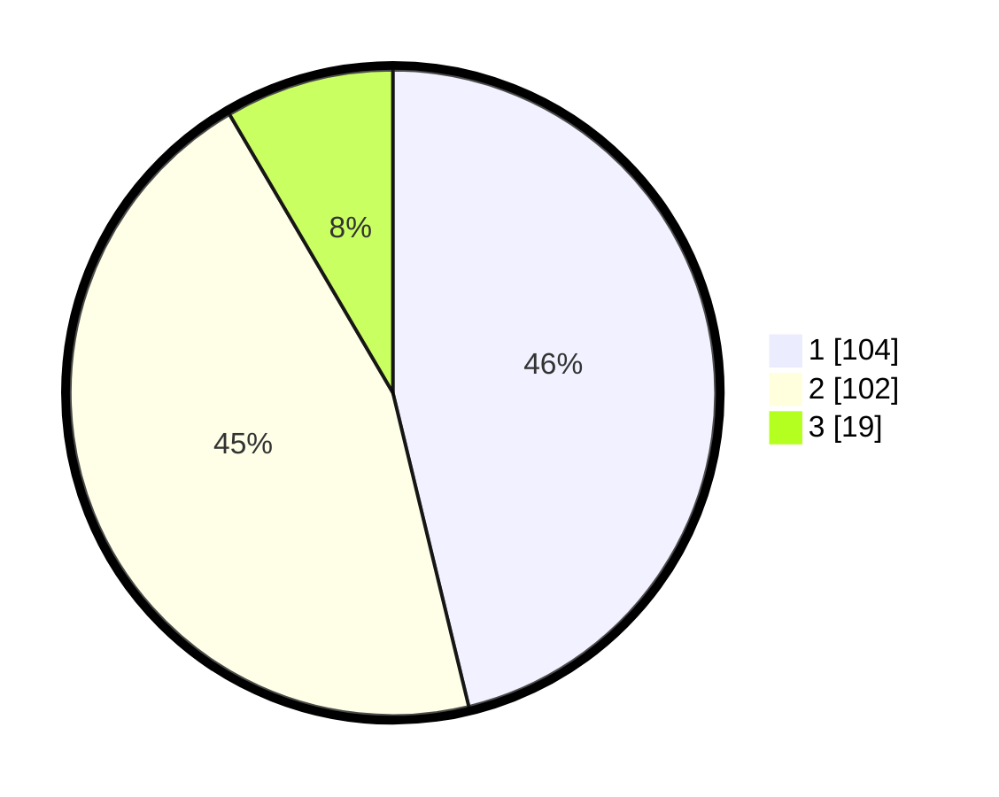

# Hasil

## Grafik

## Tabel

| No.    | Nama Paslon    | Suara | Suara (raw) | Persentase |
|:------ |:-------------- | -----:| -----------:| ----------:|
| 100025 | ANIES MUHAIMIN | 104   | [104][p-1]  | 46,22      |
| 100026 | PRABOWO GIBRAN | 102   | [102][p-2]  | 45,33      |
| 100027 | GANJAR MAHFUD  | 19    | [19][p-3]   | 8,44       |

[p-1]: https://github.com/gigit-pemilu/pemilu-2024/blob/main/pilpres/hitung-suara/sub/31-dki-jakarta/sub/75-jakarta-timur/sub/06-cakung/sub/1004-cakung-timur/sub/074-tps/sub/paslon-1.txt
[p-2]: https://github.com/gigit-pemilu/pemilu-2024/blob/main/pilpres/hitung-suara/sub/31-dki-jakarta/sub/75-jakarta-timur/sub/06-cakung/sub/1004-cakung-timur/sub/074-tps/sub/paslon-2.txt
[p-3]: https://github.com/gigit-pemilu/pemilu-2024/blob/main/pilpres/hitung-suara/sub/31-dki-jakarta/sub/75-jakarta-timur/sub/06-cakung/sub/1004-cakung-timur/sub/074-tps/sub/paslon-3.txt

## Foto C Plano

https://sirekap-obj-formc.kpu.go.id/64fd/pemilu/ppwp/31/75/06/10/04/3175061004074-20240214-215733--21c8b774-9959-4a9a-a58d-dc8246003f6b.jpg

https://sirekap-obj-formc.kpu.go.id/64fd/pemilu/ppwp/31/75/06/10/04/3175061004074-20240214-215807--6d8ba7fd-36d1-46b7-8134-e3c9140e051d.jpg

https://sirekap-obj-formc.kpu.go.id/64fd/pemilu/ppwp/31/75/06/10/04/3175061004074-20240214-215924--9e21d1d4-7631-4f38-8d72-3b4315bdabd6.jpg

## Metadata

| Key        | Value               |
| ---------- | ------------------- |
| Time Stamp | 2024-02-24 22:31:28 |

