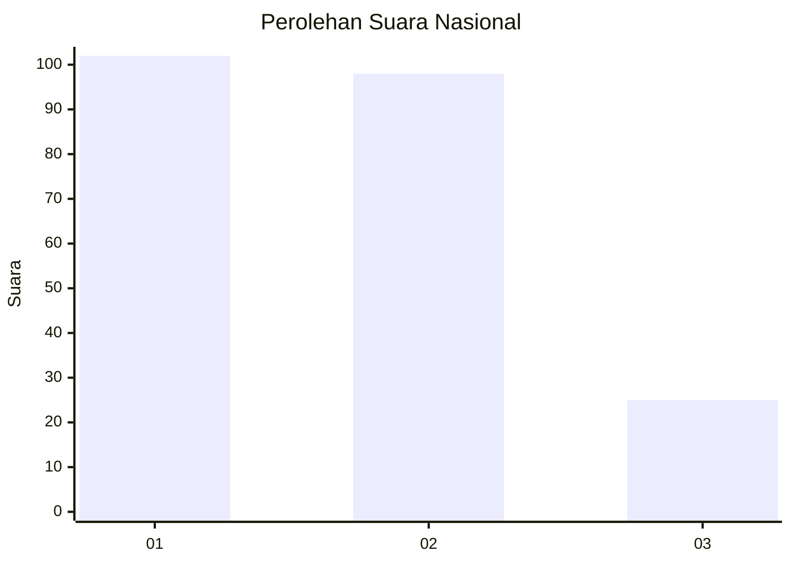
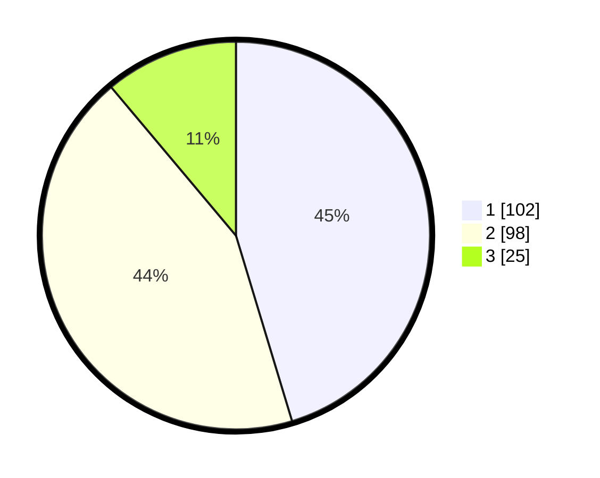

# Hasil

## Grafik

## Tabel

| No.    | Nama Paslon    | Suara | Suara (raw) | Persentase |
|:------ |:-------------- | -----:| -----------:| ----------:|
| 100025 | ANIES MUHAIMIN | 102   | [102][p-1]  | 45,33      |
| 100026 | PRABOWO GIBRAN | 98    | [98][p-2]   | 43,56      |
| 100027 | GANJAR MAHFUD  | 25    | [25][p-3]   | 11,11      |

[p-1]: https://github.com/gigit-pemilu/pemilu-2024/blob/main/pilpres/hitung-suara/sub/31-dki-jakarta/sub/75-jakarta-timur/sub/06-cakung/sub/1004-cakung-timur/sub/098-tps/sub/paslon-1.txt
[p-2]: https://github.com/gigit-pemilu/pemilu-2024/blob/main/pilpres/hitung-suara/sub/31-dki-jakarta/sub/75-jakarta-timur/sub/06-cakung/sub/1004-cakung-timur/sub/098-tps/sub/paslon-2.txt
[p-3]: https://github.com/gigit-pemilu/pemilu-2024/blob/main/pilpres/hitung-suara/sub/31-dki-jakarta/sub/75-jakarta-timur/sub/06-cakung/sub/1004-cakung-timur/sub/098-tps/sub/paslon-3.txt

## Foto C Plano

https://sirekap-obj-formc.kpu.go.id/6d3d/pemilu/ppwp/31/75/06/10/04/3175061004098-20240215-041018--0409995f-becc-40a7-b557-ce55bc82cee1.jpg

https://sirekap-obj-formc.kpu.go.id/6d3d/pemilu/ppwp/31/75/06/10/04/3175061004098-20240215-032145--d3e0a80c-1a70-430f-86d3-a6ac1c8395b5.jpg

https://sirekap-obj-formc.kpu.go.id/6d3d/pemilu/ppwp/31/75/06/10/04/3175061004098-20240215-041255--29ffadb5-c2e0-45c5-b743-efe4021c6472.jpg

## Metadata

| Key        | Value               |
| ---------- | ------------------- |
| Time Stamp | 2024-02-21 22:00:00 |

