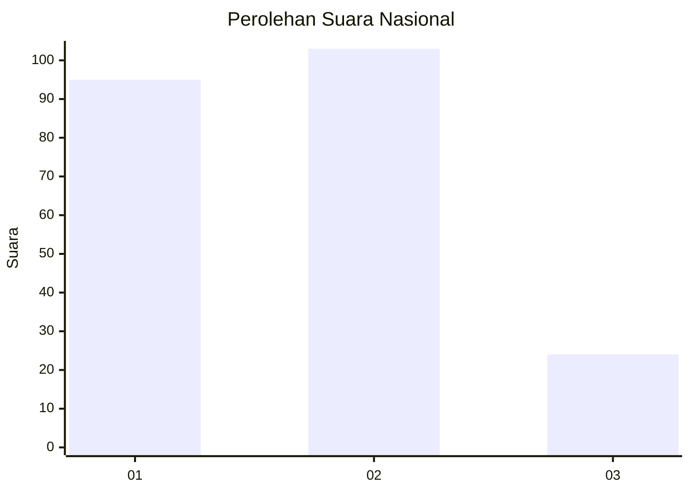
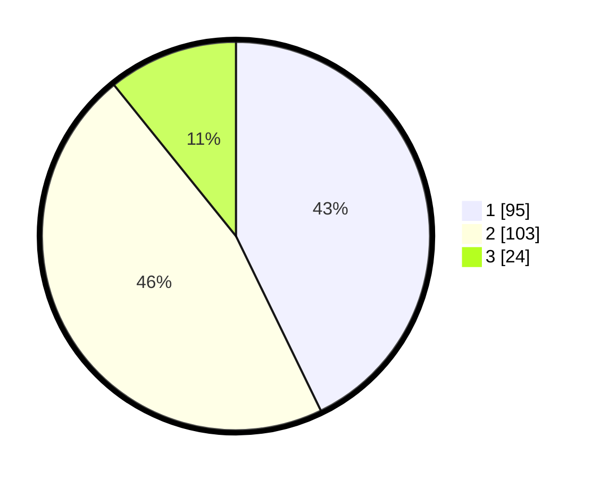

# Hasil

## Grafik

## Tabel

| No.    | Nama Paslon    | Suara | Suara (raw) | Persentase |
|:------ |:-------------- | -----:| -----------:| ----------:|
| 100025 | ANIES MUHAIMIN | 95    | [95][p-1]   | 42,79      |
| 100026 | PRABOWO GIBRAN | 103   | [103][p-2]  | 46,40      |
| 100027 | GANJAR MAHFUD  | 24    | [24][p-3]   | 10,81      |

[p-1]: https://github.com/gigit-pemilu/pemilu-2024/blob/main/pilpres/hitung-suara/sub/31-dki-jakarta/sub/75-jakarta-timur/sub/06-cakung/sub/1004-cakung-timur/sub/114-tps/sub/paslon-1.txt
[p-2]: https://github.com/gigit-pemilu/pemilu-2024/blob/main/pilpres/hitung-suara/sub/31-dki-jakarta/sub/75-jakarta-timur/sub/06-cakung/sub/1004-cakung-timur/sub/114-tps/sub/paslon-2.txt
[p-3]: https://github.com/gigit-pemilu/pemilu-2024/blob/main/pilpres/hitung-suara/sub/31-dki-jakarta/sub/75-jakarta-timur/sub/06-cakung/sub/1004-cakung-timur/sub/114-tps/sub/paslon-3.txt

## Foto C Plano

https://sirekap-obj-formc.kpu.go.id/ce1e/pemilu/ppwp/31/75/06/10/04/3175061004114-20240215-023646--c1b409cd-eb96-417c-b38b-fc6188288934.jpg

https://sirekap-obj-formc.kpu.go.id/ce1e/pemilu/ppwp/31/75/06/10/04/3175061004114-20240215-023756--4f28103a-eb0c-40e6-9181-78fe8a0bafdf.jpg

https://sirekap-obj-formc.kpu.go.id/ce1e/pemilu/ppwp/31/75/06/10/04/3175061004114-20240215-024204--510d3dd6-3dd7-4848-b3d5-a7c2af3bbabd.jpg

## Metadata

| Key        | Value               |
| ---------- | ------------------- |
| Time Stamp | 2024-02-25 14:00:00 |

