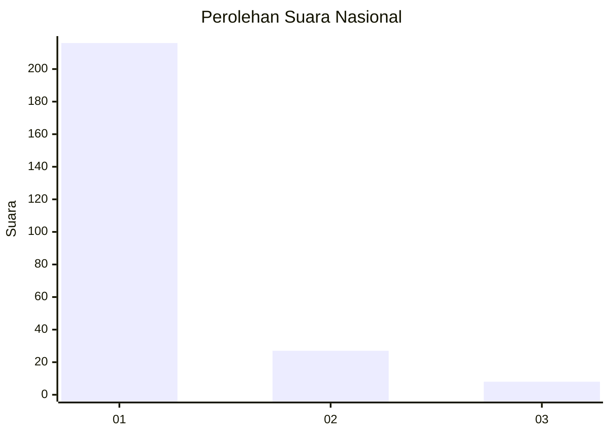
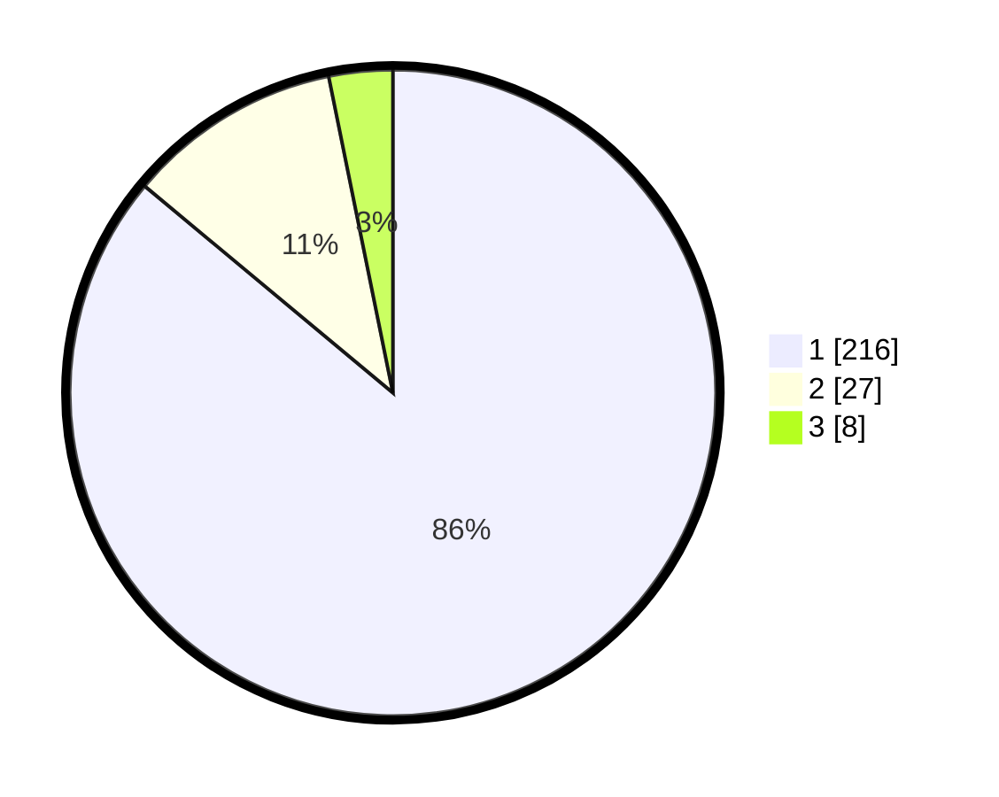

# Hasil

## Grafik

## Tabel

| No. | Nama Paslon    | Suara | Suara (raw) | Persentase |
|:--- |:-------------- | -----:| -----------:| ----------:|
| 1   | ANIES MUHAIMIN | 216   | [216][p-1]  | 86,06      |
| 2   | PRABOWO GIBRAN | 27    | [27][p-2]   | 10,76      |
| 3   | GANJAR MAHFUD  | 8     | [8][p-3]    | 3,19       |

[p-1]: https://github.com/gigit-pemilu/pemilu-2024/blob/main/pilpres/hitung-suara/sub/31-dki-jakarta/sub/75-jakarta-timur/sub/06-cakung/sub/1004-cakung-timur/sub/123-tps/sub/paslon-1.txt
[p-2]: https://github.com/gigit-pemilu/pemilu-2024/blob/main/pilpres/hitung-suara/sub/31-dki-jakarta/sub/75-jakarta-timur/sub/06-cakung/sub/1004-cakung-timur/sub/123-tps/sub/paslon-2.txt
[p-3]: https://github.com/gigit-pemilu/pemilu-2024/blob/main/pilpres/hitung-suara/sub/31-dki-jakarta/sub/75-jakarta-timur/sub/06-cakung/sub/1004-cakung-timur/sub/123-tps/sub/paslon-3.txt

## Foto C Plano

https://sirekap-obj-formc.kpu.go.id/51ad/pemilu/ppwp/31/75/06/10/04/3175061004123-20240214-213939--1f608e9e-d174-42b9-9f8f-6579312faef6.jpg

https://sirekap-obj-formc.kpu.go.id/51ad/pemilu/ppwp/31/75/06/10/04/3175061004123-20240214-214108--6831d432-0fc8-4b79-ac57-a66fa4638160.jpg

https://sirekap-obj-formc.kpu.go.id/51ad/pemilu/ppwp/31/75/06/10/04/3175061004123-20240214-214313--01ca208c-2af6-4b08-b21c-f506888b71df.jpg

## Metadata

| Key        | Value               |
| ---------- | ------------------- |
| Time Stamp | 2024-02-25 14:00:00 |

