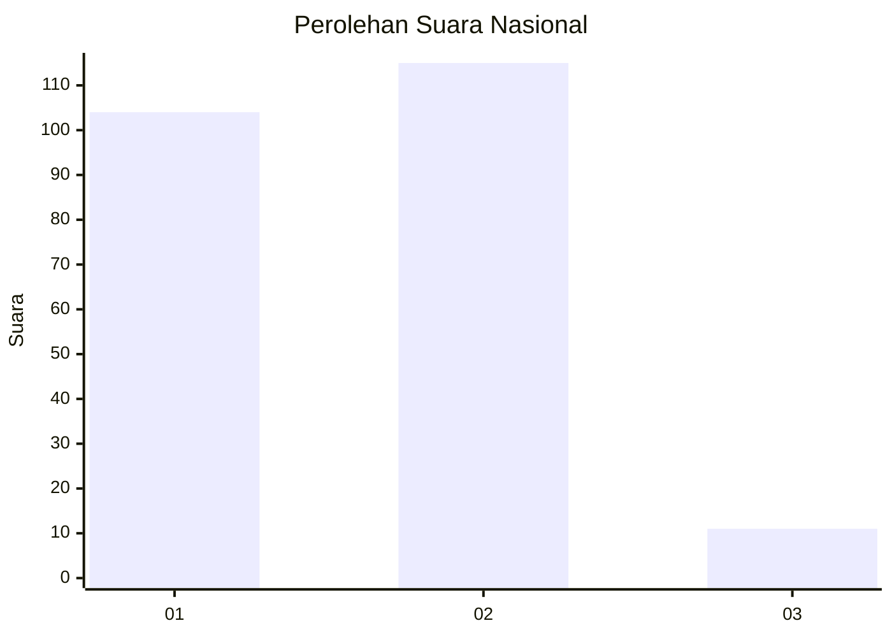
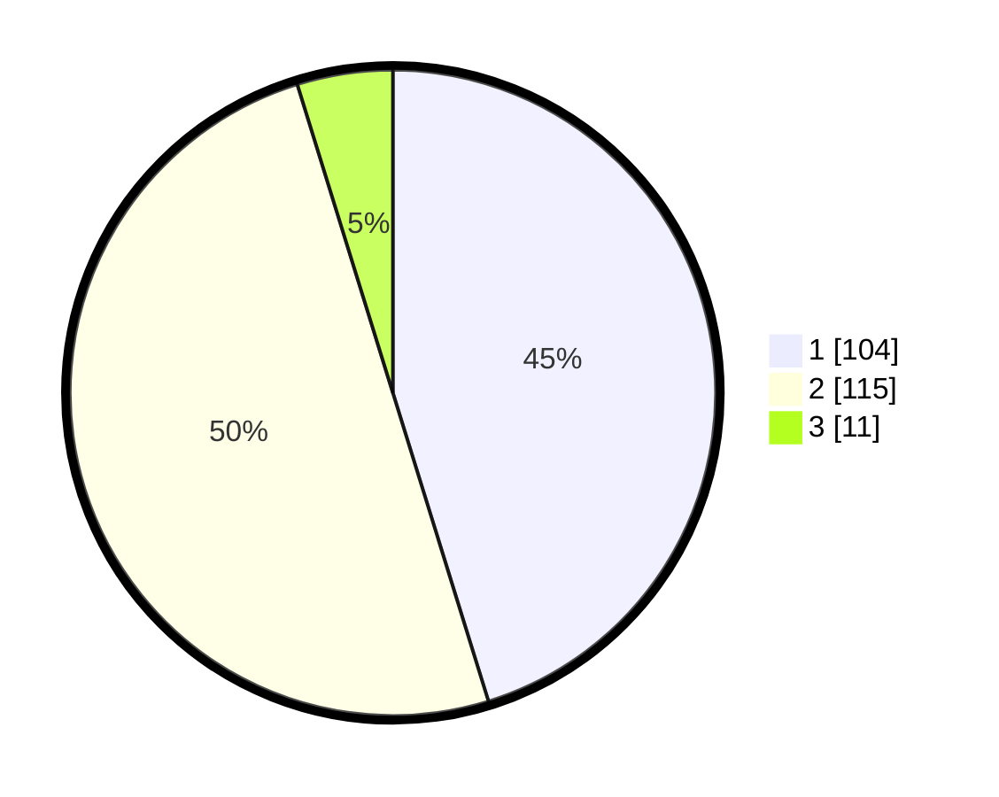

# Hasil

## Grafik

## Tabel

| No.    | Nama Paslon    | Suara | Suara (raw) | Persentase |
|:------ |:-------------- | -----:| -----------:| ----------:|
| 100025 | ANIES MUHAIMIN | 104   | [104][p-1]  | 45,22      |
| 100026 | PRABOWO GIBRAN | 115   | [115][p-2]  | 50,00      |
| 100027 | GANJAR MAHFUD  | 11    | [11][p-3]   | 4,78       |

[p-1]: https://github.com/gigit-pemilu/pemilu-2024/blob/main/pilpres/hitung-suara/sub/31-dki-jakarta/sub/75-jakarta-timur/sub/06-cakung/sub/1004-cakung-timur/sub/131-tps/sub/paslon-1.txt
[p-2]: https://github.com/gigit-pemilu/pemilu-2024/blob/main/pilpres/hitung-suara/sub/31-dki-jakarta/sub/75-jakarta-timur/sub/06-cakung/sub/1004-cakung-timur/sub/131-tps/sub/paslon-2.txt
[p-3]: https://github.com/gigit-pemilu/pemilu-2024/blob/main/pilpres/hitung-suara/sub/31-dki-jakarta/sub/75-jakarta-timur/sub/06-cakung/sub/1004-cakung-timur/sub/131-tps/sub/paslon-3.txt

## Foto C Plano

https://sirekap-obj-formc.kpu.go.id/2c1c/pemilu/ppwp/31/75/06/10/04/3175061004131-20240214-231150--819c7ddc-f976-45f8-b7c4-3f8169ad0488.jpg

https://sirekap-obj-formc.kpu.go.id/2c1c/pemilu/ppwp/31/75/06/10/04/3175061004131-20240214-231439--ca27b248-7e91-4a8e-b716-2ba54874f0e8.jpg

https://sirekap-obj-formc.kpu.go.id/2c1c/pemilu/ppwp/31/75/06/10/04/3175061004131-20240214-224853--911f1775-56d4-4eb9-9f36-2e2ae0c44f0c.jpg

## Metadata

| Key        | Value               |
| ---------- | ------------------- |
| Time Stamp | 2024-02-24 22:31:28 |

