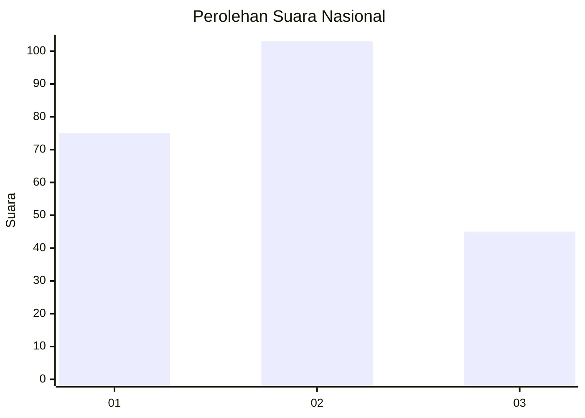
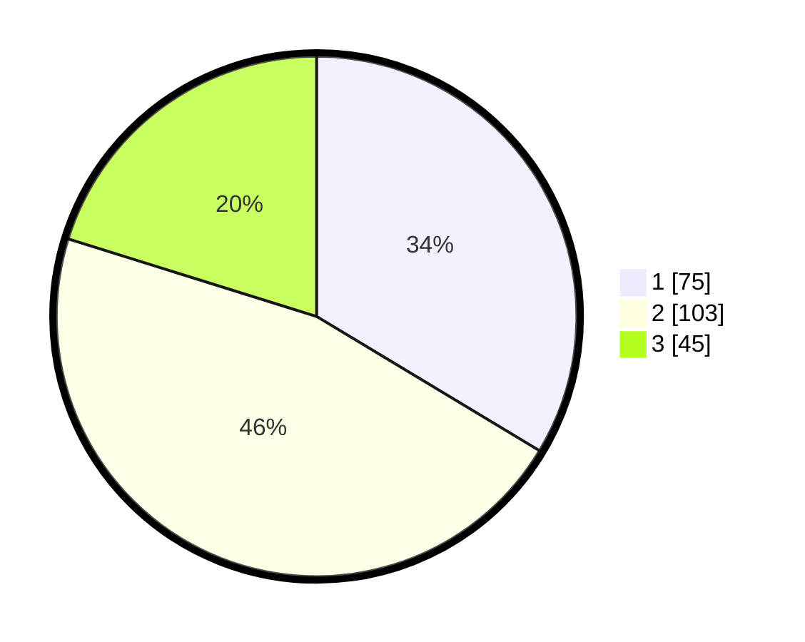

# Hasil

## Grafik

## Tabel

| No.    | Nama Paslon    | Suara | Suara (raw) | Persentase |
|:------ |:-------------- | -----:| -----------:| ----------:|
| 100025 | ANIES MUHAIMIN | 75    | [75][p-1]   | 33,63      |
| 100026 | PRABOWO GIBRAN | 103   | [103][p-2]  | 46,19      |
| 100027 | GANJAR MAHFUD  | 45    | [45][p-3]   | 20,18      |

[p-1]: https://github.com/gigit-pemilu/pemilu-2024/blob/main/pilpres/hitung-suara/sub/31-dki-jakarta/sub/75-jakarta-timur/sub/06-cakung/sub/1004-cakung-timur/sub/152-tps/sub/paslon-1.txt
[p-2]: https://github.com/gigit-pemilu/pemilu-2024/blob/main/pilpres/hitung-suara/sub/31-dki-jakarta/sub/75-jakarta-timur/sub/06-cakung/sub/1004-cakung-timur/sub/152-tps/sub/paslon-2.txt
[p-3]: https://github.com/gigit-pemilu/pemilu-2024/blob/main/pilpres/hitung-suara/sub/31-dki-jakarta/sub/75-jakarta-timur/sub/06-cakung/sub/1004-cakung-timur/sub/152-tps/sub/paslon-3.txt

## Foto C Plano

https://sirekap-obj-formc.kpu.go.id/bc30/pemilu/ppwp/31/75/06/10/04/3175061004152-20240215-022951--9af2fab5-15b1-4f29-b0fe-93f361f4ef6a.jpg

https://sirekap-obj-formc.kpu.go.id/bc30/pemilu/ppwp/31/75/06/10/04/3175061004152-20240215-023028--f6ba4fa5-bd9d-47a9-af6d-2065f23241d4.jpg

https://sirekap-obj-formc.kpu.go.id/bc30/pemilu/ppwp/31/75/06/10/04/3175061004152-20240215-023043--dec6f57a-0f8b-49e9-8ef2-08def3b66238.jpg

## Metadata

| Key        | Value               |
| ---------- | ------------------- |
| Time Stamp | 2024-02-25 15:00:00 |

