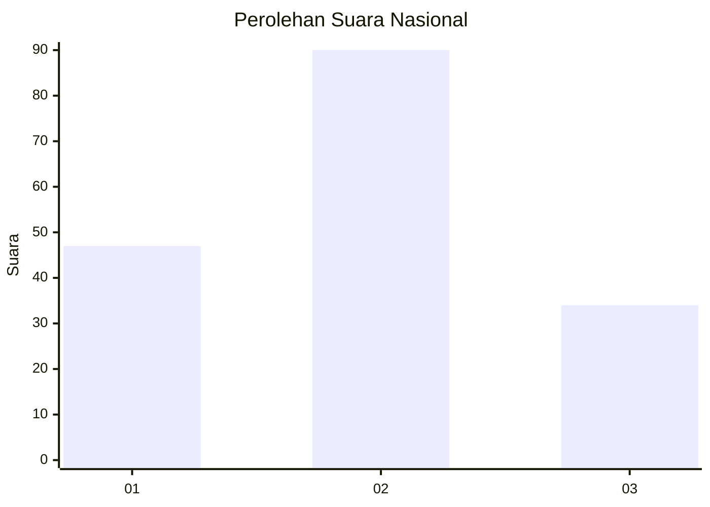
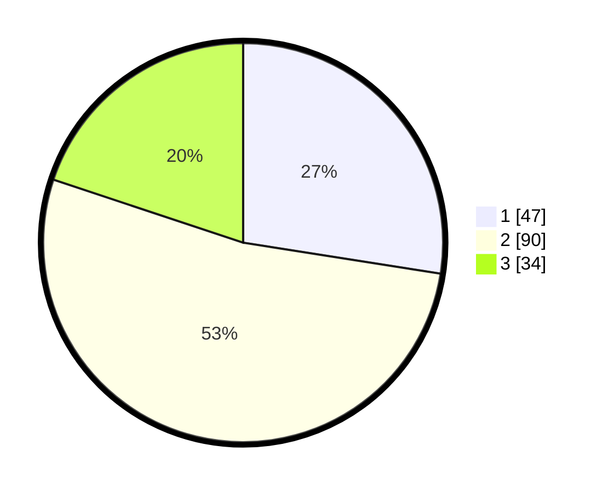

# Hasil

## Grafik

## Tabel

| No.    | Nama Paslon    | Suara | Suara (raw) | Persentase |
|:------ |:-------------- | -----:| -----------:| ----------:|
| 100025 | ANIES MUHAIMIN | 47    | [47][p-1]   | 27,49      |
| 100026 | PRABOWO GIBRAN | 90    | [90][p-2]   | 52,63      |
| 100027 | GANJAR MAHFUD  | 34    | [34][p-3]   | 19,88      |

[p-1]: https://github.com/gigit-pemilu/pemilu-2024/blob/main/pilpres/hitung-suara/sub/31-dki-jakarta/sub/75-jakarta-timur/sub/06-cakung/sub/1004-cakung-timur/sub/153-tps/sub/paslon-1.txt
[p-2]: https://github.com/gigit-pemilu/pemilu-2024/blob/main/pilpres/hitung-suara/sub/31-dki-jakarta/sub/75-jakarta-timur/sub/06-cakung/sub/1004-cakung-timur/sub/153-tps/sub/paslon-2.txt
[p-3]: https://github.com/gigit-pemilu/pemilu-2024/blob/main/pilpres/hitung-suara/sub/31-dki-jakarta/sub/75-jakarta-timur/sub/06-cakung/sub/1004-cakung-timur/sub/153-tps/sub/paslon-3.txt

## Foto C Plano

https://sirekap-obj-formc.kpu.go.id/3a64/pemilu/ppwp/31/75/06/10/04/3175061004153-20240215-022311--d3886e87-6e1e-46ac-b2c7-30bbddc0efe2.jpg

https://sirekap-obj-formc.kpu.go.id/3a64/pemilu/ppwp/31/75/06/10/04/3175061004153-20240215-022321--cfc9c825-f1a1-400a-8869-d367d1b09769.jpg

https://sirekap-obj-formc.kpu.go.id/3a64/pemilu/ppwp/31/75/06/10/04/3175061004153-20240215-022328--d56f59c5-ac7d-45d5-8197-ef47c7606d54.jpg

## Metadata

| Key        | Value               |
| ---------- | ------------------- |
| Time Stamp | 2024-02-25 14:00:00 |

