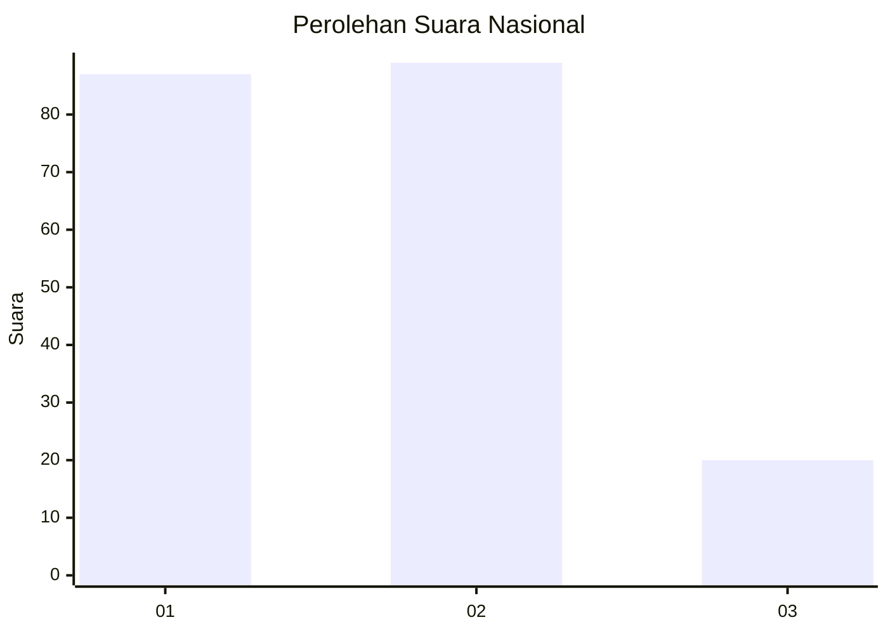
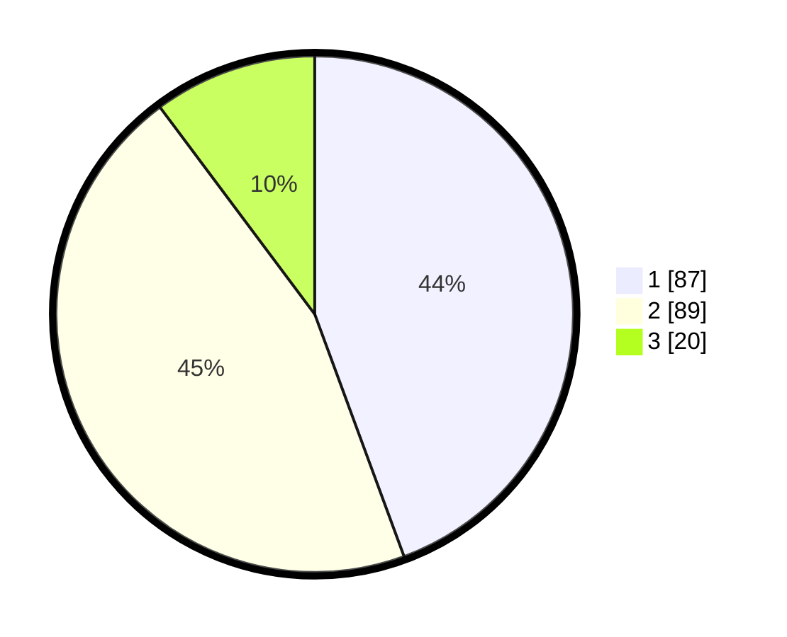

# Hasil

## Grafik

## Tabel

| No.    | Nama Paslon    | Suara | Suara (raw) | Persentase |
|:------ |:-------------- | -----:| -----------:| ----------:|
| 100025 | ANIES MUHAIMIN | 87    | [87][p-1]   | 44,39      |
| 100026 | PRABOWO GIBRAN | 89    | [89][p-2]   | 45,41      |
| 100027 | GANJAR MAHFUD  | 20    | [20][p-3]   | 10,20      |

[p-1]: https://github.com/gigit-pemilu/pemilu-2024/blob/main/pilpres/hitung-suara/sub/31-dki-jakarta/sub/75-jakarta-timur/sub/06-cakung/sub/1004-cakung-timur/sub/170-tps/sub/paslon-1.txt
[p-2]: https://github.com/gigit-pemilu/pemilu-2024/blob/main/pilpres/hitung-suara/sub/31-dki-jakarta/sub/75-jakarta-timur/sub/06-cakung/sub/1004-cakung-timur/sub/170-tps/sub/paslon-2.txt
[p-3]: https://github.com/gigit-pemilu/pemilu-2024/blob/main/pilpres/hitung-suara/sub/31-dki-jakarta/sub/75-jakarta-timur/sub/06-cakung/sub/1004-cakung-timur/sub/170-tps/sub/paslon-3.txt

## Foto C Plano

https://sirekap-obj-formc.kpu.go.id/f304/pemilu/ppwp/31/75/06/10/04/3175061004170-20240215-233558--6b683c83-de7d-46e8-8023-985cfa2557ad.jpg

https://sirekap-obj-formc.kpu.go.id/f304/pemilu/ppwp/31/75/06/10/04/3175061004170-20240215-233634--d85a02d8-2892-4df3-9891-42a5545535dd.jpg

https://sirekap-obj-formc.kpu.go.id/f304/pemilu/ppwp/31/75/06/10/04/3175061004170-20240215-233644--a1e8afcd-55a0-4af0-93a2-fe3350d37763.jpg

## Metadata

| Key        | Value               |
| ---------- | ------------------- |
| Time Stamp | 2024-02-24 22:31:28 |

