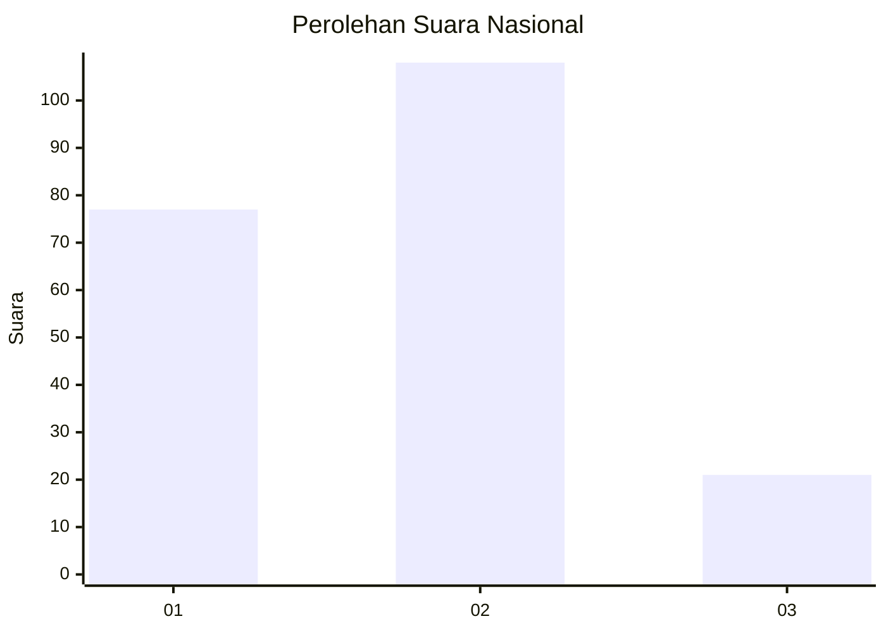
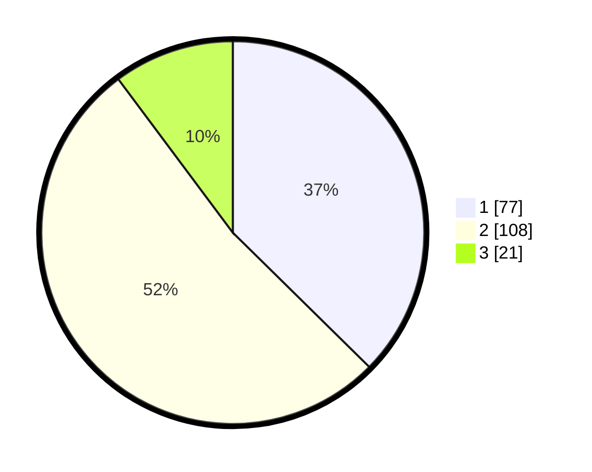

# Hasil

## Grafik

## Tabel

| No.    | Nama Paslon    | Suara | Suara (raw) | Persentase |
|:------ |:-------------- | -----:| -----------:| ----------:|
| 100025 | ANIES MUHAIMIN | 77    | [77][p-1]   | 37,38      |
| 100026 | PRABOWO GIBRAN | 108   | [108][p-2]  | 52,43      |
| 100027 | GANJAR MAHFUD  | 21    | [21][p-3]   | 10,19      |

[p-1]: https://github.com/gigit-pemilu/pemilu-2024/blob/main/pilpres/hitung-suara/sub/31-dki-jakarta/sub/75-jakarta-timur/sub/06-cakung/sub/1004-cakung-timur/sub/178-tps/sub/paslon-1.txt
[p-2]: https://github.com/gigit-pemilu/pemilu-2024/blob/main/pilpres/hitung-suara/sub/31-dki-jakarta/sub/75-jakarta-timur/sub/06-cakung/sub/1004-cakung-timur/sub/178-tps/sub/paslon-2.txt
[p-3]: https://github.com/gigit-pemilu/pemilu-2024/blob/main/pilpres/hitung-suara/sub/31-dki-jakarta/sub/75-jakarta-timur/sub/06-cakung/sub/1004-cakung-timur/sub/178-tps/sub/paslon-3.txt

## Foto C Plano

https://sirekap-obj-formc.kpu.go.id/b656/pemilu/ppwp/31/75/06/10/04/3175061004178-20240214-224301--e33bcf03-6e86-479e-b307-e7c2791eb056.jpg

https://sirekap-obj-formc.kpu.go.id/b656/pemilu/ppwp/31/75/06/10/04/3175061004178-20240214-224343--67ef186f-5adb-46ab-9337-421d46ef0439.jpg

https://sirekap-obj-formc.kpu.go.id/b656/pemilu/ppwp/31/75/06/10/04/3175061004178-20240214-224419--245eb69d-7624-4aaf-bbf5-66f62f7dbdd7.jpg

## Metadata

| Key        | Value               |
| ---------- | ------------------- |
| Time Stamp | 2024-02-24 22:31:28 |

