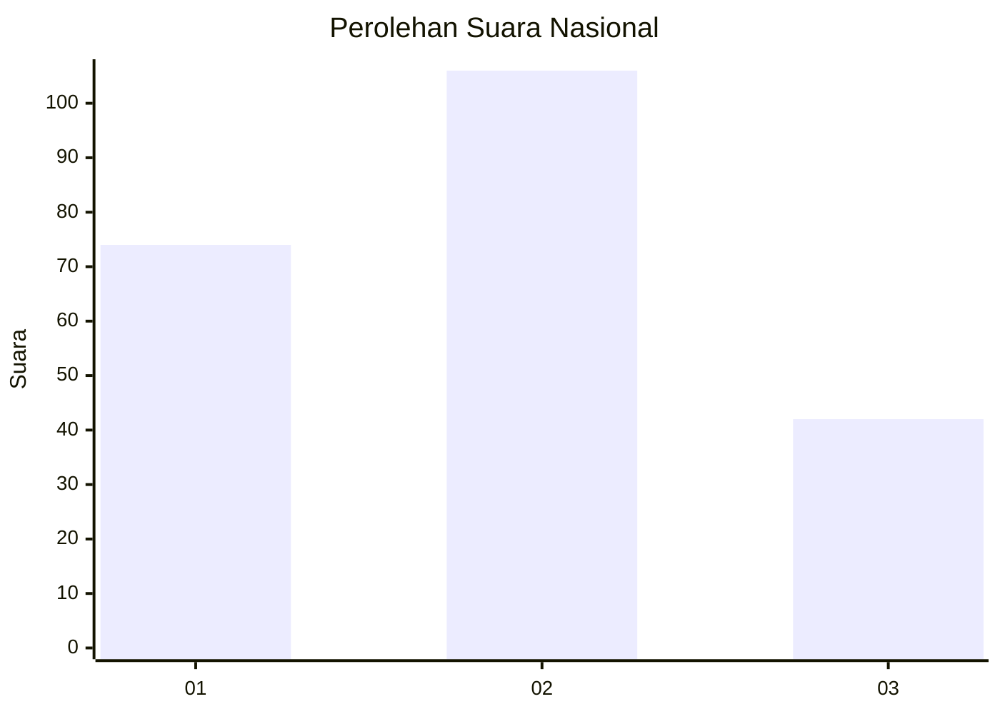
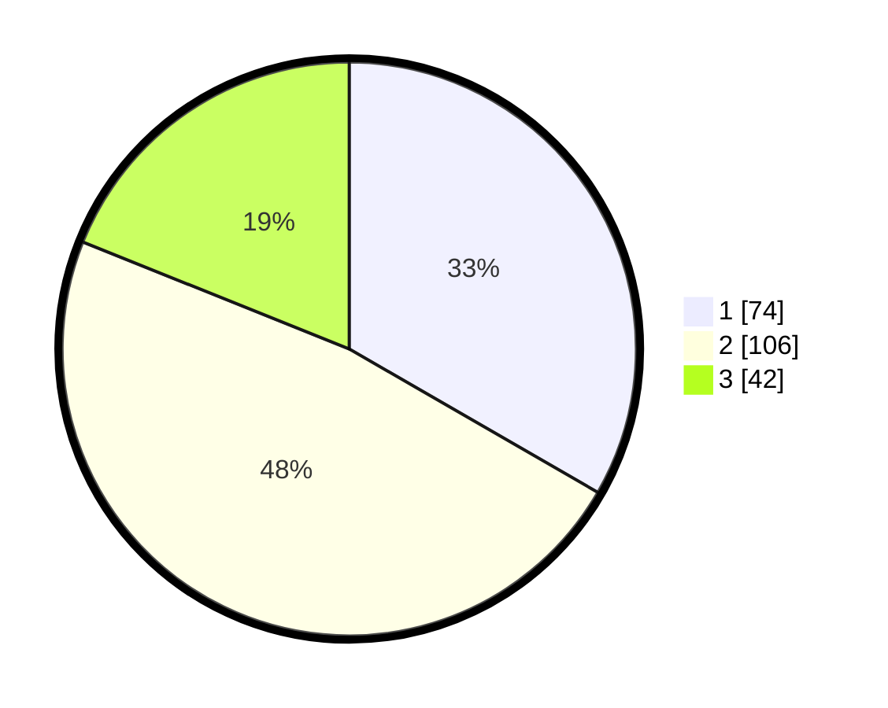

# Hasil

## Grafik

## Tabel

| No.    | Nama Paslon    | Suara | Suara (raw) | Persentase |
|:------ |:-------------- | -----:| -----------:| ----------:|
| 100025 | ANIES MUHAIMIN | 74    | [74][p-1]   | 33,33      |
| 100026 | PRABOWO GIBRAN | 106   | [106][p-2]  | 47,75      |
| 100027 | GANJAR MAHFUD  | 42    | [42][p-3]   | 18,92      |

[p-1]: https://github.com/gigit-pemilu/pemilu-2024/blob/main/pilpres/hitung-suara/sub/31-dki-jakarta/sub/75-jakarta-timur/sub/06-cakung/sub/1004-cakung-timur/sub/184-tps/sub/paslon-1.txt
[p-2]: https://github.com/gigit-pemilu/pemilu-2024/blob/main/pilpres/hitung-suara/sub/31-dki-jakarta/sub/75-jakarta-timur/sub/06-cakung/sub/1004-cakung-timur/sub/184-tps/sub/paslon-2.txt
[p-3]: https://github.com/gigit-pemilu/pemilu-2024/blob/main/pilpres/hitung-suara/sub/31-dki-jakarta/sub/75-jakarta-timur/sub/06-cakung/sub/1004-cakung-timur/sub/184-tps/sub/paslon-3.txt

## Foto C Plano

https://sirekap-obj-formc.kpu.go.id/33f1/pemilu/ppwp/31/75/06/10/04/3175061004184-20240216-172917--7bc9275f-f6ad-4fd7-bb6c-4a80f117ea27.jpg

https://sirekap-obj-formc.kpu.go.id/33f1/pemilu/ppwp/31/75/06/10/04/3175061004184-20240215-023911--accf02a8-f35a-42ba-ad25-673173034184.jpg

https://sirekap-obj-formc.kpu.go.id/33f1/pemilu/ppwp/31/75/06/10/04/3175061004184-20240215-023954--308a6270-d9a5-40a3-864d-1fcbd2120f28.jpg

## Metadata

| Key        | Value               |
| ---------- | ------------------- |
| Time Stamp | 2024-02-24 22:31:28 |

