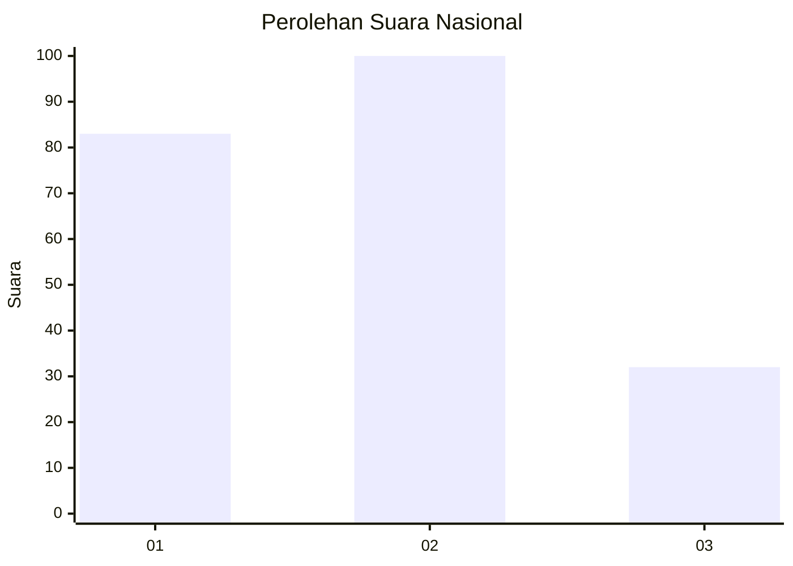
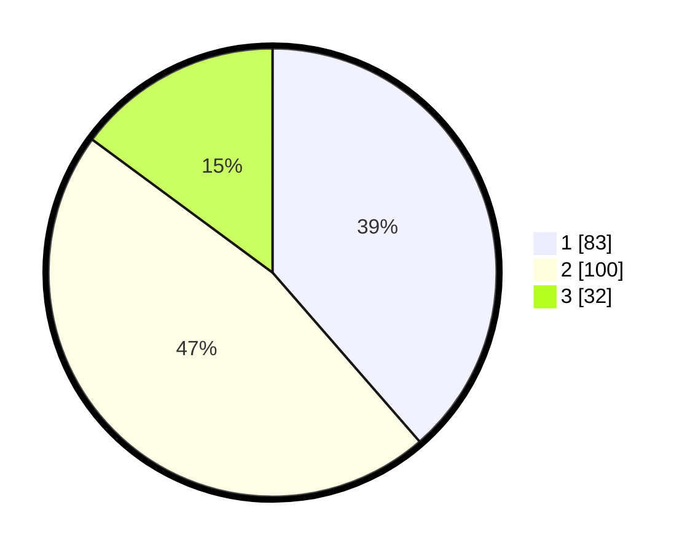

# Hasil

## Grafik

## Tabel

| No.    | Nama Paslon    | Suara | Suara (raw) | Persentase |
|:------ |:-------------- | -----:| -----------:| ----------:|
| 100025 | ANIES MUHAIMIN | 83    | [83][p-1]   | 38,60      |
| 100026 | PRABOWO GIBRAN | 100   | [100][p-2]  | 46,51      |
| 100027 | GANJAR MAHFUD  | 32    | [32][p-3]   | 14,88      |

[p-1]: https://github.com/gigit-pemilu/pemilu-2024/blob/main/pilpres/hitung-suara/sub/31-dki-jakarta/sub/75-jakarta-timur/sub/06-cakung/sub/1004-cakung-timur/sub/188-tps/sub/paslon-1.txt
[p-2]: https://github.com/gigit-pemilu/pemilu-2024/blob/main/pilpres/hitung-suara/sub/31-dki-jakarta/sub/75-jakarta-timur/sub/06-cakung/sub/1004-cakung-timur/sub/188-tps/sub/paslon-2.txt
[p-3]: https://github.com/gigit-pemilu/pemilu-2024/blob/main/pilpres/hitung-suara/sub/31-dki-jakarta/sub/75-jakarta-timur/sub/06-cakung/sub/1004-cakung-timur/sub/188-tps/sub/paslon-3.txt

## Foto C Plano

https://sirekap-obj-formc.kpu.go.id/447c/pemilu/ppwp/31/75/06/10/04/3175061004188-20240214-231355--3e36a262-d015-4eb4-9287-8d89dbbb843f.jpg

https://sirekap-obj-formc.kpu.go.id/447c/pemilu/ppwp/31/75/06/10/04/3175061004188-20240214-235444--5c3601e8-f529-4d00-977f-dd55016234b4.jpg

https://sirekap-obj-formc.kpu.go.id/447c/pemilu/ppwp/31/75/06/10/04/3175061004188-20240214-231518--513b7a5d-f813-4ca2-91f3-fd69f8b1fea6.jpg

## Metadata

| Key        | Value               |
| ---------- | ------------------- |
| Time Stamp | 2024-02-24 22:31:28 |

