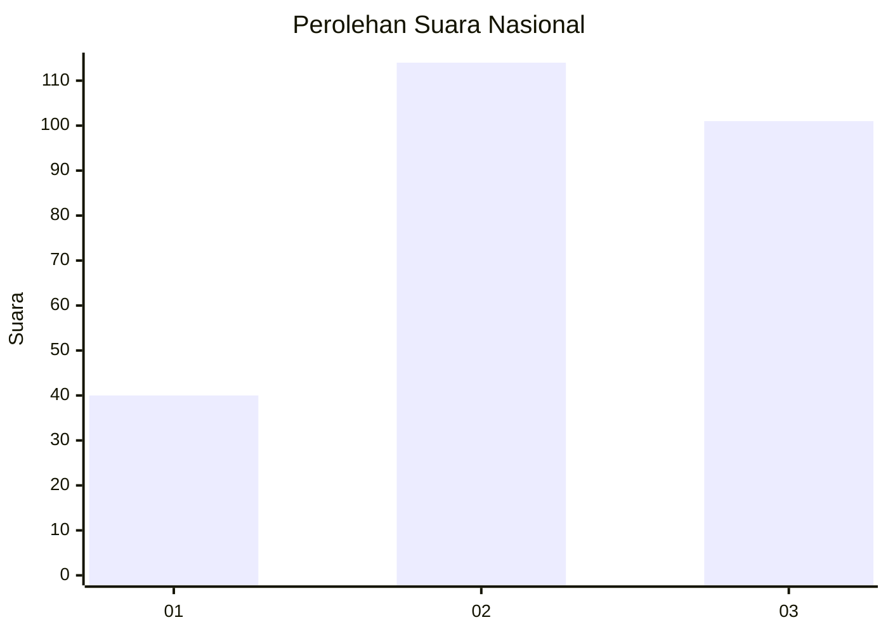
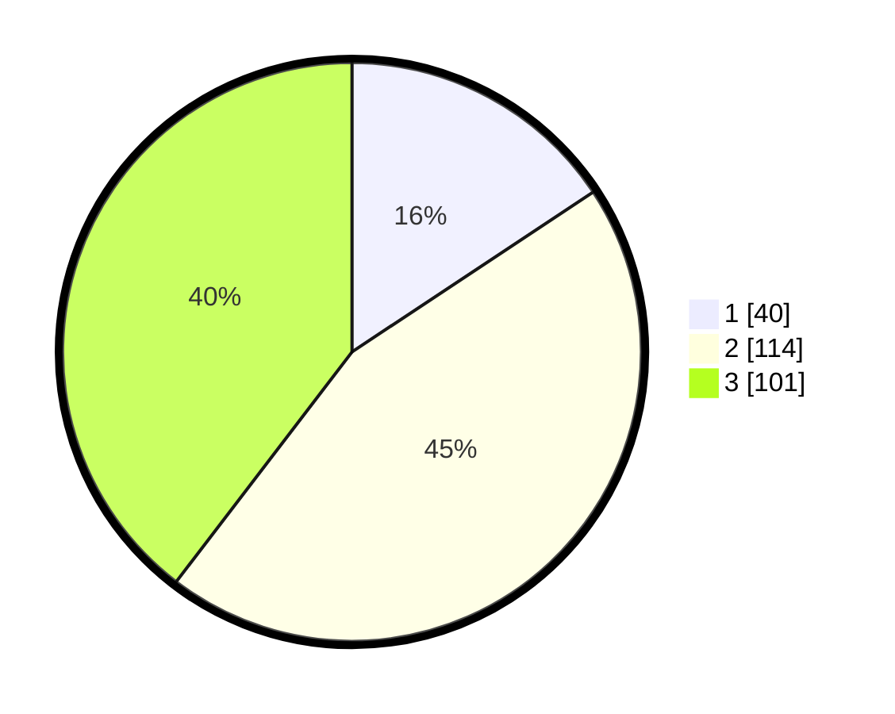

# Hasil

## Grafik

## Tabel

| No.    | Nama Paslon    | Suara | Suara (raw) | Persentase |
|:------ |:-------------- | -----:| -----------:| ----------:|
| 100025 | ANIES MUHAIMIN | 40    | [40][p-1]   | 15,69      |
| 100026 | PRABOWO GIBRAN | 114   | [114][p-2]  | 44,71      |
| 100027 | GANJAR MAHFUD  | 101   | [101][p-3]  | 39,61      |

[p-1]: https://github.com/gigit-pemilu/pemilu-2024/blob/main/pilpres/hitung-suara/sub/31-dki-jakarta/sub/75-jakarta-timur/sub/06-cakung/sub/1004-cakung-timur/sub/197-tps/sub/paslon-1.txt
[p-2]: https://github.com/gigit-pemilu/pemilu-2024/blob/main/pilpres/hitung-suara/sub/31-dki-jakarta/sub/75-jakarta-timur/sub/06-cakung/sub/1004-cakung-timur/sub/197-tps/sub/paslon-2.txt
[p-3]: https://github.com/gigit-pemilu/pemilu-2024/blob/main/pilpres/hitung-suara/sub/31-dki-jakarta/sub/75-jakarta-timur/sub/06-cakung/sub/1004-cakung-timur/sub/197-tps/sub/paslon-3.txt

## Foto C Plano

https://sirekap-obj-formc.kpu.go.id/7bdc/pemilu/ppwp/31/75/06/10/04/3175061004197-20240214-215626--6c395f77-ebf8-4d44-9889-4b7eebaafc2f.jpg

https://sirekap-obj-formc.kpu.go.id/7bdc/pemilu/ppwp/31/75/06/10/04/3175061004197-20240214-215640--2b204cf3-bd08-4c34-9f0e-c2ddd70d811b.jpg

https://sirekap-obj-formc.kpu.go.id/7bdc/pemilu/ppwp/31/75/06/10/04/3175061004197-20240214-213247--6f2ac593-2a83-4916-870b-6de989486771.jpg

## Metadata

| Key        | Value               |
| ---------- | ------------------- |
| Time Stamp | 2024-02-24 22:31:28 |

