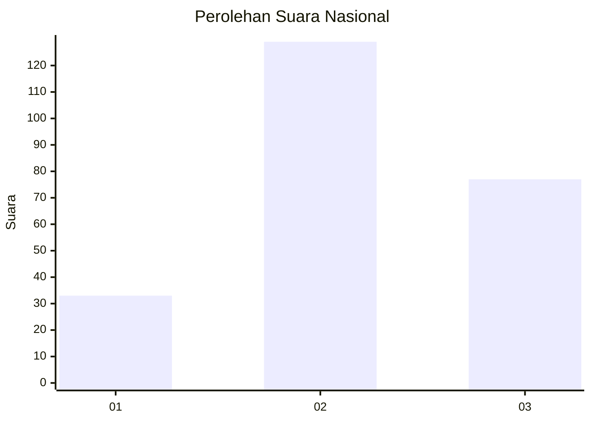
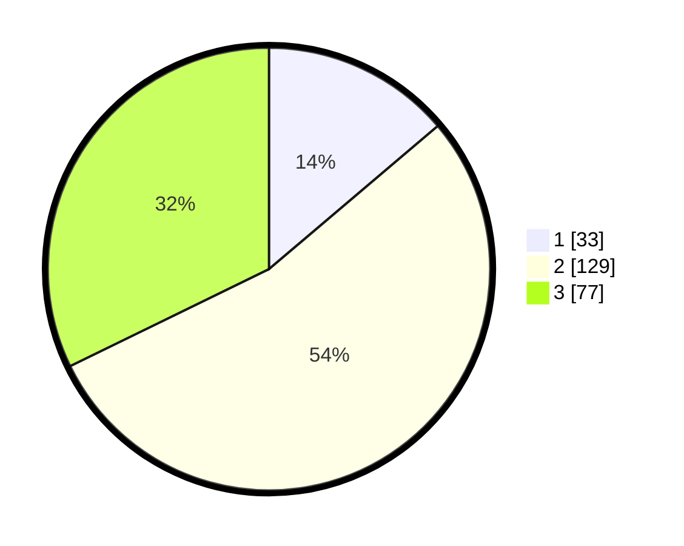

# Hasil

## Grafik

## Tabel

| No.    | Nama Paslon    | Suara | Suara (raw) | Persentase |
|:------ |:-------------- | -----:| -----------:| ----------:|
| 100025 | ANIES MUHAIMIN | 33    | [33][p-1]   | 13,81      |
| 100026 | PRABOWO GIBRAN | 129   | [129][p-2]  | 53,97      |
| 100027 | GANJAR MAHFUD  | 77    | [77][p-3]   | 32,22      |

[p-1]: https://github.com/gigit-pemilu/pemilu-2024/blob/main/pilpres/hitung-suara/sub/31-dki-jakarta/sub/75-jakarta-timur/sub/06-cakung/sub/1004-cakung-timur/sub/198-tps/sub/paslon-1.txt
[p-2]: https://github.com/gigit-pemilu/pemilu-2024/blob/main/pilpres/hitung-suara/sub/31-dki-jakarta/sub/75-jakarta-timur/sub/06-cakung/sub/1004-cakung-timur/sub/198-tps/sub/paslon-2.txt
[p-3]: https://github.com/gigit-pemilu/pemilu-2024/blob/main/pilpres/hitung-suara/sub/31-dki-jakarta/sub/75-jakarta-timur/sub/06-cakung/sub/1004-cakung-timur/sub/198-tps/sub/paslon-3.txt

## Foto C Plano

https://sirekap-obj-formc.kpu.go.id/94c4/pemilu/ppwp/31/75/06/10/04/3175061004198-20240214-210915--47facdaa-1da2-4d67-98b7-32fa7849f037.jpg

https://sirekap-obj-formc.kpu.go.id/94c4/pemilu/ppwp/31/75/06/10/04/3175061004198-20240214-214349--19e63821-6fb0-4943-9ad8-44d80f6bce97.jpg

https://sirekap-obj-formc.kpu.go.id/94c4/pemilu/ppwp/31/75/06/10/04/3175061004198-20240214-214405--586e91bc-daba-49ea-8d47-dce2c6097bae.jpg

## Metadata

| Key        | Value               |
| ---------- | ------------------- |
| Time Stamp | 2024-02-24 22:31:28 |

