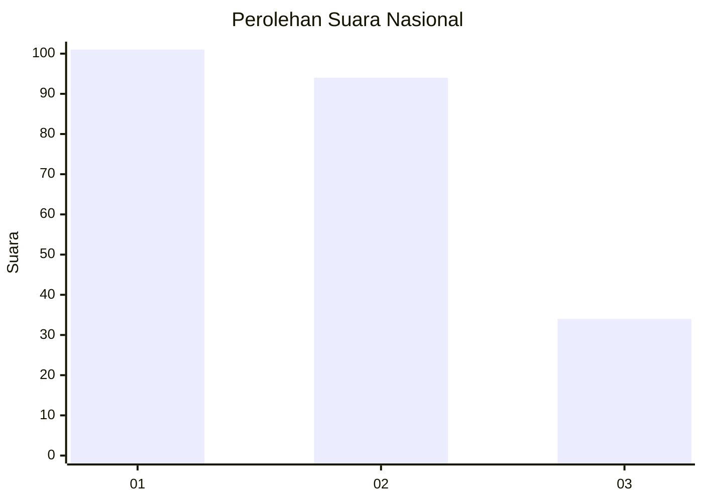
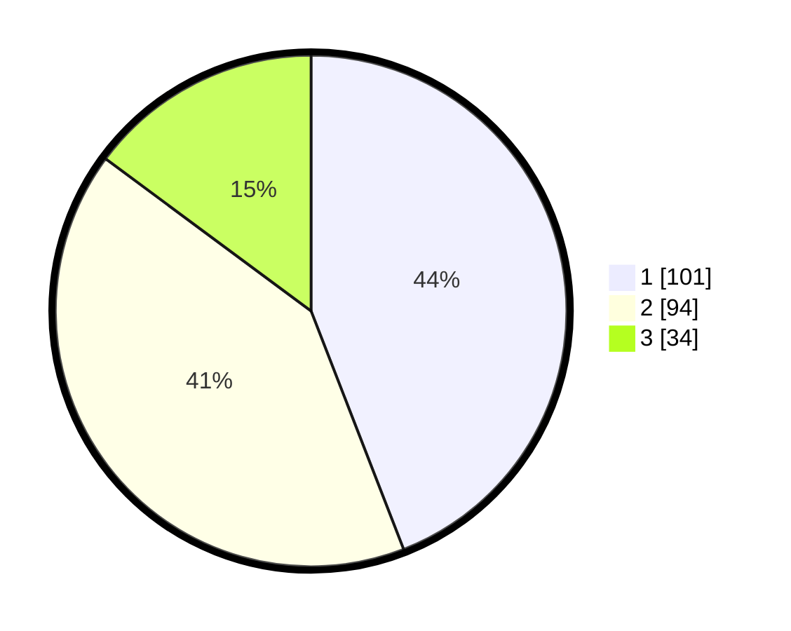

# Hasil

## Grafik

## Tabel

| No.    | Nama Paslon    | Suara | Suara (raw) | Persentase |
|:------ |:-------------- | -----:| -----------:| ----------:|
| 100025 | ANIES MUHAIMIN | 101   | [101][p-1]  | 44,10      |
| 100026 | PRABOWO GIBRAN | 94    | [94][p-2]   | 41,05      |
| 100027 | GANJAR MAHFUD  | 34    | [34][p-3]   | 14,85      |

[p-1]: https://github.com/gigit-pemilu/pemilu-2024/blob/main/pilpres/hitung-suara/sub/31-dki-jakarta/sub/75-jakarta-timur/sub/06-cakung/sub/1005-pulo-gebang/sub/004-tps/sub/paslon-1.txt
[p-2]: https://github.com/gigit-pemilu/pemilu-2024/blob/main/pilpres/hitung-suara/sub/31-dki-jakarta/sub/75-jakarta-timur/sub/06-cakung/sub/1005-pulo-gebang/sub/004-tps/sub/paslon-2.txt
[p-3]: https://github.com/gigit-pemilu/pemilu-2024/blob/main/pilpres/hitung-suara/sub/31-dki-jakarta/sub/75-jakarta-timur/sub/06-cakung/sub/1005-pulo-gebang/sub/004-tps/sub/paslon-3.txt

## Foto C Plano

https://sirekap-obj-formc.kpu.go.id/7b9f/pemilu/ppwp/31/75/06/10/05/3175061005004-20240215-020040--9bf6d03a-e0b0-4d94-ac90-ea6c4b2236cc.jpg

https://sirekap-obj-formc.kpu.go.id/7b9f/pemilu/ppwp/31/75/06/10/05/3175061005004-20240215-020232--1cf7935e-805c-4193-a398-8357a3fd0de6.jpg

https://sirekap-obj-formc.kpu.go.id/7b9f/pemilu/ppwp/31/75/06/10/05/3175061005004-20240215-020407--9579f7aa-9b7b-4714-8421-96e4760b4b20.jpg

## Metadata

| Key        | Value               |
| ---------- | ------------------- |
| Time Stamp | 2024-02-24 22:31:28 |

