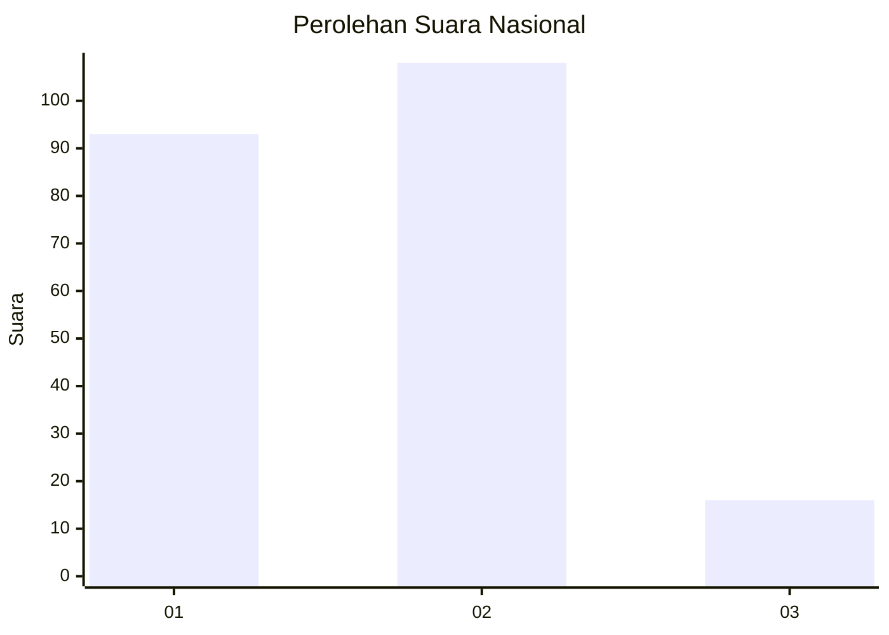
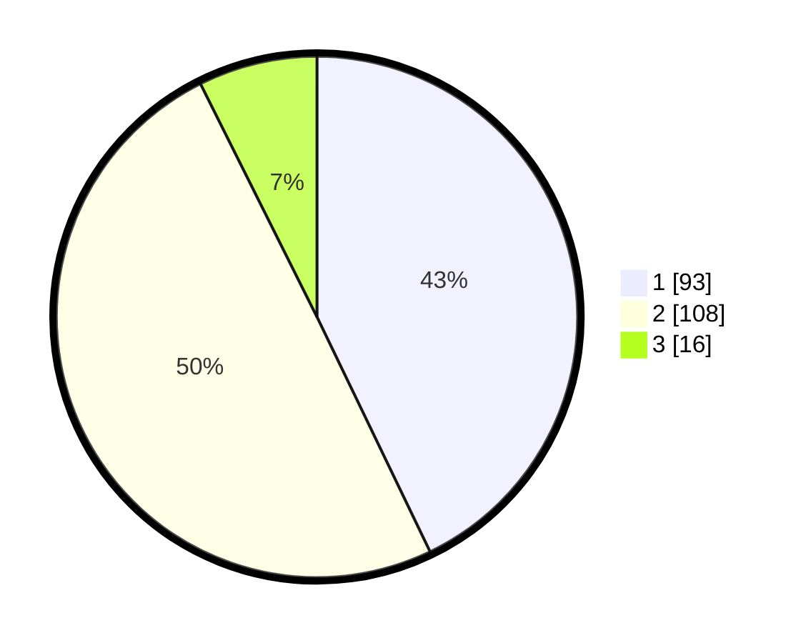

# Hasil

## Grafik

## Tabel

| No.    | Nama Paslon    | Suara | Suara (raw) | Persentase |
|:------ |:-------------- | -----:| -----------:| ----------:|
| 100025 | ANIES MUHAIMIN | 93    | [93][p-1]   | 42,86      |
| 100026 | PRABOWO GIBRAN | 108   | [108][p-2]  | 49,77      |
| 100027 | GANJAR MAHFUD  | 16    | [16][p-3]   | 7,37       |

[p-1]: https://github.com/gigit-pemilu/pemilu-2024/blob/main/pilpres/hitung-suara/sub/31-dki-jakarta/sub/75-jakarta-timur/sub/06-cakung/sub/1005-pulo-gebang/sub/012-tps/sub/paslon-1.txt
[p-2]: https://github.com/gigit-pemilu/pemilu-2024/blob/main/pilpres/hitung-suara/sub/31-dki-jakarta/sub/75-jakarta-timur/sub/06-cakung/sub/1005-pulo-gebang/sub/012-tps/sub/paslon-2.txt
[p-3]: https://github.com/gigit-pemilu/pemilu-2024/blob/main/pilpres/hitung-suara/sub/31-dki-jakarta/sub/75-jakarta-timur/sub/06-cakung/sub/1005-pulo-gebang/sub/012-tps/sub/paslon-3.txt

## Foto C Plano

https://sirekap-obj-formc.kpu.go.id/4f56/pemilu/ppwp/31/75/06/10/05/3175061005012-20240215-022014--e9c754c6-004f-453d-8ac8-f8afef05ee78.jpg

https://sirekap-obj-formc.kpu.go.id/4f56/pemilu/ppwp/31/75/06/10/05/3175061005012-20240215-022512--018fd294-e081-42b1-953f-a33ab97f3ca9.jpg

https://sirekap-obj-formc.kpu.go.id/4f56/pemilu/ppwp/31/75/06/10/05/3175061005012-20240215-022519--8edce8b0-4e62-42ba-b0c9-26aadd087647.jpg

## Metadata

| Key        | Value               |
| ---------- | ------------------- |
| Time Stamp | 2024-02-20 11:00:00 |

