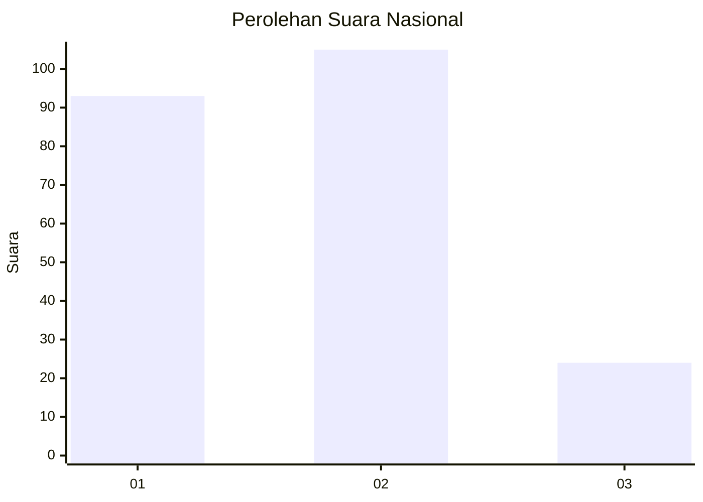
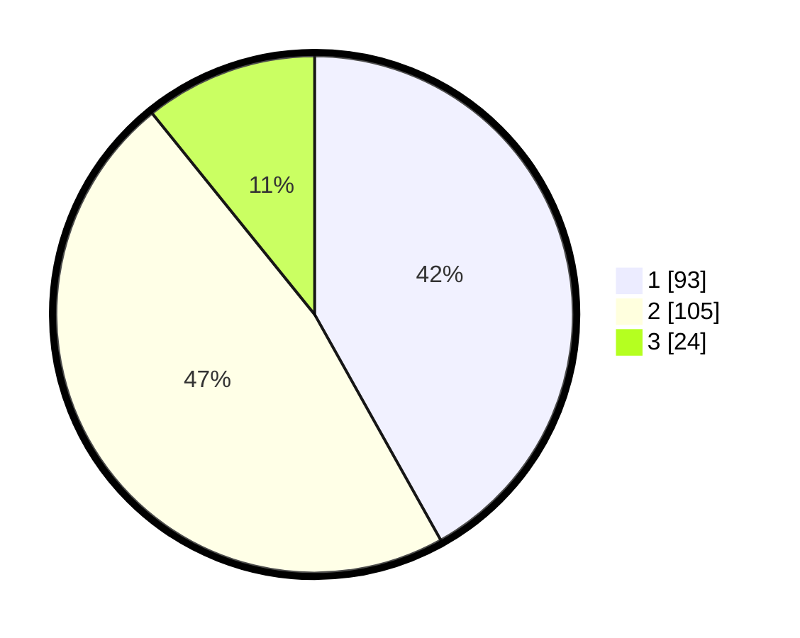

# Hasil

## Grafik

## Tabel

| No.    | Nama Paslon    | Suara | Suara (raw) | Persentase |
|:------ |:-------------- | -----:| -----------:| ----------:|
| 100025 | ANIES MUHAIMIN | 93    | [93][p-1]   | 41,89      |
| 100026 | PRABOWO GIBRAN | 105   | [105][p-2]  | 47,30      |
| 100027 | GANJAR MAHFUD  | 24    | [24][p-3]   | 10,81      |

[p-1]: https://github.com/gigit-pemilu/pemilu-2024/blob/main/pilpres/hitung-suara/sub/31-dki-jakarta/sub/75-jakarta-timur/sub/06-cakung/sub/1005-pulo-gebang/sub/013-tps/sub/paslon-1.txt
[p-2]: https://github.com/gigit-pemilu/pemilu-2024/blob/main/pilpres/hitung-suara/sub/31-dki-jakarta/sub/75-jakarta-timur/sub/06-cakung/sub/1005-pulo-gebang/sub/013-tps/sub/paslon-2.txt
[p-3]: https://github.com/gigit-pemilu/pemilu-2024/blob/main/pilpres/hitung-suara/sub/31-dki-jakarta/sub/75-jakarta-timur/sub/06-cakung/sub/1005-pulo-gebang/sub/013-tps/sub/paslon-3.txt

## Foto C Plano

https://sirekap-obj-formc.kpu.go.id/b613/pemilu/ppwp/31/75/06/10/05/3175061005013-20240214-195249--af3b3649-76da-496c-94d0-02aeb0bbc276.jpg

https://sirekap-obj-formc.kpu.go.id/b613/pemilu/ppwp/31/75/06/10/05/3175061005013-20240214-191856--9fe73f6c-595c-403a-bd65-425c5b17f2a2.jpg

https://sirekap-obj-formc.kpu.go.id/b613/pemilu/ppwp/31/75/06/10/05/3175061005013-20240214-192037--d359aac1-68a0-4100-a459-a9baa962e48a.jpg

## Metadata

| Key        | Value               |
| ---------- | ------------------- |
| Time Stamp | 2024-02-24 22:31:28 |

