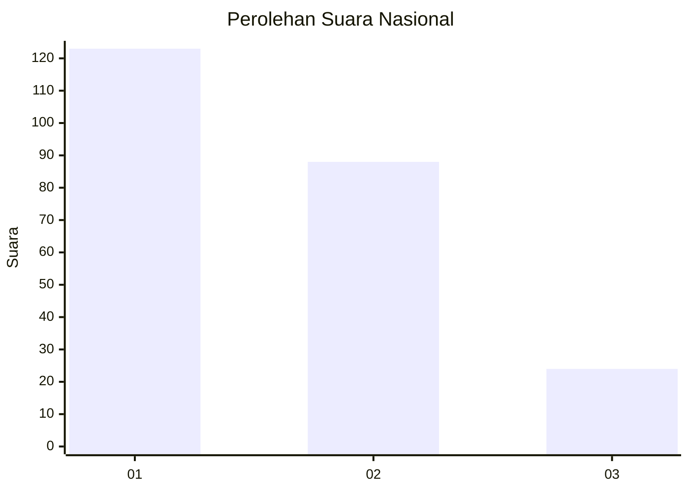
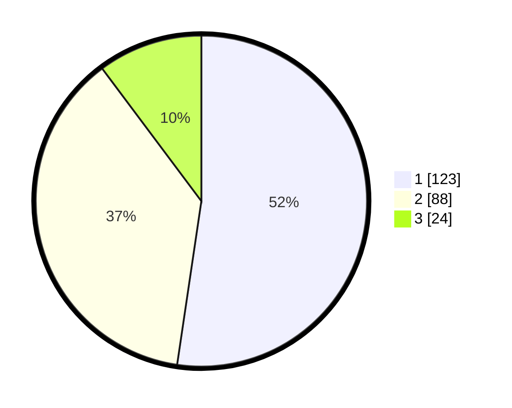

# Hasil

## Grafik

## Tabel

| No.    | Nama Paslon    | Suara | Suara (raw) | Persentase |
|:------ |:-------------- | -----:| -----------:| ----------:|
| 100025 | ANIES MUHAIMIN | 123   | [123][p-1]  | 52,34      |
| 100026 | PRABOWO GIBRAN | 88    | [88][p-2]   | 37,45      |
| 100027 | GANJAR MAHFUD  | 24    | [24][p-3]   | 10,21      |

[p-1]: https://github.com/gigit-pemilu/pemilu-2024/blob/main/pilpres/hitung-suara/sub/31-dki-jakarta/sub/75-jakarta-timur/sub/06-cakung/sub/1005-pulo-gebang/sub/032-tps/sub/paslon-1.txt
[p-2]: https://github.com/gigit-pemilu/pemilu-2024/blob/main/pilpres/hitung-suara/sub/31-dki-jakarta/sub/75-jakarta-timur/sub/06-cakung/sub/1005-pulo-gebang/sub/032-tps/sub/paslon-2.txt
[p-3]: https://github.com/gigit-pemilu/pemilu-2024/blob/main/pilpres/hitung-suara/sub/31-dki-jakarta/sub/75-jakarta-timur/sub/06-cakung/sub/1005-pulo-gebang/sub/032-tps/sub/paslon-3.txt

## Foto C Plano

https://sirekap-obj-formc.kpu.go.id/dbb6/pemilu/ppwp/31/75/06/10/05/3175061005032-20240214-225547--b1157534-b517-4384-a4d7-3ca0a786a162.jpg

https://sirekap-obj-formc.kpu.go.id/dbb6/pemilu/ppwp/31/75/06/10/05/3175061005032-20240214-225922--b6668fd1-8d2c-4f72-81e4-356952902132.jpg

https://sirekap-obj-formc.kpu.go.id/dbb6/pemilu/ppwp/31/75/06/10/05/3175061005032-20240214-230119--be3dfa08-ee8e-4acd-b045-18a8a447e93e.jpg

## Metadata

| Key        | Value               |
| ---------- | ------------------- |
| Time Stamp | 2024-02-19 14:00:00 |

