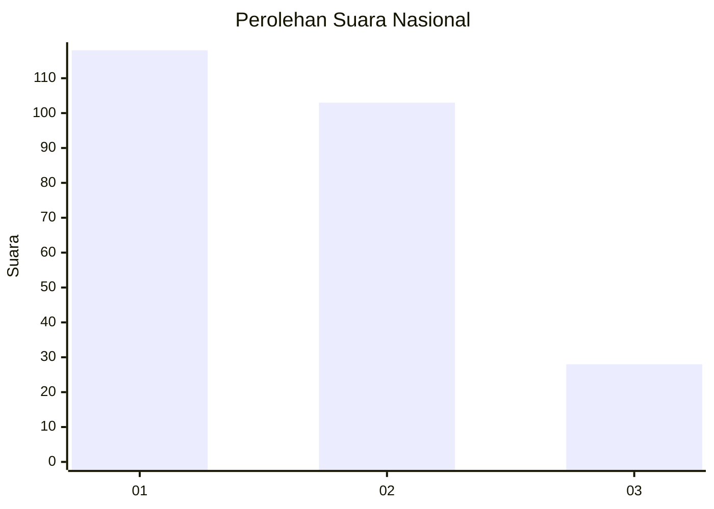
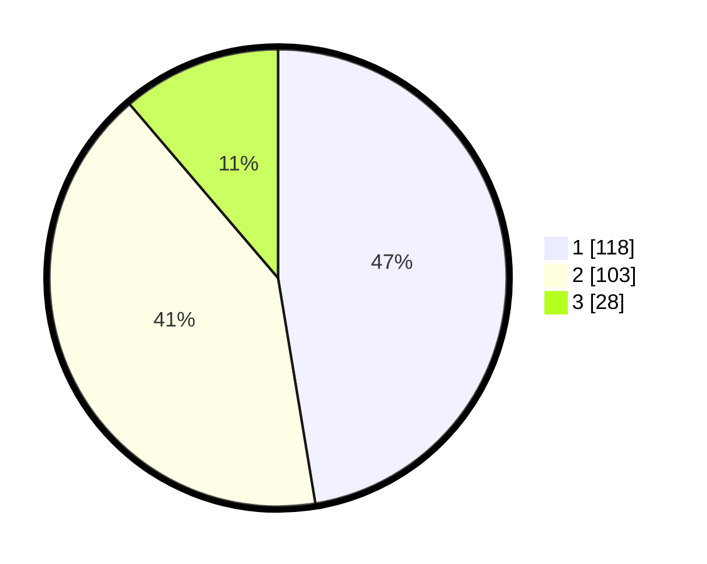

# Hasil

## Grafik

## Tabel

| No.    | Nama Paslon    | Suara | Suara (raw) | Persentase |
|:------ |:-------------- | -----:| -----------:| ----------:|
| 100025 | ANIES MUHAIMIN | 118   | [118][p-1]  | 47,39      |
| 100026 | PRABOWO GIBRAN | 103   | [103][p-2]  | 41,37      |
| 100027 | GANJAR MAHFUD  | 28    | [28][p-3]   | 11,24      |

[p-1]: https://github.com/gigit-pemilu/pemilu-2024/blob/main/pilpres/hitung-suara/sub/31-dki-jakarta/sub/75-jakarta-timur/sub/06-cakung/sub/1005-pulo-gebang/sub/039-tps/sub/paslon-1.txt
[p-2]: https://github.com/gigit-pemilu/pemilu-2024/blob/main/pilpres/hitung-suara/sub/31-dki-jakarta/sub/75-jakarta-timur/sub/06-cakung/sub/1005-pulo-gebang/sub/039-tps/sub/paslon-2.txt
[p-3]: https://github.com/gigit-pemilu/pemilu-2024/blob/main/pilpres/hitung-suara/sub/31-dki-jakarta/sub/75-jakarta-timur/sub/06-cakung/sub/1005-pulo-gebang/sub/039-tps/sub/paslon-3.txt

## Foto C Plano

https://sirekap-obj-formc.kpu.go.id/8079/pemilu/ppwp/31/75/06/10/05/3175061005039-20240214-234149--a3a7caf7-23cf-4b52-8875-8edcb1a31472.jpg

https://sirekap-obj-formc.kpu.go.id/8079/pemilu/ppwp/31/75/06/10/05/3175061005039-20240214-234505--93e16a87-58fd-450f-ad56-e956a4943b3f.jpg

https://sirekap-obj-formc.kpu.go.id/8079/pemilu/ppwp/31/75/06/10/05/3175061005039-20240214-234704--b13c1a97-0842-44f5-9b87-c6d1b503f76a.jpg

## Metadata

| Key        | Value               |
| ---------- | ------------------- |
| Time Stamp | 2024-02-20 11:00:00 |

