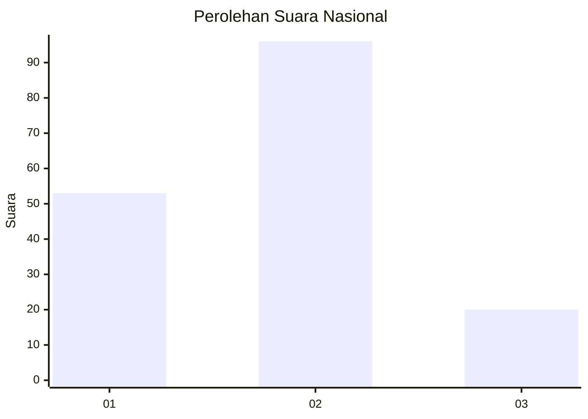
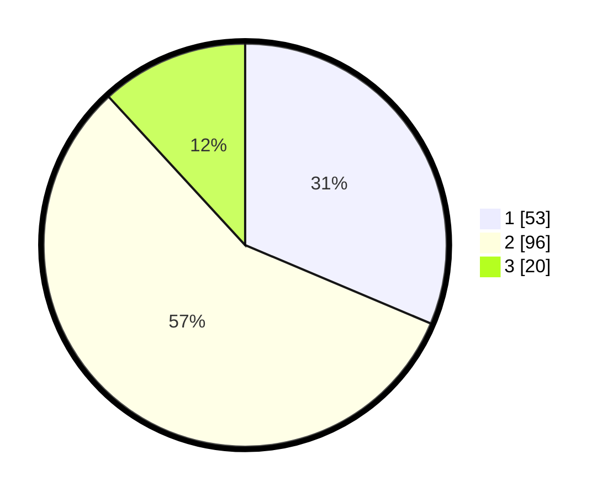

# Hasil

## Grafik

## Tabel

| No.    | Nama Paslon    | Suara | Suara (raw) | Persentase |
|:------ |:-------------- | -----:| -----------:| ----------:|
| 100025 | ANIES MUHAIMIN | 53    | [53][p-1]   | 31,36      |
| 100026 | PRABOWO GIBRAN | 96    | [96][p-2]   | 56,80      |
| 100027 | GANJAR MAHFUD  | 20    | [20][p-3]   | 11,83      |

[p-1]: https://github.com/gigit-pemilu/pemilu-2024/blob/main/pilpres/hitung-suara/sub/31-dki-jakarta/sub/75-jakarta-timur/sub/06-cakung/sub/1005-pulo-gebang/sub/042-tps/sub/paslon-1.txt
[p-2]: https://github.com/gigit-pemilu/pemilu-2024/blob/main/pilpres/hitung-suara/sub/31-dki-jakarta/sub/75-jakarta-timur/sub/06-cakung/sub/1005-pulo-gebang/sub/042-tps/sub/paslon-2.txt
[p-3]: https://github.com/gigit-pemilu/pemilu-2024/blob/main/pilpres/hitung-suara/sub/31-dki-jakarta/sub/75-jakarta-timur/sub/06-cakung/sub/1005-pulo-gebang/sub/042-tps/sub/paslon-3.txt

## Foto C Plano

https://sirekap-obj-formc.kpu.go.id/e170/pemilu/ppwp/31/75/06/10/05/3175061005042-20240214-221841--c96403fe-bd4e-440d-b047-0a115d7b488f.jpg

https://sirekap-obj-formc.kpu.go.id/e170/pemilu/ppwp/31/75/06/10/05/3175061005042-20240214-221946--917f0826-87b5-43be-bfc6-6e4535dfcc46.jpg

https://sirekap-obj-formc.kpu.go.id/e170/pemilu/ppwp/31/75/06/10/05/3175061005042-20240214-222033--7af73c1d-1b31-4a05-ad8e-5b1618229569.jpg

## Metadata

| Key        | Value               |
| ---------- | ------------------- |
| Time Stamp | 2024-02-24 22:31:28 |

