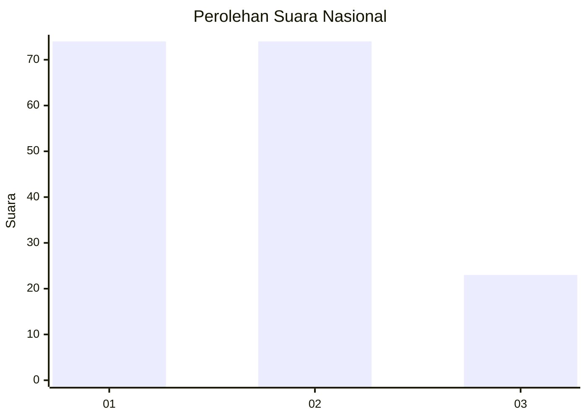
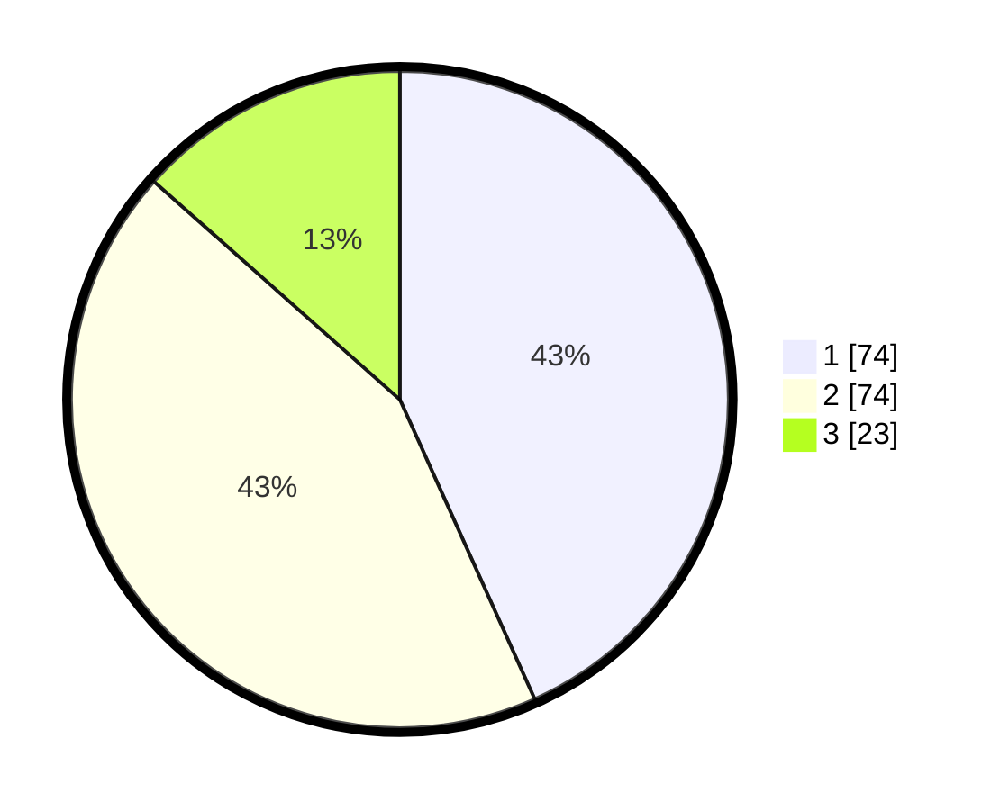

# Hasil

## Grafik

## Tabel

| No.    | Nama Paslon    | Suara | Suara (raw) | Persentase |
|:------ |:-------------- | -----:| -----------:| ----------:|
| 100025 | ANIES MUHAIMIN | 74    | [74][p-1]   | 43,27      |
| 100026 | PRABOWO GIBRAN | 74    | [74][p-2]   | 43,27      |
| 100027 | GANJAR MAHFUD  | 23    | [23][p-3]   | 13,45      |

[p-1]: https://github.com/gigit-pemilu/pemilu-2024/blob/main/pilpres/hitung-suara/sub/31-dki-jakarta/sub/75-jakarta-timur/sub/06-cakung/sub/1005-pulo-gebang/sub/043-tps/sub/paslon-1.txt
[p-2]: https://github.com/gigit-pemilu/pemilu-2024/blob/main/pilpres/hitung-suara/sub/31-dki-jakarta/sub/75-jakarta-timur/sub/06-cakung/sub/1005-pulo-gebang/sub/043-tps/sub/paslon-2.txt
[p-3]: https://github.com/gigit-pemilu/pemilu-2024/blob/main/pilpres/hitung-suara/sub/31-dki-jakarta/sub/75-jakarta-timur/sub/06-cakung/sub/1005-pulo-gebang/sub/043-tps/sub/paslon-3.txt

## Foto C Plano

https://sirekap-obj-formc.kpu.go.id/eb00/pemilu/ppwp/31/75/06/10/05/3175061005043-20240214-233048--af0a3978-6257-4a57-81a6-39037b4811c2.jpg

https://sirekap-obj-formc.kpu.go.id/eb00/pemilu/ppwp/31/75/06/10/05/3175061005043-20240214-233331--27b54f0b-1d8b-48a7-80b4-f62b9bfa9c7a.jpg

https://sirekap-obj-formc.kpu.go.id/eb00/pemilu/ppwp/31/75/06/10/05/3175061005043-20240214-233430--ddd6e358-586a-4a06-bcf3-b0c50d1e8c1c.jpg

## Metadata

| Key        | Value               |
| ---------- | ------------------- |
| Time Stamp | 2024-02-24 22:31:28 |

