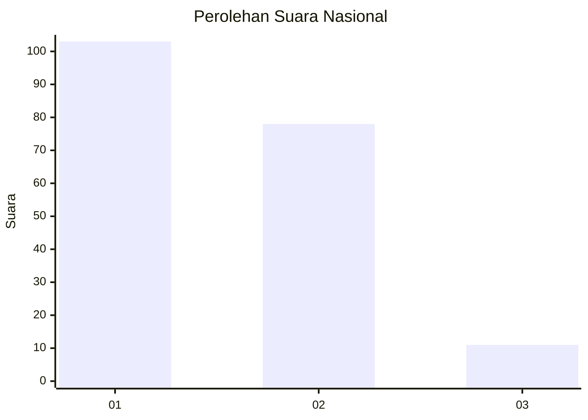
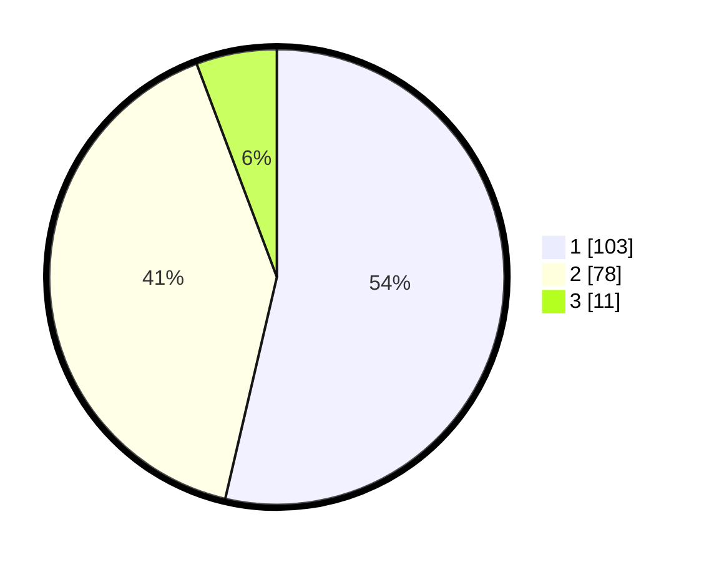

# Hasil

## Grafik

## Tabel

| No.    | Nama Paslon    | Suara | Suara (raw) | Persentase |
|:------ |:-------------- | -----:| -----------:| ----------:|
| 100025 | ANIES MUHAIMIN | 103   | [103][p-1]  | 53,65      |
| 100026 | PRABOWO GIBRAN | 78    | [78][p-2]   | 40,63      |
| 100027 | GANJAR MAHFUD  | 11    | [11][p-3]   | 5,73       |

[p-1]: https://github.com/gigit-pemilu/pemilu-2024/blob/main/pilpres/hitung-suara/sub/31-dki-jakarta/sub/75-jakarta-timur/sub/06-cakung/sub/1005-pulo-gebang/sub/053-tps/sub/paslon-1.txt
[p-2]: https://github.com/gigit-pemilu/pemilu-2024/blob/main/pilpres/hitung-suara/sub/31-dki-jakarta/sub/75-jakarta-timur/sub/06-cakung/sub/1005-pulo-gebang/sub/053-tps/sub/paslon-2.txt
[p-3]: https://github.com/gigit-pemilu/pemilu-2024/blob/main/pilpres/hitung-suara/sub/31-dki-jakarta/sub/75-jakarta-timur/sub/06-cakung/sub/1005-pulo-gebang/sub/053-tps/sub/paslon-3.txt

## Foto C Plano

https://sirekap-obj-formc.kpu.go.id/af37/pemilu/ppwp/31/75/06/10/05/3175061005053-20240214-215212--76e0bf9e-fd99-4ce9-be82-400200855c5b.jpg

https://sirekap-obj-formc.kpu.go.id/af37/pemilu/ppwp/31/75/06/10/05/3175061005053-20240214-215942--b11ffa65-04cc-4695-914e-0f8e1d74b8c4.jpg

https://sirekap-obj-formc.kpu.go.id/af37/pemilu/ppwp/31/75/06/10/05/3175061005053-20240214-220044--1155eda7-355a-4045-8581-d36f6904c2c4.jpg

## Metadata

| Key        | Value               |
| ---------- | ------------------- |
| Time Stamp | 2024-02-25 12:00:00 |

