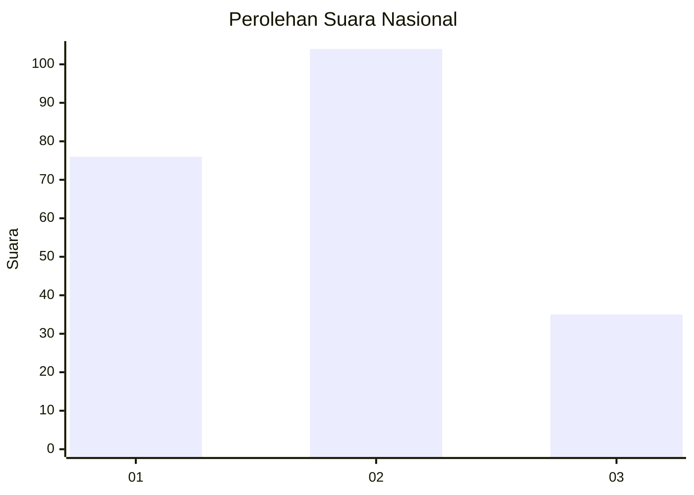
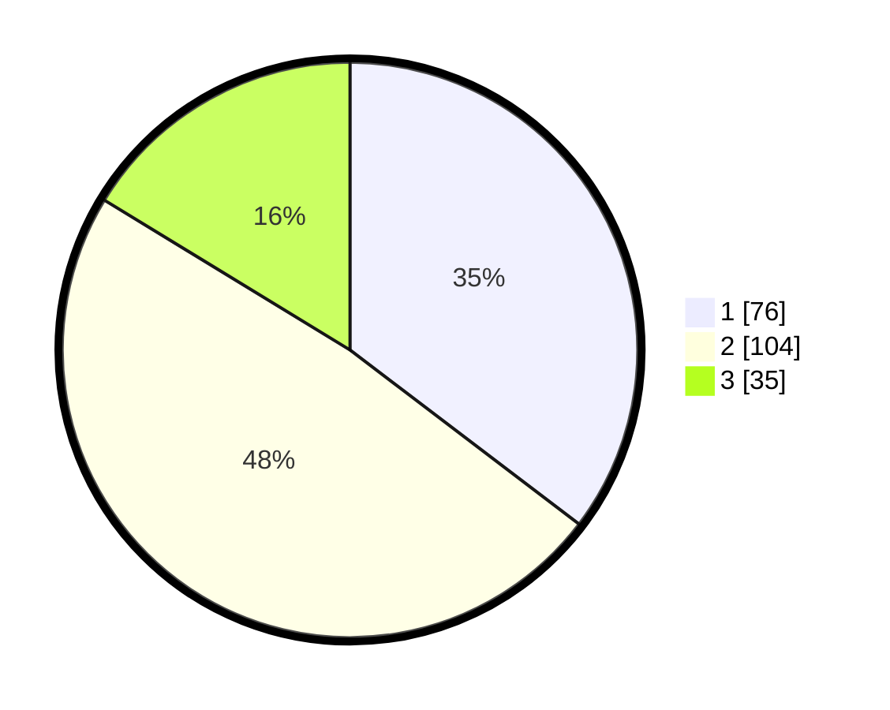

# Hasil

## Grafik

## Tabel

| No.    | Nama Paslon    | Suara | Suara (raw) | Persentase |
|:------ |:-------------- | -----:| -----------:| ----------:|
| 100025 | ANIES MUHAIMIN | 76    | [76][p-1]   | 35,35      |
| 100026 | PRABOWO GIBRAN | 104   | [104][p-2]  | 48,37      |
| 100027 | GANJAR MAHFUD  | 35    | [35][p-3]   | 16,28      |

[p-1]: https://github.com/gigit-pemilu/pemilu-2024/blob/main/pilpres/hitung-suara/sub/31-dki-jakarta/sub/75-jakarta-timur/sub/06-cakung/sub/1005-pulo-gebang/sub/056-tps/sub/paslon-1.txt
[p-2]: https://github.com/gigit-pemilu/pemilu-2024/blob/main/pilpres/hitung-suara/sub/31-dki-jakarta/sub/75-jakarta-timur/sub/06-cakung/sub/1005-pulo-gebang/sub/056-tps/sub/paslon-2.txt
[p-3]: https://github.com/gigit-pemilu/pemilu-2024/blob/main/pilpres/hitung-suara/sub/31-dki-jakarta/sub/75-jakarta-timur/sub/06-cakung/sub/1005-pulo-gebang/sub/056-tps/sub/paslon-3.txt

## Foto C Plano

https://sirekap-obj-formc.kpu.go.id/e0c9/pemilu/ppwp/31/75/06/10/05/3175061005056-20240214-205730--c054ed41-fc97-4db7-a622-7dc67eb03478.jpg

https://sirekap-obj-formc.kpu.go.id/e0c9/pemilu/ppwp/31/75/06/10/05/3175061005056-20240214-210044--0f145cc7-dbdf-4561-9ecc-b00d8f6a44ec.jpg

https://sirekap-obj-formc.kpu.go.id/e0c9/pemilu/ppwp/31/75/06/10/05/3175061005056-20240214-203438--d12f1b94-0f3e-43a9-8bc1-ab0736ed8ed7.jpg

## Metadata

| Key        | Value               |
| ---------- | ------------------- |
| Time Stamp | 2024-02-15 00:41:44 |

