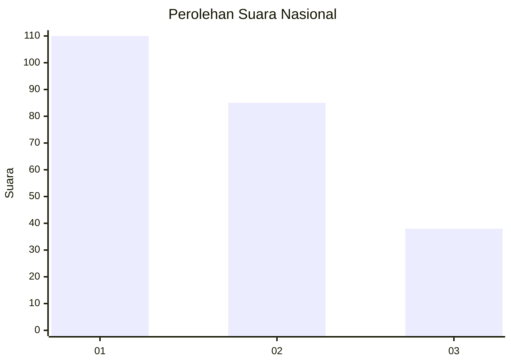
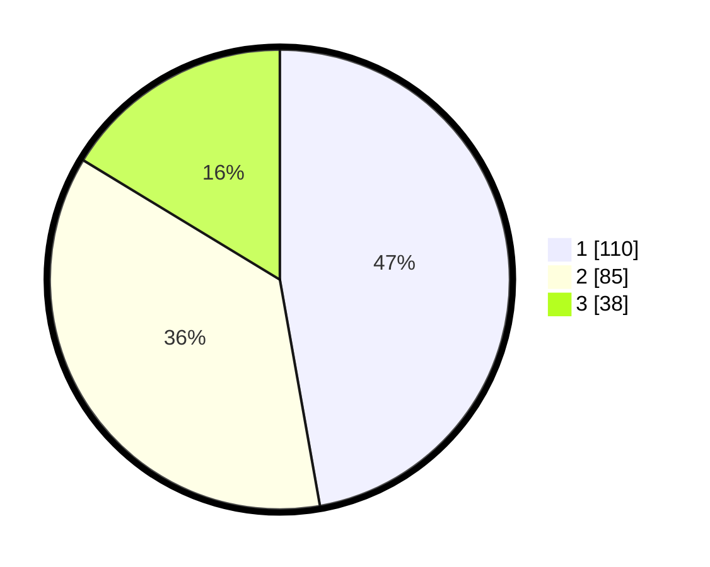

# Hasil

## Grafik

## Tabel

| No.    | Nama Paslon    | Suara | Suara (raw) | Persentase |
|:------ |:-------------- | -----:| -----------:| ----------:|
| 100025 | ANIES MUHAIMIN | 110   | [110][p-1]  | 47,21      |
| 100026 | PRABOWO GIBRAN | 85    | [85][p-2]   | 36,48      |
| 100027 | GANJAR MAHFUD  | 38    | [38][p-3]   | 16,31      |

[p-1]: https://github.com/gigit-pemilu/pemilu-2024/blob/main/pilpres/hitung-suara/sub/31-dki-jakarta/sub/75-jakarta-timur/sub/06-cakung/sub/1005-pulo-gebang/sub/057-tps/sub/paslon-1.txt
[p-2]: https://github.com/gigit-pemilu/pemilu-2024/blob/main/pilpres/hitung-suara/sub/31-dki-jakarta/sub/75-jakarta-timur/sub/06-cakung/sub/1005-pulo-gebang/sub/057-tps/sub/paslon-2.txt
[p-3]: https://github.com/gigit-pemilu/pemilu-2024/blob/main/pilpres/hitung-suara/sub/31-dki-jakarta/sub/75-jakarta-timur/sub/06-cakung/sub/1005-pulo-gebang/sub/057-tps/sub/paslon-3.txt

## Foto C Plano

https://sirekap-obj-formc.kpu.go.id/7173/pemilu/ppwp/31/75/06/10/05/3175061005057-20240214-225616--eb1c2501-9cb5-46e9-9ad3-a100fe55a46a.jpg

https://sirekap-obj-formc.kpu.go.id/7173/pemilu/ppwp/31/75/06/10/05/3175061005057-20240214-225720--39693bac-b0fa-4744-b930-af7334bbe932.jpg

https://sirekap-obj-formc.kpu.go.id/7173/pemilu/ppwp/31/75/06/10/05/3175061005057-20240214-225814--b119f3c5-250d-4cf7-8737-21b5f53459cb.jpg

## Metadata

| Key        | Value               |
| ---------- | ------------------- |
| Time Stamp | 2024-02-27 16:00:00 |

