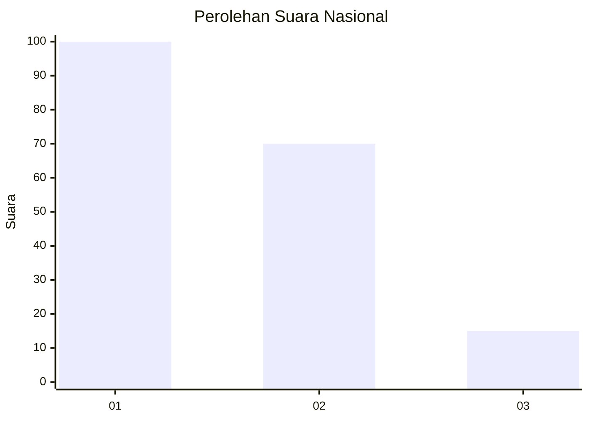
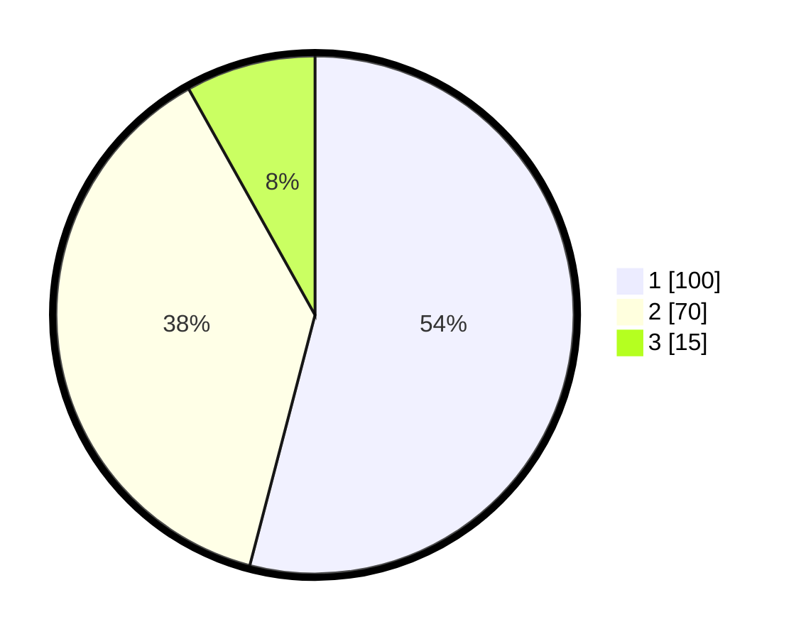

# Hasil

## Grafik

## Tabel

| No.    | Nama Paslon    | Suara | Suara (raw) | Persentase |
|:------ |:-------------- | -----:| -----------:| ----------:|
| 100025 | ANIES MUHAIMIN | 100   | [100][p-1]  | 54,05      |
| 100026 | PRABOWO GIBRAN | 70    | [70][p-2]   | 37,84      |
| 100027 | GANJAR MAHFUD  | 15    | [15][p-3]   | 8,11       |

[p-1]: https://github.com/gigit-pemilu/pemilu-2024/blob/main/pilpres/hitung-suara/sub/31-dki-jakarta/sub/75-jakarta-timur/sub/06-cakung/sub/1005-pulo-gebang/sub/058-tps/sub/paslon-1.txt
[p-2]: https://github.com/gigit-pemilu/pemilu-2024/blob/main/pilpres/hitung-suara/sub/31-dki-jakarta/sub/75-jakarta-timur/sub/06-cakung/sub/1005-pulo-gebang/sub/058-tps/sub/paslon-2.txt
[p-3]: https://github.com/gigit-pemilu/pemilu-2024/blob/main/pilpres/hitung-suara/sub/31-dki-jakarta/sub/75-jakarta-timur/sub/06-cakung/sub/1005-pulo-gebang/sub/058-tps/sub/paslon-3.txt

## Foto C Plano

https://sirekap-obj-formc.kpu.go.id/3c02/pemilu/ppwp/31/75/06/10/05/3175061005058-20240214-224416--847648f6-3156-4625-9670-94079c94285c.jpg

https://sirekap-obj-formc.kpu.go.id/3c02/pemilu/ppwp/31/75/06/10/05/3175061005058-20240214-224642--511d87ed-5a51-4940-9cdb-f1e8badf47b5.jpg

https://sirekap-obj-formc.kpu.go.id/3c02/pemilu/ppwp/31/75/06/10/05/3175061005058-20240214-225250--04c10461-fd8a-4c9b-acbc-3265e12c1417.jpg

## Metadata

| Key        | Value               |
| ---------- | ------------------- |
| Time Stamp | 2024-02-19 14:00:00 |

