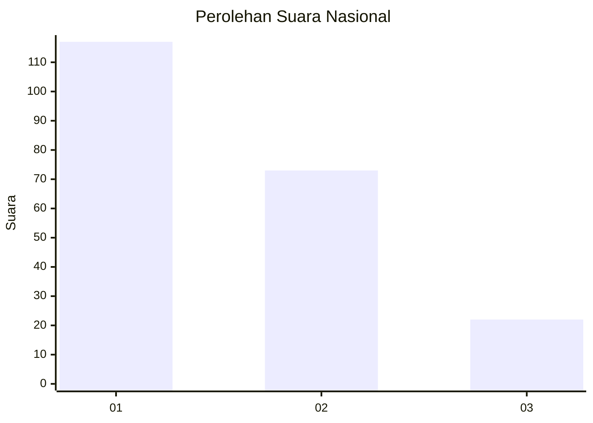
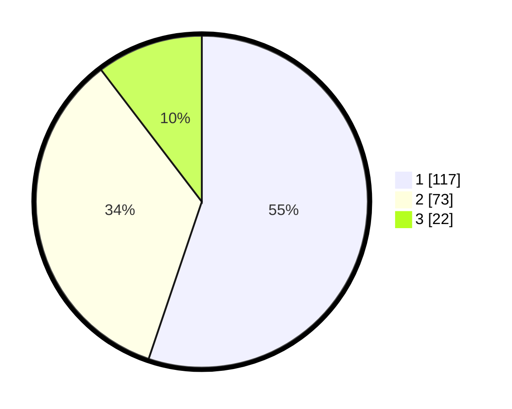

# Hasil

## Grafik

## Tabel

| No.    | Nama Paslon    | Suara | Suara (raw) | Persentase |
|:------ |:-------------- | -----:| -----------:| ----------:|
| 100025 | ANIES MUHAIMIN | 117   | [117][p-1]  | 55,19      |
| 100026 | PRABOWO GIBRAN | 73    | [73][p-2]   | 34,43      |
| 100027 | GANJAR MAHFUD  | 22    | [22][p-3]   | 10,38      |

[p-1]: https://github.com/gigit-pemilu/pemilu-2024/blob/main/pilpres/hitung-suara/sub/31-dki-jakarta/sub/75-jakarta-timur/sub/06-cakung/sub/1005-pulo-gebang/sub/069-tps/sub/paslon-1.txt
[p-2]: https://github.com/gigit-pemilu/pemilu-2024/blob/main/pilpres/hitung-suara/sub/31-dki-jakarta/sub/75-jakarta-timur/sub/06-cakung/sub/1005-pulo-gebang/sub/069-tps/sub/paslon-2.txt
[p-3]: https://github.com/gigit-pemilu/pemilu-2024/blob/main/pilpres/hitung-suara/sub/31-dki-jakarta/sub/75-jakarta-timur/sub/06-cakung/sub/1005-pulo-gebang/sub/069-tps/sub/paslon-3.txt

## Foto C Plano

https://sirekap-obj-formc.kpu.go.id/442c/pemilu/ppwp/31/75/06/10/05/3175061005069-20240214-225714--b80f4c33-bfcc-4579-81b8-cbe09fdfaede.jpg

https://sirekap-obj-formc.kpu.go.id/442c/pemilu/ppwp/31/75/06/10/05/3175061005069-20240214-225814--10735c97-c6af-4244-be8e-769322510205.jpg

https://sirekap-obj-formc.kpu.go.id/442c/pemilu/ppwp/31/75/06/10/05/3175061005069-20240214-225921--44ecfa3f-1a11-45c2-9d9f-fc644911b44e.jpg

## Metadata

| Key        | Value               |
| ---------- | ------------------- |
| Time Stamp | 2024-02-19 14:00:00 |

