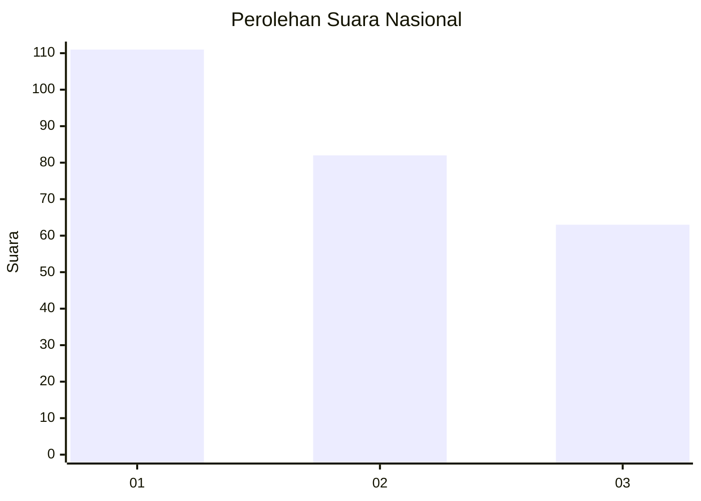
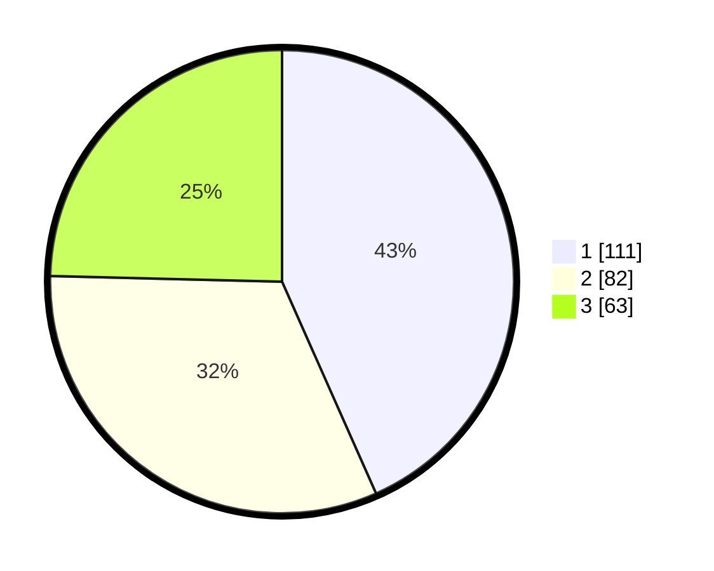

# Hasil

## Grafik

## Tabel

| No.    | Nama Paslon    | Suara | Suara (raw) | Persentase |
|:------ |:-------------- | -----:| -----------:| ----------:|
| 100025 | ANIES MUHAIMIN | 111   | [111][p-1]  | 43,36      |
| 100026 | PRABOWO GIBRAN | 82    | [82][p-2]   | 32,03      |
| 100027 | GANJAR MAHFUD  | 63    | [63][p-3]   | 24,61      |

[p-1]: https://github.com/gigit-pemilu/pemilu-2024/blob/main/pilpres/hitung-suara/sub/31-dki-jakarta/sub/75-jakarta-timur/sub/06-cakung/sub/1005-pulo-gebang/sub/074-tps/sub/paslon-1.txt
[p-2]: https://github.com/gigit-pemilu/pemilu-2024/blob/main/pilpres/hitung-suara/sub/31-dki-jakarta/sub/75-jakarta-timur/sub/06-cakung/sub/1005-pulo-gebang/sub/074-tps/sub/paslon-2.txt
[p-3]: https://github.com/gigit-pemilu/pemilu-2024/blob/main/pilpres/hitung-suara/sub/31-dki-jakarta/sub/75-jakarta-timur/sub/06-cakung/sub/1005-pulo-gebang/sub/074-tps/sub/paslon-3.txt

## Foto C Plano

https://sirekap-obj-formc.kpu.go.id/f596/pemilu/ppwp/31/75/06/10/05/3175061005074-20240215-004618--28ed8d41-c2f9-4795-939e-39a1e859f709.jpg

https://sirekap-obj-formc.kpu.go.id/f596/pemilu/ppwp/31/75/06/10/05/3175061005074-20240215-004738--ef036446-8f52-4078-9984-1d84001ba947.jpg

https://sirekap-obj-formc.kpu.go.id/f596/pemilu/ppwp/31/75/06/10/05/3175061005074-20240215-004829--91feb108-8e61-4be8-8bab-7a5bd3155939.jpg

## Metadata

| Key        | Value               |
| ---------- | ------------------- |
| Time Stamp | 2024-02-25 14:00:00 |

