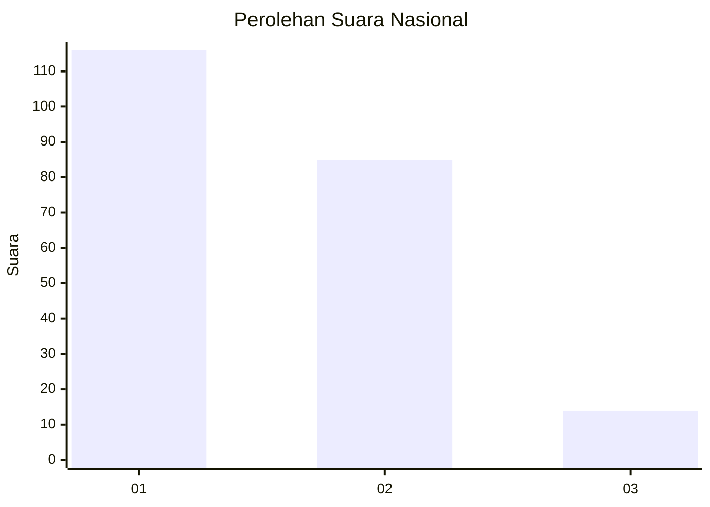
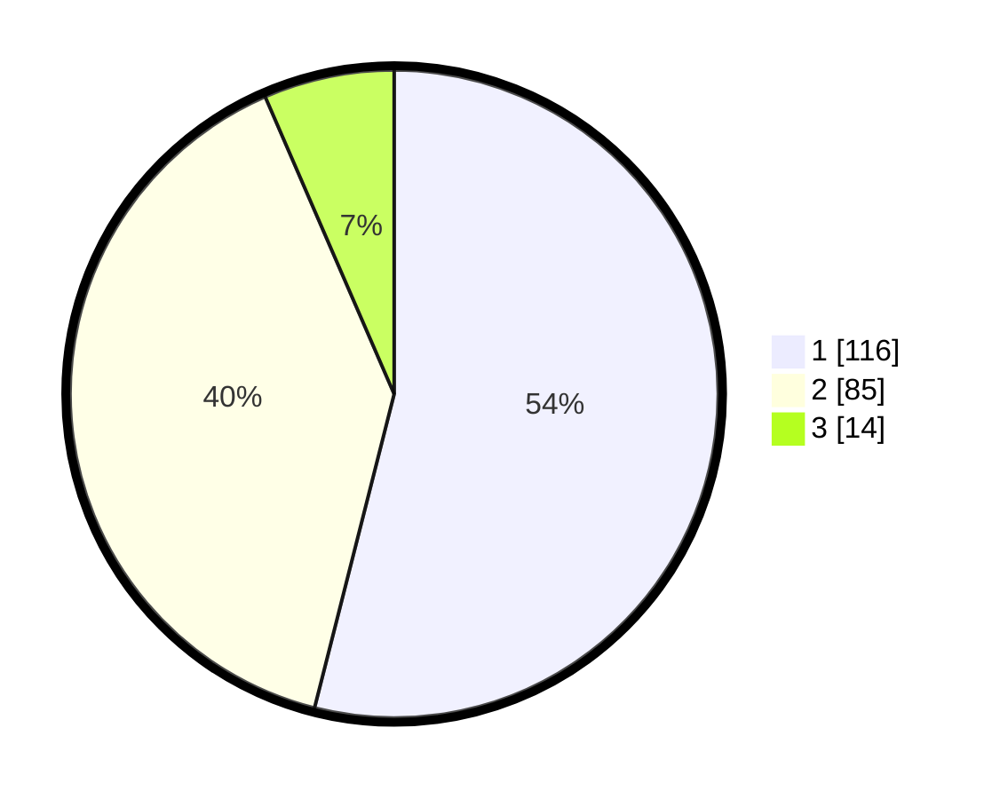

# Hasil

## Grafik

## Tabel

| No.    | Nama Paslon    | Suara | Suara (raw) | Persentase |
|:------ |:-------------- | -----:| -----------:| ----------:|
| 100025 | ANIES MUHAIMIN | 116   | [116][p-1]  | 53,95      |
| 100026 | PRABOWO GIBRAN | 85    | [85][p-2]   | 39,53      |
| 100027 | GANJAR MAHFUD  | 14    | [14][p-3]   | 6,51       |

[p-1]: https://github.com/gigit-pemilu/pemilu-2024/blob/main/pilpres/hitung-suara/sub/31-dki-jakarta/sub/75-jakarta-timur/sub/06-cakung/sub/1005-pulo-gebang/sub/076-tps/sub/paslon-1.txt
[p-2]: https://github.com/gigit-pemilu/pemilu-2024/blob/main/pilpres/hitung-suara/sub/31-dki-jakarta/sub/75-jakarta-timur/sub/06-cakung/sub/1005-pulo-gebang/sub/076-tps/sub/paslon-2.txt
[p-3]: https://github.com/gigit-pemilu/pemilu-2024/blob/main/pilpres/hitung-suara/sub/31-dki-jakarta/sub/75-jakarta-timur/sub/06-cakung/sub/1005-pulo-gebang/sub/076-tps/sub/paslon-3.txt

## Foto C Plano

https://sirekap-obj-formc.kpu.go.id/0287/pemilu/ppwp/31/75/06/10/05/3175061005076-20240214-230740--db6df846-e6dd-4460-b10f-df80cb851ef5.jpg

https://sirekap-obj-formc.kpu.go.id/0287/pemilu/ppwp/31/75/06/10/05/3175061005076-20240214-231121--a761a235-bb20-4bce-a848-ff941a9d02d0.jpg

https://sirekap-obj-formc.kpu.go.id/0287/pemilu/ppwp/31/75/06/10/05/3175061005076-20240214-231200--2b67b32c-b612-4d0e-adbc-bfa47baabb1d.jpg

## Metadata

| Key        | Value               |
| ---------- | ------------------- |
| Time Stamp | 2024-02-19 14:00:00 |

