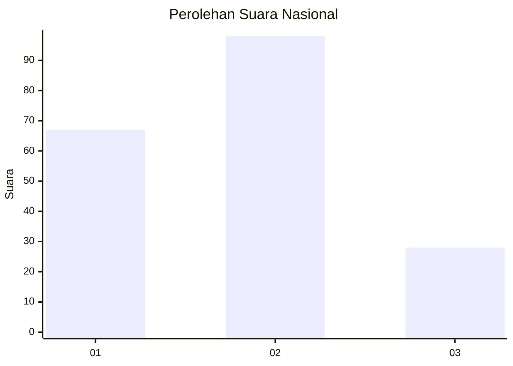
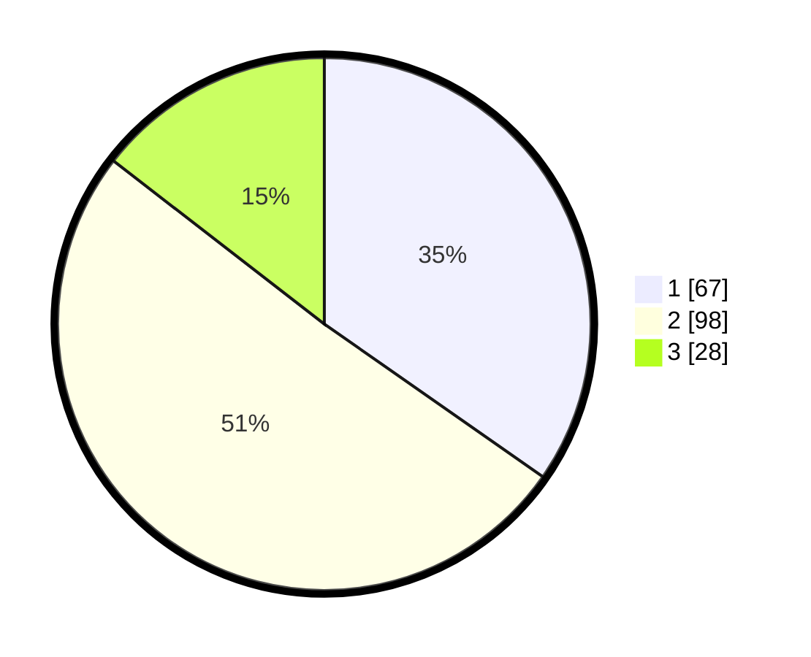

# Hasil

## Grafik

## Tabel

| No.    | Nama Paslon    | Suara | Suara (raw) | Persentase |
|:------ |:-------------- | -----:| -----------:| ----------:|
| 100025 | ANIES MUHAIMIN | 67    | [67][p-1]   | 34,72      |
| 100026 | PRABOWO GIBRAN | 98    | [98][p-2]   | 50,78      |
| 100027 | GANJAR MAHFUD  | 28    | [28][p-3]   | 14,51      |

[p-1]: https://github.com/gigit-pemilu/pemilu-2024/blob/main/pilpres/hitung-suara/sub/31-dki-jakarta/sub/75-jakarta-timur/sub/06-cakung/sub/1005-pulo-gebang/sub/083-tps/sub/paslon-1.txt
[p-2]: https://github.com/gigit-pemilu/pemilu-2024/blob/main/pilpres/hitung-suara/sub/31-dki-jakarta/sub/75-jakarta-timur/sub/06-cakung/sub/1005-pulo-gebang/sub/083-tps/sub/paslon-2.txt
[p-3]: https://github.com/gigit-pemilu/pemilu-2024/blob/main/pilpres/hitung-suara/sub/31-dki-jakarta/sub/75-jakarta-timur/sub/06-cakung/sub/1005-pulo-gebang/sub/083-tps/sub/paslon-3.txt

## Foto C Plano

https://sirekap-obj-formc.kpu.go.id/2952/pemilu/ppwp/31/75/06/10/05/3175061005083-20240214-215959--f9f07fea-dd2e-4fb6-a2c1-2c3ce3bcdda8.jpg

https://sirekap-obj-formc.kpu.go.id/2952/pemilu/ppwp/31/75/06/10/05/3175061005083-20240214-220003--c8897b0f-c30d-4908-8c47-f62bd1a2cdae.jpg

https://sirekap-obj-formc.kpu.go.id/2952/pemilu/ppwp/31/75/06/10/05/3175061005083-20240214-220008--1f9f1a2f-bc05-4425-8978-8f8e26b3696c.jpg

## Metadata

| Key        | Value               |
| ---------- | ------------------- |
| Time Stamp | 2024-02-24 22:31:28 |

