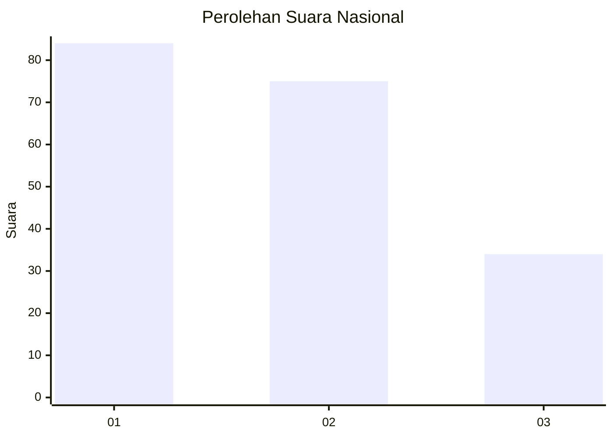
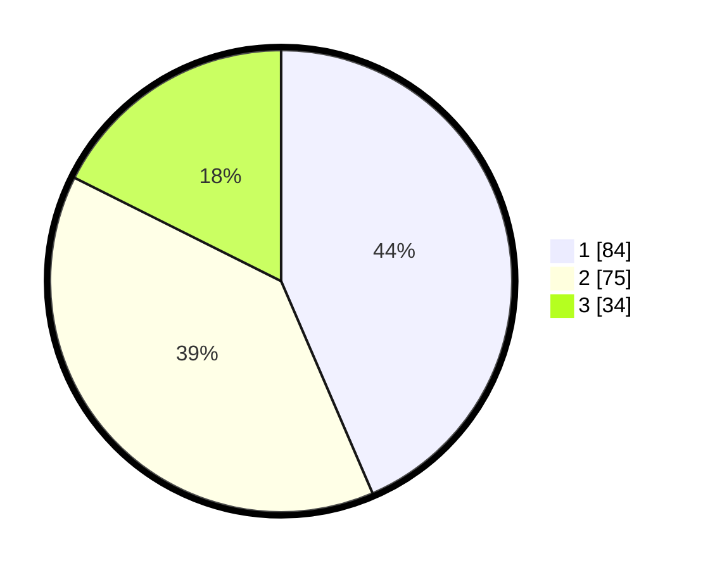

# Hasil

## Grafik

## Tabel

| No.    | Nama Paslon    | Suara | Suara (raw) | Persentase |
|:------ |:-------------- | -----:| -----------:| ----------:|
| 100025 | ANIES MUHAIMIN | 84    | [84][p-1]   | 43,52      |
| 100026 | PRABOWO GIBRAN | 75    | [75][p-2]   | 38,86      |
| 100027 | GANJAR MAHFUD  | 34    | [34][p-3]   | 17,62      |

[p-1]: https://github.com/gigit-pemilu/pemilu-2024/blob/main/pilpres/hitung-suara/sub/31-dki-jakarta/sub/75-jakarta-timur/sub/06-cakung/sub/1005-pulo-gebang/sub/084-tps/sub/paslon-1.txt
[p-2]: https://github.com/gigit-pemilu/pemilu-2024/blob/main/pilpres/hitung-suara/sub/31-dki-jakarta/sub/75-jakarta-timur/sub/06-cakung/sub/1005-pulo-gebang/sub/084-tps/sub/paslon-2.txt
[p-3]: https://github.com/gigit-pemilu/pemilu-2024/blob/main/pilpres/hitung-suara/sub/31-dki-jakarta/sub/75-jakarta-timur/sub/06-cakung/sub/1005-pulo-gebang/sub/084-tps/sub/paslon-3.txt

## Foto C Plano

https://sirekap-obj-formc.kpu.go.id/6298/pemilu/ppwp/31/75/06/10/05/3175061005084-20240214-191500--78e36955-d372-46b7-807d-cfd1b33f1e5e.jpg

https://sirekap-obj-formc.kpu.go.id/6298/pemilu/ppwp/31/75/06/10/05/3175061005084-20240214-191508--d0011ab1-8d10-4c79-93b2-979b26d7e0f5.jpg

https://sirekap-obj-formc.kpu.go.id/6298/pemilu/ppwp/31/75/06/10/05/3175061005084-20240214-191453--fe1f7007-47ce-410d-b82d-3152f3ccf0be.jpg

## Metadata

| Key        | Value               |
| ---------- | ------------------- |
| Time Stamp | 2024-02-19 14:00:00 |

