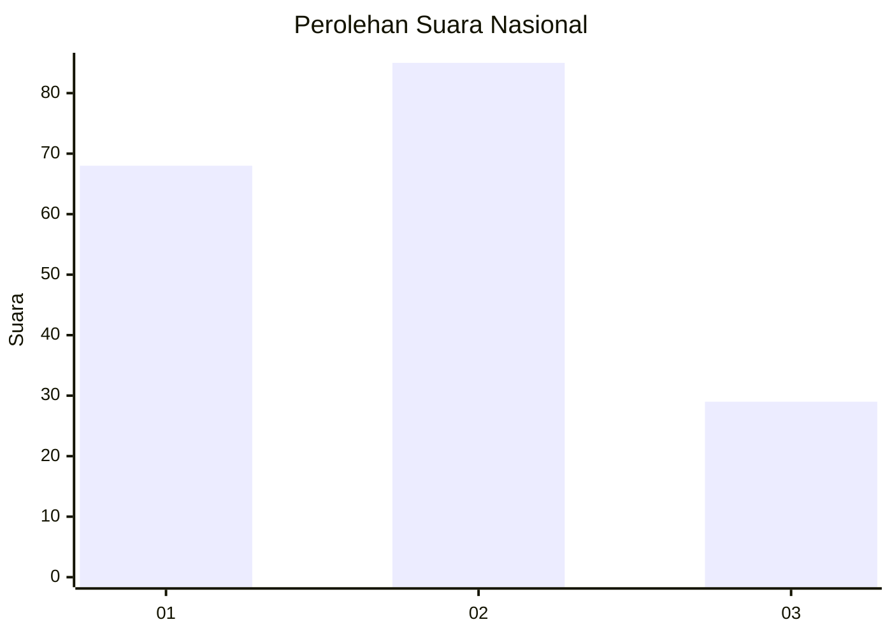
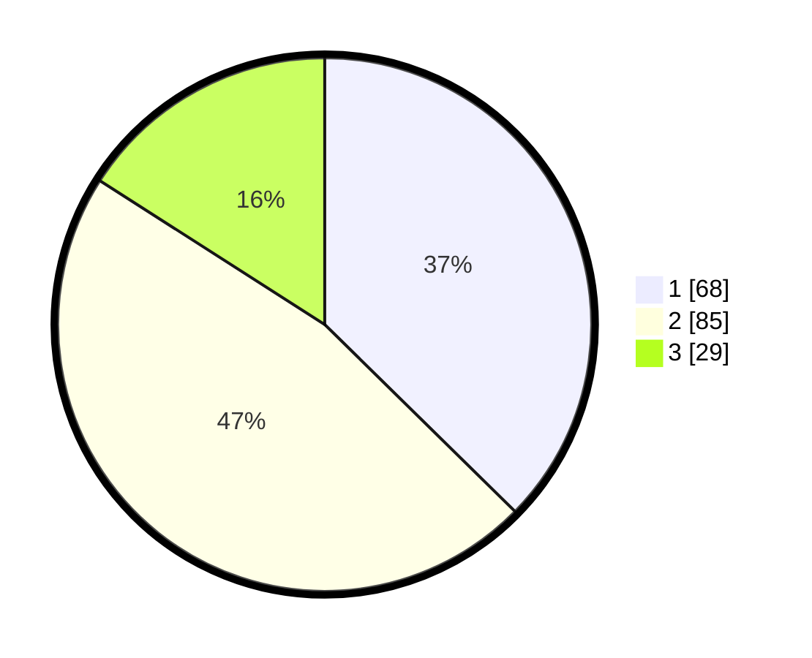

# Hasil

## Grafik

## Tabel

| No.    | Nama Paslon    | Suara | Suara (raw) | Persentase |
|:------ |:-------------- | -----:| -----------:| ----------:|
| 100025 | ANIES MUHAIMIN | 68    | [68][p-1]   | 37,36      |
| 100026 | PRABOWO GIBRAN | 85    | [85][p-2]   | 46,70      |
| 100027 | GANJAR MAHFUD  | 29    | [29][p-3]   | 15,93      |

[p-1]: https://github.com/gigit-pemilu/pemilu-2024/blob/main/pilpres/hitung-suara/sub/31-dki-jakarta/sub/75-jakarta-timur/sub/06-cakung/sub/1005-pulo-gebang/sub/090-tps/sub/paslon-1.txt
[p-2]: https://github.com/gigit-pemilu/pemilu-2024/blob/main/pilpres/hitung-suara/sub/31-dki-jakarta/sub/75-jakarta-timur/sub/06-cakung/sub/1005-pulo-gebang/sub/090-tps/sub/paslon-2.txt
[p-3]: https://github.com/gigit-pemilu/pemilu-2024/blob/main/pilpres/hitung-suara/sub/31-dki-jakarta/sub/75-jakarta-timur/sub/06-cakung/sub/1005-pulo-gebang/sub/090-tps/sub/paslon-3.txt

## Foto C Plano

https://sirekap-obj-formc.kpu.go.id/7fe2/pemilu/ppwp/31/75/06/10/05/3175061005090-20240214-213438--074fd761-2214-4cc7-8800-d355bc9299b2.jpg

https://sirekap-obj-formc.kpu.go.id/7fe2/pemilu/ppwp/31/75/06/10/05/3175061005090-20240214-213520--543d6578-65b1-4ec1-a128-6375846f5193.jpg

https://sirekap-obj-formc.kpu.go.id/7fe2/pemilu/ppwp/31/75/06/10/05/3175061005090-20240214-213600--d97388e7-7609-4888-a278-54574972c4a1.jpg

## Metadata

| Key        | Value               |
| ---------- | ------------------- |
| Time Stamp | 2024-02-24 22:31:28 |

