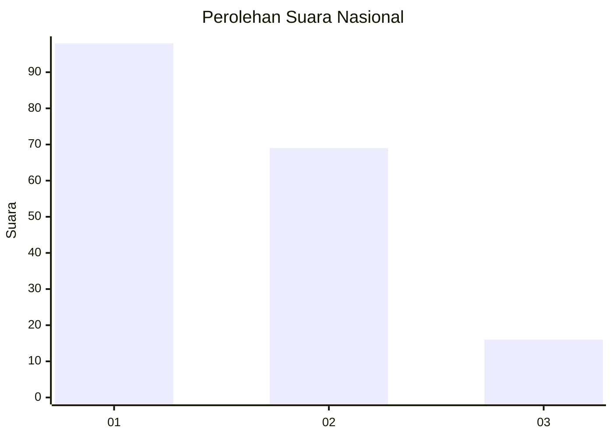
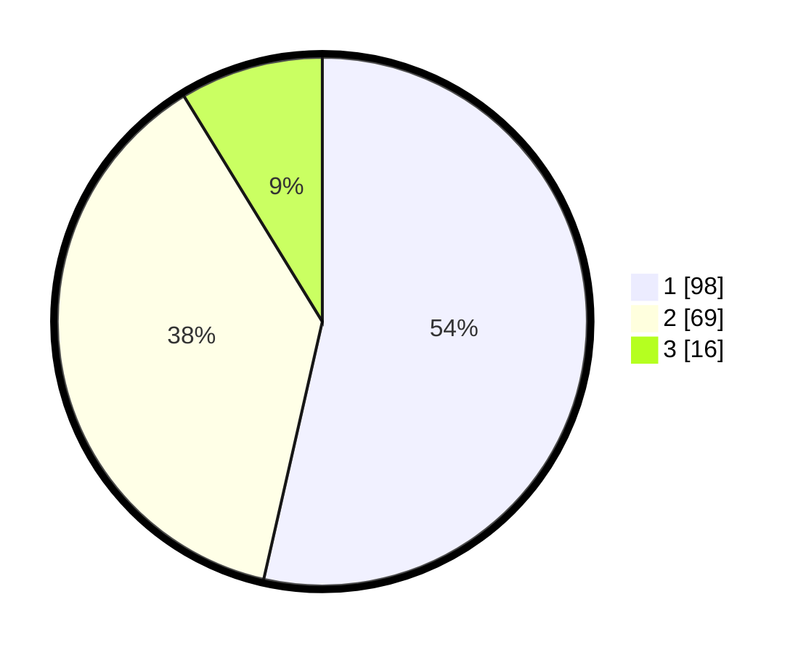

# Hasil

## Grafik

## Tabel

| No.    | Nama Paslon    | Suara | Suara (raw) | Persentase |
|:------ |:-------------- | -----:| -----------:| ----------:|
| 100025 | ANIES MUHAIMIN | 98    | [98][p-1]   | 53,55      |
| 100026 | PRABOWO GIBRAN | 69    | [69][p-2]   | 37,70      |
| 100027 | GANJAR MAHFUD  | 16    | [16][p-3]   | 8,74       |

[p-1]: https://github.com/gigit-pemilu/pemilu-2024/blob/main/pilpres/hitung-suara/sub/31-dki-jakarta/sub/75-jakarta-timur/sub/06-cakung/sub/1005-pulo-gebang/sub/097-tps/sub/paslon-1.txt
[p-2]: https://github.com/gigit-pemilu/pemilu-2024/blob/main/pilpres/hitung-suara/sub/31-dki-jakarta/sub/75-jakarta-timur/sub/06-cakung/sub/1005-pulo-gebang/sub/097-tps/sub/paslon-2.txt
[p-3]: https://github.com/gigit-pemilu/pemilu-2024/blob/main/pilpres/hitung-suara/sub/31-dki-jakarta/sub/75-jakarta-timur/sub/06-cakung/sub/1005-pulo-gebang/sub/097-tps/sub/paslon-3.txt

## Foto C Plano

https://sirekap-obj-formc.kpu.go.id/5d66/pemilu/ppwp/31/75/06/10/05/3175061005097-20240214-221805--c77b4394-70a4-4472-8474-d8ff7ec4df65.jpg

https://sirekap-obj-formc.kpu.go.id/5d66/pemilu/ppwp/31/75/06/10/05/3175061005097-20240214-221837--be6dce83-e26e-4c0e-ad97-2ab75e623a35.jpg

https://sirekap-obj-formc.kpu.go.id/5d66/pemilu/ppwp/31/75/06/10/05/3175061005097-20240214-221907--80b3831c-eae1-43e2-91aa-d040416c232e.jpg

## Metadata

| Key        | Value               |
| ---------- | ------------------- |
| Time Stamp | 2024-02-19 14:00:00 |

