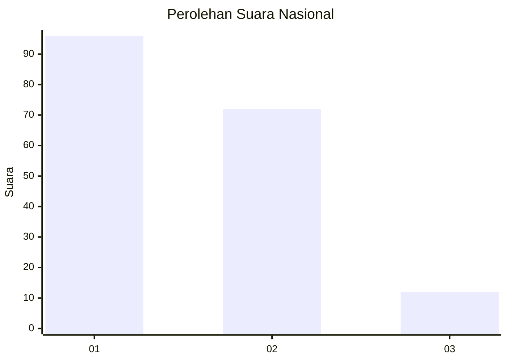
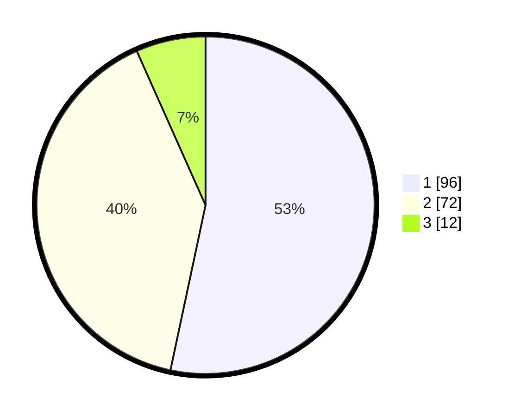

# Hasil

## Grafik

## Tabel

| No.    | Nama Paslon    | Suara | Suara (raw) | Persentase |
|:------ |:-------------- | -----:| -----------:| ----------:|
| 100025 | ANIES MUHAIMIN | 96    | [96][p-1]   | 53,33      |
| 100026 | PRABOWO GIBRAN | 72    | [72][p-2]   | 40,00      |
| 100027 | GANJAR MAHFUD  | 12    | [12][p-3]   | 6,67       |

[p-1]: https://github.com/gigit-pemilu/pemilu-2024/blob/main/pilpres/hitung-suara/sub/31-dki-jakarta/sub/75-jakarta-timur/sub/06-cakung/sub/1005-pulo-gebang/sub/126-tps/sub/paslon-1.txt
[p-2]: https://github.com/gigit-pemilu/pemilu-2024/blob/main/pilpres/hitung-suara/sub/31-dki-jakarta/sub/75-jakarta-timur/sub/06-cakung/sub/1005-pulo-gebang/sub/126-tps/sub/paslon-2.txt
[p-3]: https://github.com/gigit-pemilu/pemilu-2024/blob/main/pilpres/hitung-suara/sub/31-dki-jakarta/sub/75-jakarta-timur/sub/06-cakung/sub/1005-pulo-gebang/sub/126-tps/sub/paslon-3.txt

## Foto C Plano

https://sirekap-obj-formc.kpu.go.id/119d/pemilu/ppwp/31/75/06/10/05/3175061005126-20240214-221245--460b1409-22c8-4331-ae39-96bb04cdf042.jpg

https://sirekap-obj-formc.kpu.go.id/119d/pemilu/ppwp/31/75/06/10/05/3175061005126-20240214-155207--40c20b43-1abe-44c7-8c4c-6a322a12d27f.jpg

https://sirekap-obj-formc.kpu.go.id/119d/pemilu/ppwp/31/75/06/10/05/3175061005126-20240214-202248--236c0d88-95d1-4079-a598-a1a209b25461.jpg

## Metadata

| Key        | Value               |
| ---------- | ------------------- |
| Time Stamp | 2024-02-24 22:31:28 |

