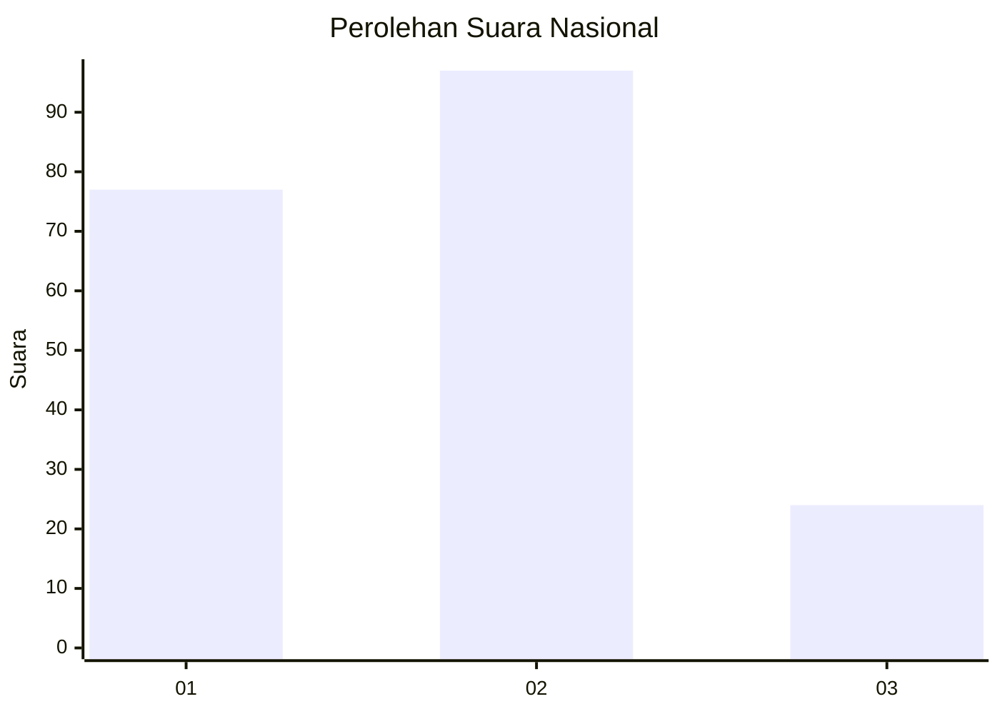
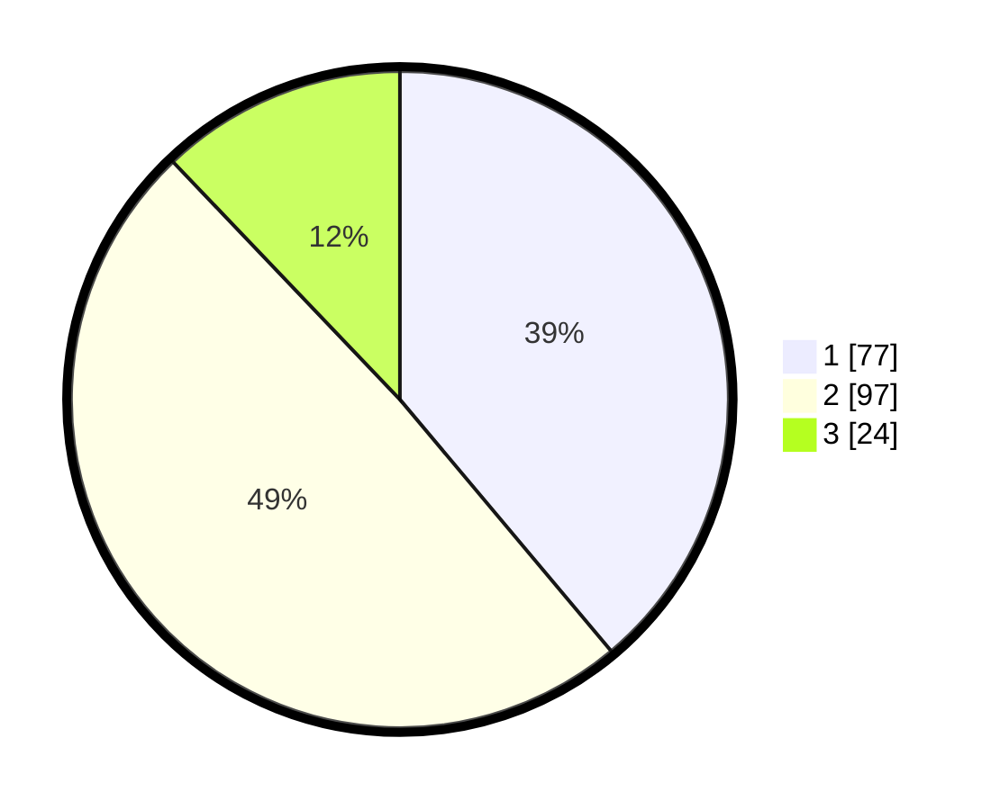

# Hasil

## Grafik

## Tabel

| No.    | Nama Paslon    | Suara | Suara (raw) | Persentase |
|:------ |:-------------- | -----:| -----------:| ----------:|
| 100025 | ANIES MUHAIMIN | 77    | [77][p-1]   | 38,89      |
| 100026 | PRABOWO GIBRAN | 97    | [97][p-2]   | 48,99      |
| 100027 | GANJAR MAHFUD  | 24    | [24][p-3]   | 12,12      |

[p-1]: https://github.com/gigit-pemilu/pemilu-2024/blob/main/pilpres/hitung-suara/sub/31-dki-jakarta/sub/75-jakarta-timur/sub/06-cakung/sub/1005-pulo-gebang/sub/152-tps/sub/paslon-1.txt
[p-2]: https://github.com/gigit-pemilu/pemilu-2024/blob/main/pilpres/hitung-suara/sub/31-dki-jakarta/sub/75-jakarta-timur/sub/06-cakung/sub/1005-pulo-gebang/sub/152-tps/sub/paslon-2.txt
[p-3]: https://github.com/gigit-pemilu/pemilu-2024/blob/main/pilpres/hitung-suara/sub/31-dki-jakarta/sub/75-jakarta-timur/sub/06-cakung/sub/1005-pulo-gebang/sub/152-tps/sub/paslon-3.txt

## Foto C Plano

https://sirekap-obj-formc.kpu.go.id/174d/pemilu/ppwp/31/75/06/10/05/3175061005152-20240214-220401--a9cd0c98-698e-4bd3-b10a-48e48a1d8641.jpg

https://sirekap-obj-formc.kpu.go.id/174d/pemilu/ppwp/31/75/06/10/05/3175061005152-20240214-220726--8bfee35f-28a4-4e40-a0ff-9b6ad7b72652.jpg

https://sirekap-obj-formc.kpu.go.id/174d/pemilu/ppwp/31/75/06/10/05/3175061005152-20240214-220818--31ca8910-15d0-4f47-afb5-e1c1b2db6e00.jpg

## Metadata

| Key        | Value               |
| ---------- | ------------------- |
| Time Stamp | 2024-02-19 14:00:00 |

