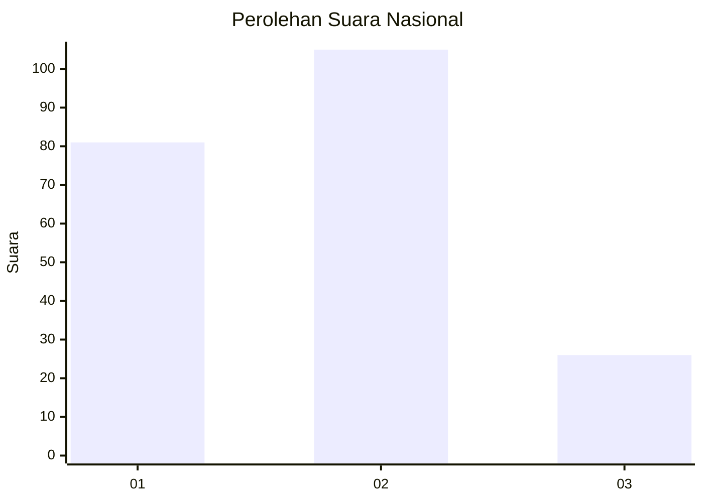
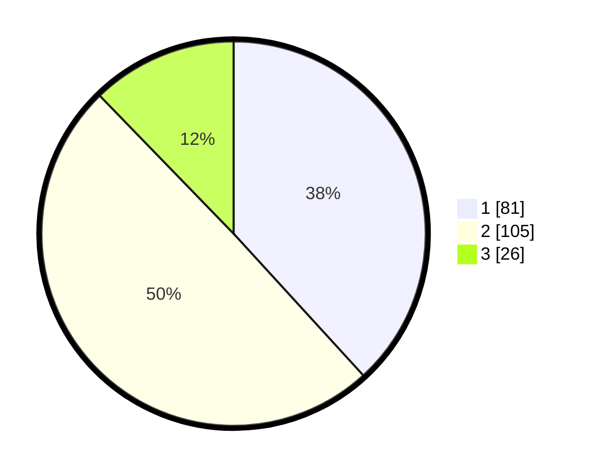

# Hasil

## Grafik

## Tabel

| No.    | Nama Paslon    | Suara | Suara (raw) | Persentase |
|:------ |:-------------- | -----:| -----------:| ----------:|
| 100025 | ANIES MUHAIMIN | 81    | [81][p-1]   | 38,21      |
| 100026 | PRABOWO GIBRAN | 105   | [105][p-2]  | 49,53      |
| 100027 | GANJAR MAHFUD  | 26    | [26][p-3]   | 12,26      |

[p-1]: https://github.com/gigit-pemilu/pemilu-2024/blob/main/pilpres/hitung-suara/sub/31-dki-jakarta/sub/75-jakarta-timur/sub/06-cakung/sub/1005-pulo-gebang/sub/155-tps/sub/paslon-1.txt
[p-2]: https://github.com/gigit-pemilu/pemilu-2024/blob/main/pilpres/hitung-suara/sub/31-dki-jakarta/sub/75-jakarta-timur/sub/06-cakung/sub/1005-pulo-gebang/sub/155-tps/sub/paslon-2.txt
[p-3]: https://github.com/gigit-pemilu/pemilu-2024/blob/main/pilpres/hitung-suara/sub/31-dki-jakarta/sub/75-jakarta-timur/sub/06-cakung/sub/1005-pulo-gebang/sub/155-tps/sub/paslon-3.txt

## Foto C Plano

https://sirekap-obj-formc.kpu.go.id/606e/pemilu/ppwp/31/75/06/10/05/3175061005155-20240214-230032--68a68041-7668-4578-a491-9e085755e7eb.jpg

https://sirekap-obj-formc.kpu.go.id/606e/pemilu/ppwp/31/75/06/10/05/3175061005155-20240214-230146--c184336f-30c2-4d7d-801a-8f12cad9dd58.jpg

https://sirekap-obj-formc.kpu.go.id/606e/pemilu/ppwp/31/75/06/10/05/3175061005155-20240214-230205--ab51d295-706e-483e-b20a-7717968d857f.jpg

## Metadata

| Key        | Value               |
| ---------- | ------------------- |
| Time Stamp | 2024-02-19 14:00:00 |

