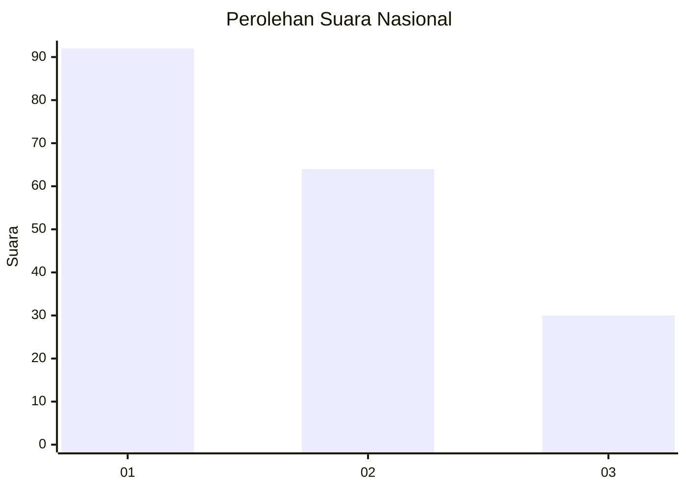
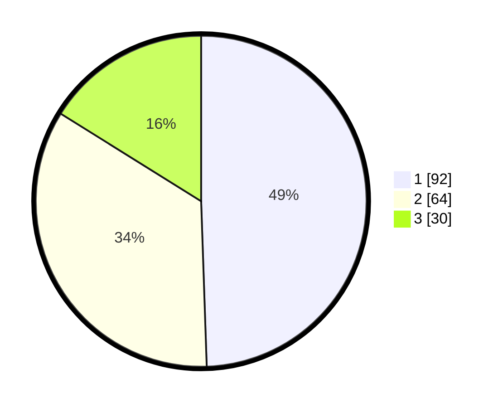

# Hasil

## Grafik

## Tabel

| No.    | Nama Paslon    | Suara | Suara (raw) | Persentase |
|:------ |:-------------- | -----:| -----------:| ----------:|
| 100025 | ANIES MUHAIMIN | 92    | [92][p-1]   | 49,46      |
| 100026 | PRABOWO GIBRAN | 64    | [64][p-2]   | 34,41      |
| 100027 | GANJAR MAHFUD  | 30    | [30][p-3]   | 16,13      |

[p-1]: https://github.com/gigit-pemilu/pemilu-2024/blob/main/pilpres/hitung-suara/sub/31-dki-jakarta/sub/75-jakarta-timur/sub/06-cakung/sub/1005-pulo-gebang/sub/179-tps/sub/paslon-1.txt
[p-2]: https://github.com/gigit-pemilu/pemilu-2024/blob/main/pilpres/hitung-suara/sub/31-dki-jakarta/sub/75-jakarta-timur/sub/06-cakung/sub/1005-pulo-gebang/sub/179-tps/sub/paslon-2.txt
[p-3]: https://github.com/gigit-pemilu/pemilu-2024/blob/main/pilpres/hitung-suara/sub/31-dki-jakarta/sub/75-jakarta-timur/sub/06-cakung/sub/1005-pulo-gebang/sub/179-tps/sub/paslon-3.txt

## Foto C Plano

https://sirekap-obj-formc.kpu.go.id/bae2/pemilu/ppwp/31/75/06/10/05/3175061005179-20240214-223152--0bb2d9d4-6b3c-4e49-8c55-9df4d62f0708.jpg

https://sirekap-obj-formc.kpu.go.id/bae2/pemilu/ppwp/31/75/06/10/05/3175061005179-20240214-223501--0742d7f1-e168-458f-9f2d-094e0aa0d19b.jpg

https://sirekap-obj-formc.kpu.go.id/bae2/pemilu/ppwp/31/75/06/10/05/3175061005179-20240214-223655--f7b048a2-0acb-4ea8-ac41-25efae6eb787.jpg

## Metadata

| Key        | Value               |
| ---------- | ------------------- |
| Time Stamp | 2024-02-19 14:00:00 |

