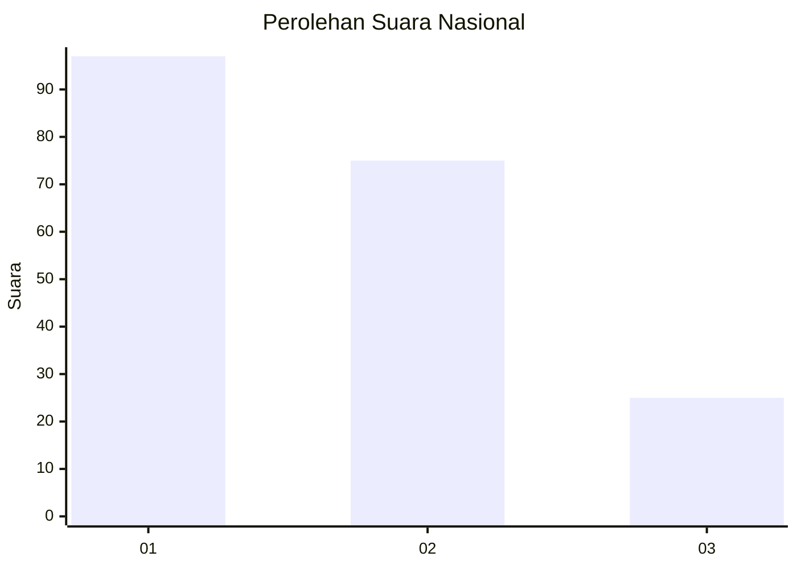
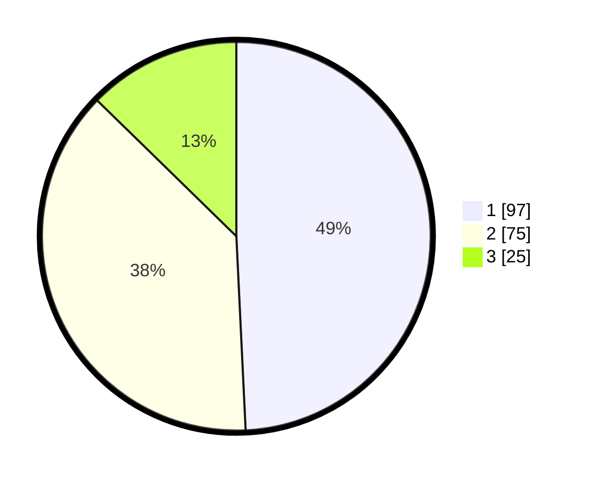

# Hasil

## Grafik

## Tabel

| No.    | Nama Paslon    | Suara | Suara (raw) | Persentase |
|:------ |:-------------- | -----:| -----------:| ----------:|
| 100025 | ANIES MUHAIMIN | 97    | [97][p-1]   | 49,24      |
| 100026 | PRABOWO GIBRAN | 75    | [75][p-2]   | 38,07      |
| 100027 | GANJAR MAHFUD  | 25    | [25][p-3]   | 12,69      |

[p-1]: https://github.com/gigit-pemilu/pemilu-2024/blob/main/pilpres/hitung-suara/sub/31-dki-jakarta/sub/75-jakarta-timur/sub/06-cakung/sub/1005-pulo-gebang/sub/199-tps/sub/paslon-1.txt
[p-2]: https://github.com/gigit-pemilu/pemilu-2024/blob/main/pilpres/hitung-suara/sub/31-dki-jakarta/sub/75-jakarta-timur/sub/06-cakung/sub/1005-pulo-gebang/sub/199-tps/sub/paslon-2.txt
[p-3]: https://github.com/gigit-pemilu/pemilu-2024/blob/main/pilpres/hitung-suara/sub/31-dki-jakarta/sub/75-jakarta-timur/sub/06-cakung/sub/1005-pulo-gebang/sub/199-tps/sub/paslon-3.txt

## Foto C Plano

https://sirekap-obj-formc.kpu.go.id/c3d1/pemilu/ppwp/31/75/06/10/05/3175061005199-20240214-222145--30325ddc-bcb6-4597-bdcb-e8922505123c.jpg

https://sirekap-obj-formc.kpu.go.id/c3d1/pemilu/ppwp/31/75/06/10/05/3175061005199-20240214-222031--03aa9789-01d1-42e9-9678-31b1e66e83db.jpg

https://sirekap-obj-formc.kpu.go.id/c3d1/pemilu/ppwp/31/75/06/10/05/3175061005199-20240214-222220--34c402e3-8ae7-4bb0-b111-3e9edb532fa6.jpg

## Metadata

| Key        | Value               |
| ---------- | ------------------- |
| Time Stamp | 2024-02-19 14:00:00 |

