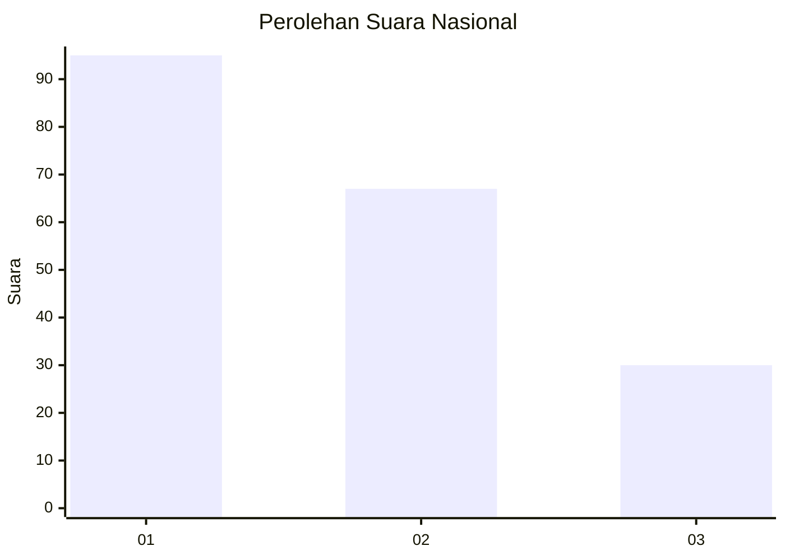
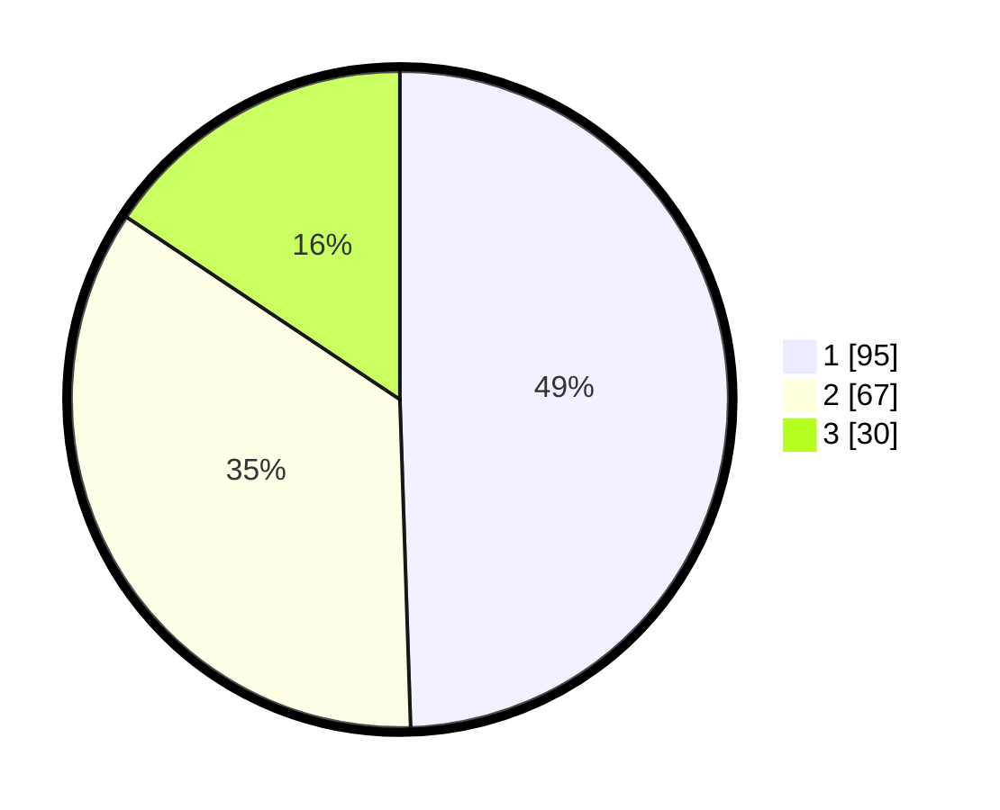

# Hasil

## Grafik

## Tabel

| No.    | Nama Paslon    | Suara | Suara (raw) | Persentase |
|:------ |:-------------- | -----:| -----------:| ----------:|
| 100025 | ANIES MUHAIMIN | 95    | [95][p-1]   | 49,48      |
| 100026 | PRABOWO GIBRAN | 67    | [67][p-2]   | 34,90      |
| 100027 | GANJAR MAHFUD  | 30    | [30][p-3]   | 15,63      |

[p-1]: https://github.com/gigit-pemilu/pemilu-2024/blob/main/pilpres/hitung-suara/sub/31-dki-jakarta/sub/75-jakarta-timur/sub/06-cakung/sub/1005-pulo-gebang/sub/211-tps/sub/paslon-1.txt
[p-2]: https://github.com/gigit-pemilu/pemilu-2024/blob/main/pilpres/hitung-suara/sub/31-dki-jakarta/sub/75-jakarta-timur/sub/06-cakung/sub/1005-pulo-gebang/sub/211-tps/sub/paslon-2.txt
[p-3]: https://github.com/gigit-pemilu/pemilu-2024/blob/main/pilpres/hitung-suara/sub/31-dki-jakarta/sub/75-jakarta-timur/sub/06-cakung/sub/1005-pulo-gebang/sub/211-tps/sub/paslon-3.txt

## Foto C Plano

https://sirekap-obj-formc.kpu.go.id/3095/pemilu/ppwp/31/75/06/10/05/3175061005211-20240214-214738--c8a3d6f1-77c1-4690-b0bb-b1f034faf177.jpg

https://sirekap-obj-formc.kpu.go.id/3095/pemilu/ppwp/31/75/06/10/05/3175061005211-20240215-103949--792d3be6-13f8-4ba1-9480-115ae2de017d.jpg

https://sirekap-obj-formc.kpu.go.id/3095/pemilu/ppwp/31/75/06/10/05/3175061005211-20240224-130401--18ccc97c-01da-41fd-a93e-eee0419fe5f7.jpg

## Metadata

| Key        | Value               |
| ---------- | ------------------- |
| Time Stamp | 2024-02-25 12:00:00 |

