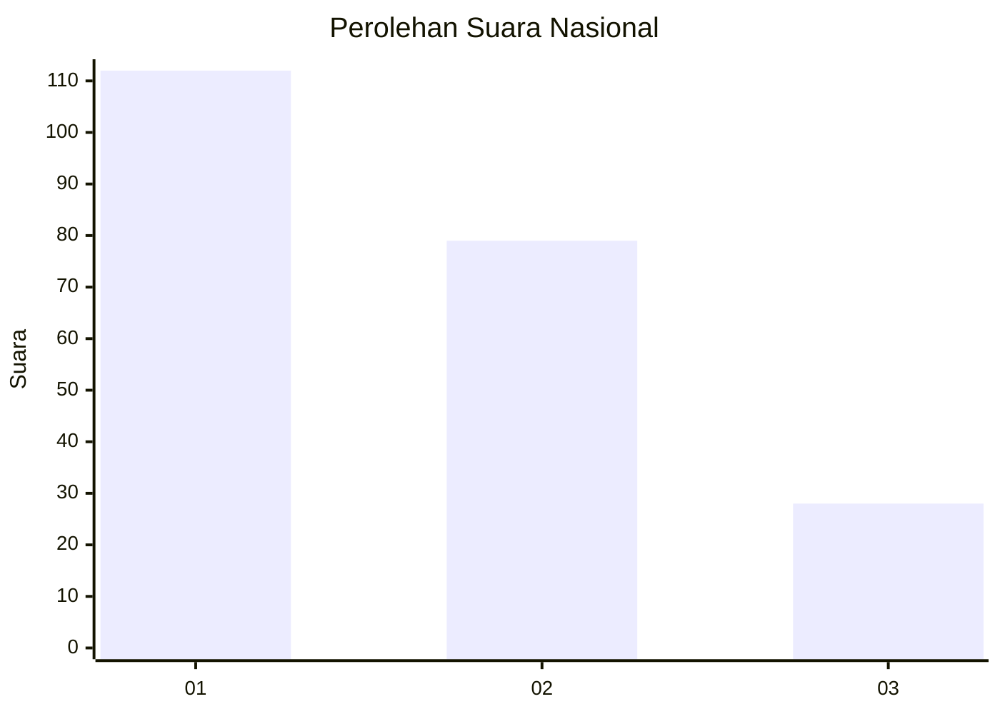
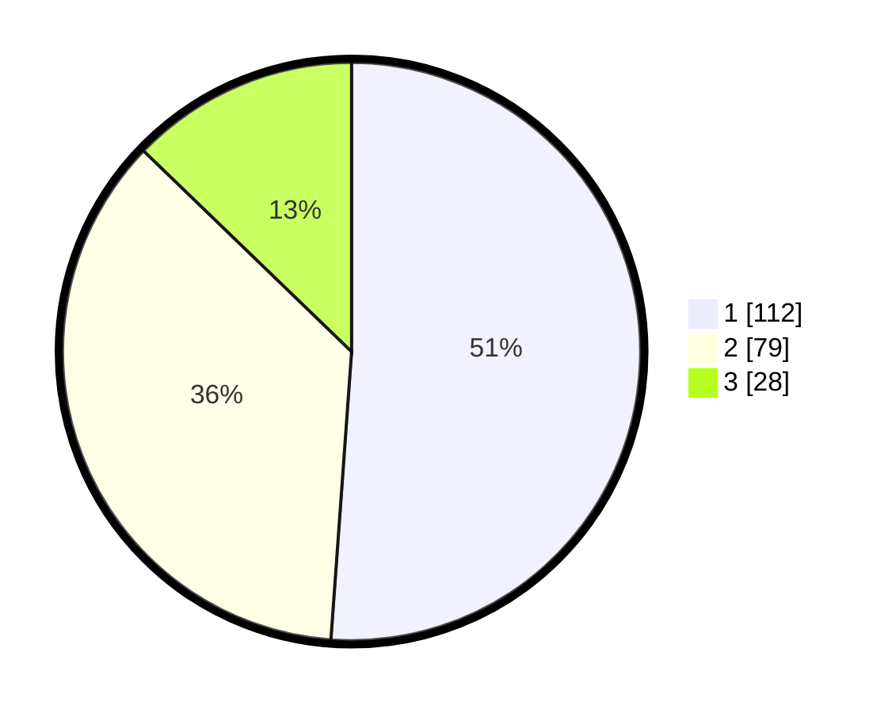

# Hasil

## Grafik

## Tabel

| No.    | Nama Paslon    | Suara | Suara (raw) | Persentase |
|:------ |:-------------- | -----:| -----------:| ----------:|
| 100025 | ANIES MUHAIMIN | 112   | [112][p-1]  | 51,14      |
| 100026 | PRABOWO GIBRAN | 79    | [79][p-2]   | 36,07      |
| 100027 | GANJAR MAHFUD  | 28    | [28][p-3]   | 12,79      |

[p-1]: https://github.com/gigit-pemilu/pemilu-2024/blob/main/pilpres/hitung-suara/sub/31-dki-jakarta/sub/75-jakarta-timur/sub/06-cakung/sub/1005-pulo-gebang/sub/212-tps/sub/paslon-1.txt
[p-2]: https://github.com/gigit-pemilu/pemilu-2024/blob/main/pilpres/hitung-suara/sub/31-dki-jakarta/sub/75-jakarta-timur/sub/06-cakung/sub/1005-pulo-gebang/sub/212-tps/sub/paslon-2.txt
[p-3]: https://github.com/gigit-pemilu/pemilu-2024/blob/main/pilpres/hitung-suara/sub/31-dki-jakarta/sub/75-jakarta-timur/sub/06-cakung/sub/1005-pulo-gebang/sub/212-tps/sub/paslon-3.txt

## Foto C Plano

https://sirekap-obj-formc.kpu.go.id/b57d/pemilu/ppwp/31/75/06/10/05/3175061005212-20240214-225026--00d9e926-6497-4ebf-b85b-b18a1f3cc4d3.jpg

https://sirekap-obj-formc.kpu.go.id/b57d/pemilu/ppwp/31/75/06/10/05/3175061005212-20240214-225152--e3e1c02e-5d97-4873-913e-49c5b063cb97.jpg

https://sirekap-obj-formc.kpu.go.id/b57d/pemilu/ppwp/31/75/06/10/05/3175061005212-20240214-225255--a78121c0-c6d3-43a3-a844-c729d36bd2f4.jpg

## Metadata

| Key        | Value               |
| ---------- | ------------------- |
| Time Stamp | 2024-02-19 15:00:00 |

