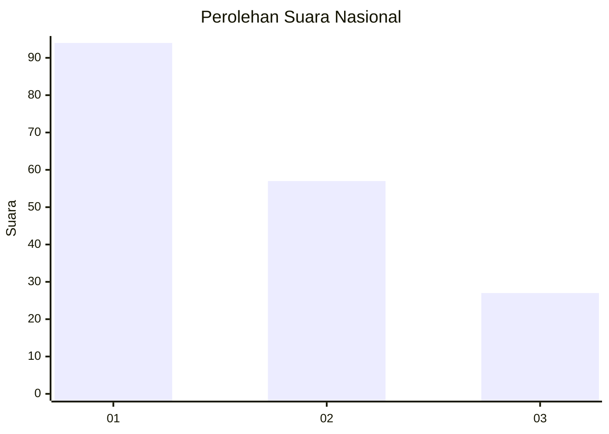
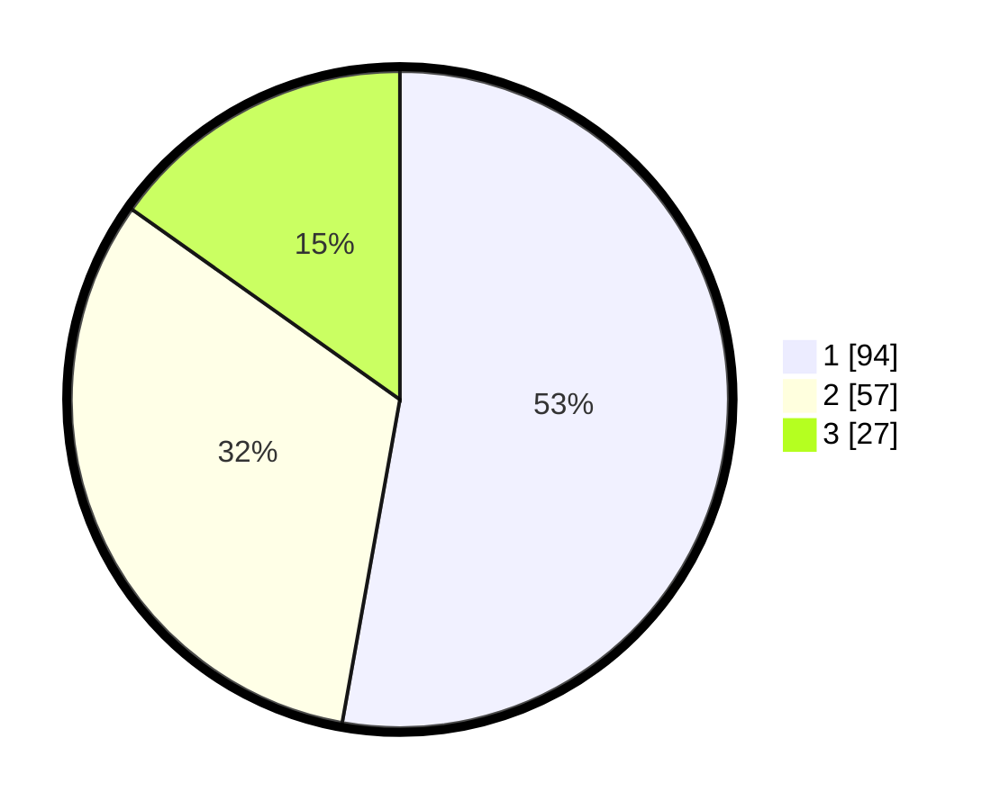

# Hasil

## Grafik

## Tabel

| No.    | Nama Paslon    | Suara | Suara (raw) | Persentase |
|:------ |:-------------- | -----:| -----------:| ----------:|
| 100025 | ANIES MUHAIMIN | 94    | [94][p-1]   | 52,81      |
| 100026 | PRABOWO GIBRAN | 57    | [57][p-2]   | 32,02      |
| 100027 | GANJAR MAHFUD  | 27    | [27][p-3]   | 15,17      |

[p-1]: https://github.com/gigit-pemilu/pemilu-2024/blob/main/pilpres/hitung-suara/sub/31-dki-jakarta/sub/75-jakarta-timur/sub/06-cakung/sub/1005-pulo-gebang/sub/220-tps/sub/paslon-1.txt
[p-2]: https://github.com/gigit-pemilu/pemilu-2024/blob/main/pilpres/hitung-suara/sub/31-dki-jakarta/sub/75-jakarta-timur/sub/06-cakung/sub/1005-pulo-gebang/sub/220-tps/sub/paslon-2.txt
[p-3]: https://github.com/gigit-pemilu/pemilu-2024/blob/main/pilpres/hitung-suara/sub/31-dki-jakarta/sub/75-jakarta-timur/sub/06-cakung/sub/1005-pulo-gebang/sub/220-tps/sub/paslon-3.txt

## Foto C Plano

https://sirekap-obj-formc.kpu.go.id/6ffe/pemilu/ppwp/31/75/06/10/05/3175061005220-20240214-223354--3eb20549-1c2b-4297-ab82-ceec96d1e64c.jpg

https://sirekap-obj-formc.kpu.go.id/6ffe/pemilu/ppwp/31/75/06/10/05/3175061005220-20240214-223413--d4e118a7-9fd0-4038-a254-65882296d768.jpg

https://sirekap-obj-formc.kpu.go.id/6ffe/pemilu/ppwp/31/75/06/10/05/3175061005220-20240214-223429--1007340e-3208-45e6-8ed9-6748dfcc461c.jpg

## Metadata

| Key        | Value               |
| ---------- | ------------------- |
| Time Stamp | 2024-02-24 22:31:28 |

