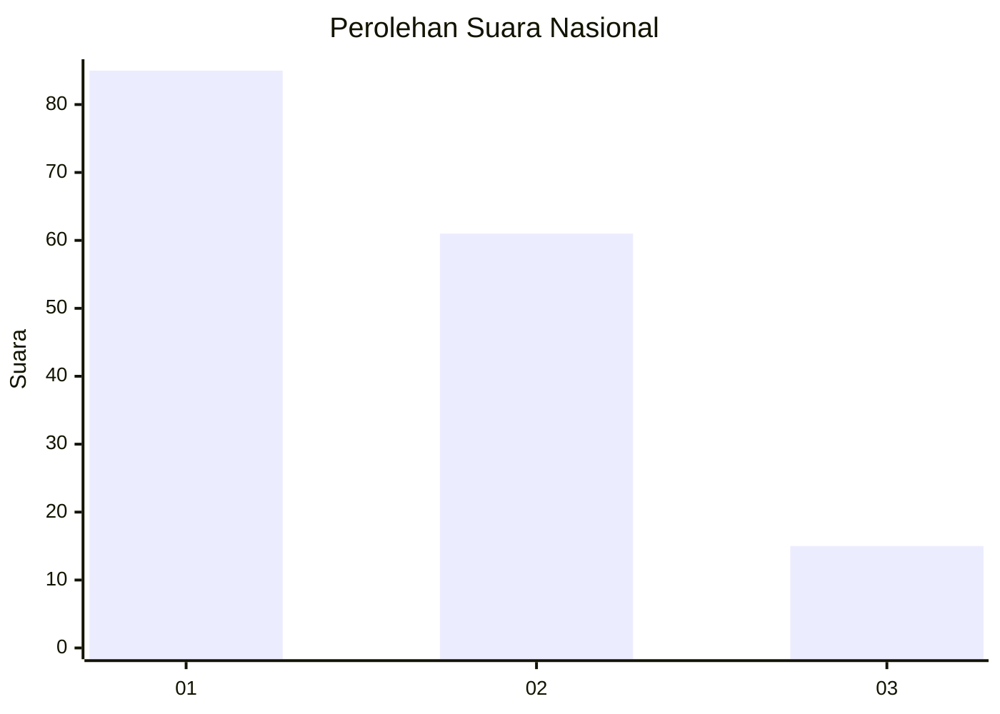
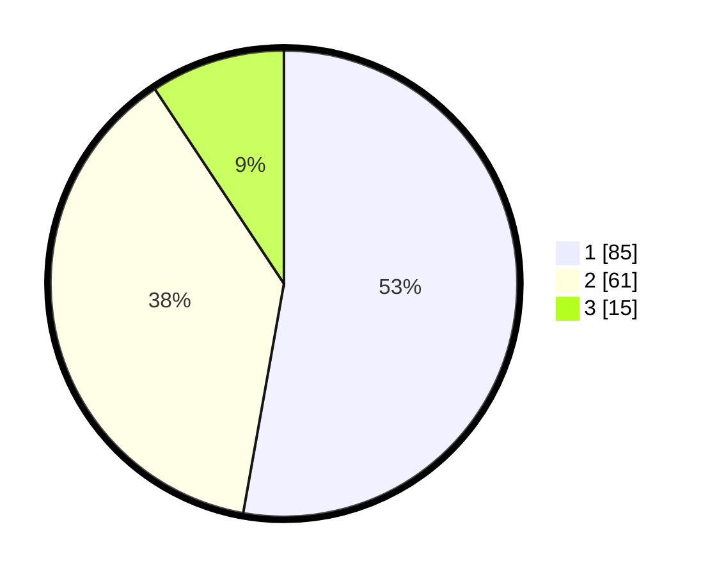

# Hasil

## Grafik

## Tabel

| No.    | Nama Paslon    | Suara | Suara (raw) | Persentase |
|:------ |:-------------- | -----:| -----------:| ----------:|
| 100025 | ANIES MUHAIMIN | 85    | [85][p-1]   | 52,80      |
| 100026 | PRABOWO GIBRAN | 61    | [61][p-2]   | 37,89      |
| 100027 | GANJAR MAHFUD  | 15    | [15][p-3]   | 9,32       |

[p-1]: https://github.com/gigit-pemilu/pemilu-2024/blob/main/pilpres/hitung-suara/sub/31-dki-jakarta/sub/75-jakarta-timur/sub/06-cakung/sub/1005-pulo-gebang/sub/223-tps/sub/paslon-1.txt
[p-2]: https://github.com/gigit-pemilu/pemilu-2024/blob/main/pilpres/hitung-suara/sub/31-dki-jakarta/sub/75-jakarta-timur/sub/06-cakung/sub/1005-pulo-gebang/sub/223-tps/sub/paslon-2.txt
[p-3]: https://github.com/gigit-pemilu/pemilu-2024/blob/main/pilpres/hitung-suara/sub/31-dki-jakarta/sub/75-jakarta-timur/sub/06-cakung/sub/1005-pulo-gebang/sub/223-tps/sub/paslon-3.txt

## Foto C Plano

https://sirekap-obj-formc.kpu.go.id/da46/pemilu/ppwp/31/75/06/10/05/3175061005223-20240214-212759--2ddcec34-7083-4702-aa3c-eac9085d2620.jpg

https://sirekap-obj-formc.kpu.go.id/da46/pemilu/ppwp/31/75/06/10/05/3175061005223-20240214-224452--1a5cbe4c-7ab7-47e8-abcc-dd2e7eb85ee5.jpg

https://sirekap-obj-formc.kpu.go.id/da46/pemilu/ppwp/31/75/06/10/05/3175061005223-20240214-213030--8d3cf48e-47d6-400c-885e-eb63a1538436.jpg

## Metadata

| Key        | Value               |
| ---------- | ------------------- |
| Time Stamp | 2024-02-24 22:31:28 |

