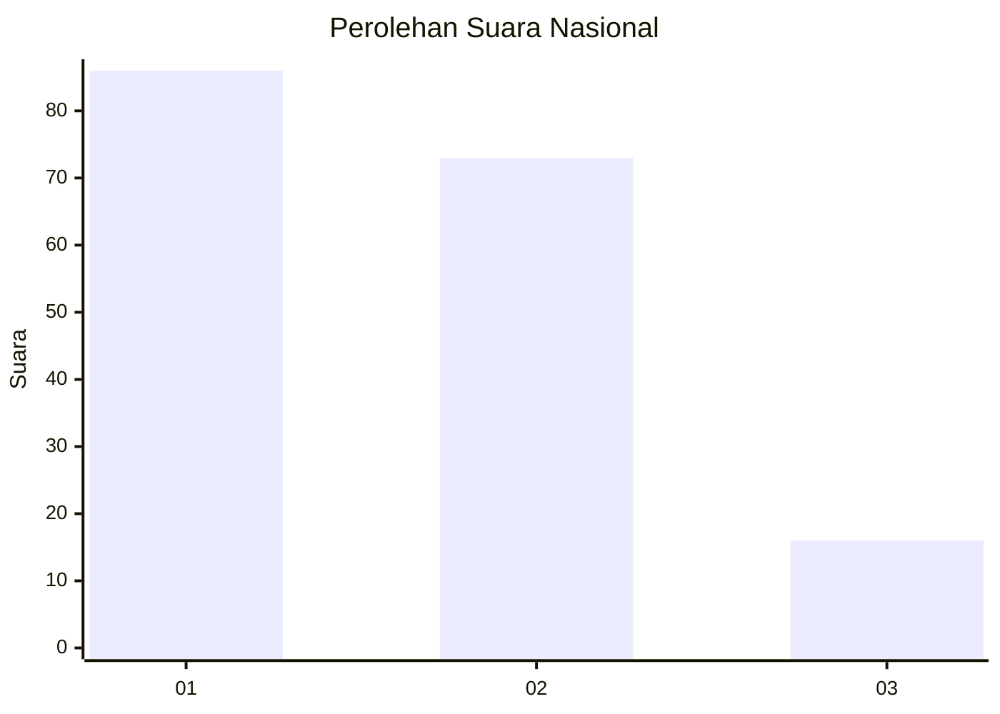
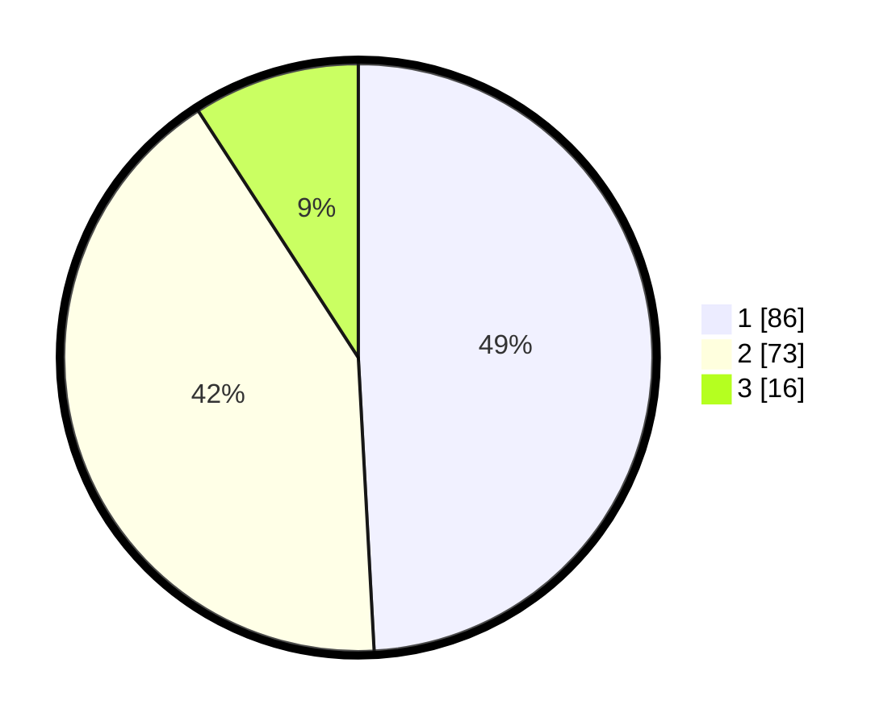

# Hasil

## Grafik

## Tabel

| No.    | Nama Paslon    | Suara | Suara (raw) | Persentase |
|:------ |:-------------- | -----:| -----------:| ----------:|
| 100025 | ANIES MUHAIMIN | 86    | [86][p-1]   | 49,14      |
| 100026 | PRABOWO GIBRAN | 73    | [73][p-2]   | 41,71      |
| 100027 | GANJAR MAHFUD  | 16    | [16][p-3]   | 9,14       |

[p-1]: https://github.com/gigit-pemilu/pemilu-2024/blob/main/pilpres/hitung-suara/sub/31-dki-jakarta/sub/75-jakarta-timur/sub/06-cakung/sub/1005-pulo-gebang/sub/226-tps/sub/paslon-1.txt
[p-2]: https://github.com/gigit-pemilu/pemilu-2024/blob/main/pilpres/hitung-suara/sub/31-dki-jakarta/sub/75-jakarta-timur/sub/06-cakung/sub/1005-pulo-gebang/sub/226-tps/sub/paslon-2.txt
[p-3]: https://github.com/gigit-pemilu/pemilu-2024/blob/main/pilpres/hitung-suara/sub/31-dki-jakarta/sub/75-jakarta-timur/sub/06-cakung/sub/1005-pulo-gebang/sub/226-tps/sub/paslon-3.txt

## Foto C Plano

https://sirekap-obj-formc.kpu.go.id/70be/pemilu/ppwp/31/75/06/10/05/3175061005226-20240214-203410--f786485c-2d33-4d2d-8aed-c4eb918989f0.jpg

https://sirekap-obj-formc.kpu.go.id/70be/pemilu/ppwp/31/75/06/10/05/3175061005226-20240214-204058--d9b3d195-deef-40c1-b238-e357d4e6f96e.jpg

https://sirekap-obj-formc.kpu.go.id/70be/pemilu/ppwp/31/75/06/10/05/3175061005226-20240214-204156--753685af-361f-4ab6-83e2-2b7fc9b27774.jpg

## Metadata

| Key        | Value               |
| ---------- | ------------------- |
| Time Stamp | 2024-02-24 22:31:28 |

