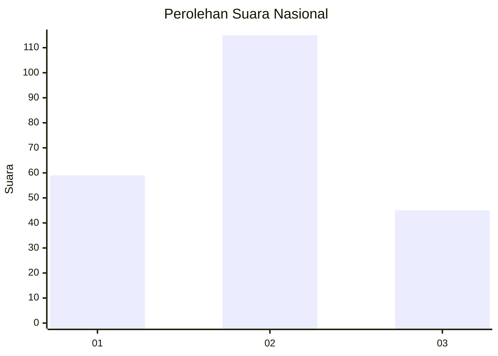
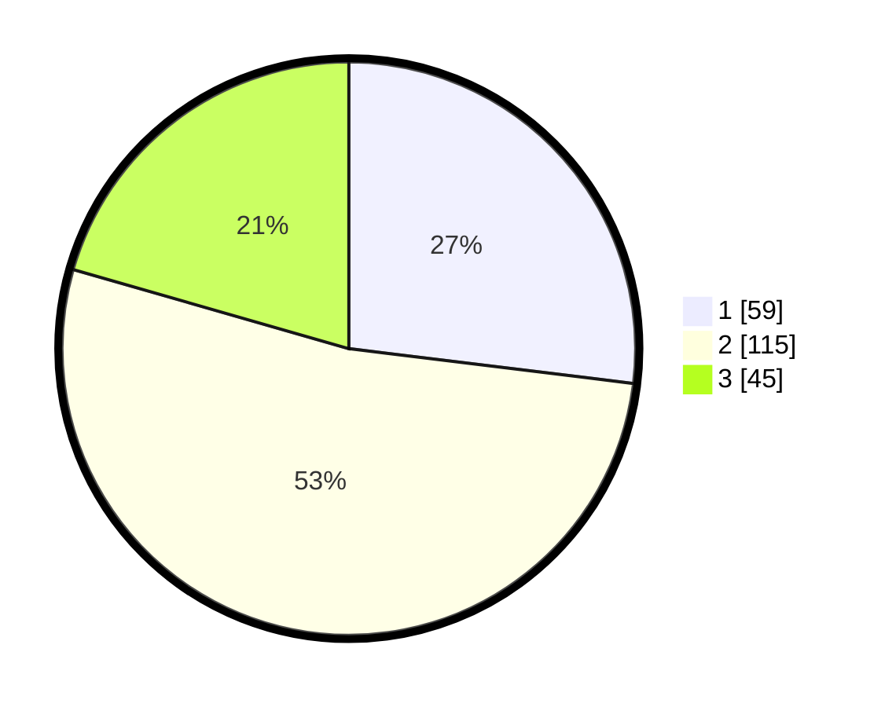

# Hasil

## Grafik

## Tabel

| No.    | Nama Paslon    | Suara | Suara (raw) | Persentase |
|:------ |:-------------- | -----:| -----------:| ----------:|
| 100025 | ANIES MUHAIMIN | 59    | [59][p-1]   | 26,94      |
| 100026 | PRABOWO GIBRAN | 115   | [115][p-2]  | 52,51      |
| 100027 | GANJAR MAHFUD  | 45    | [45][p-3]   | 20,55      |

[p-1]: https://github.com/gigit-pemilu/pemilu-2024/blob/main/pilpres/hitung-suara/sub/31-dki-jakarta/sub/75-jakarta-timur/sub/06-cakung/sub/1005-pulo-gebang/sub/243-tps/sub/paslon-1.txt
[p-2]: https://github.com/gigit-pemilu/pemilu-2024/blob/main/pilpres/hitung-suara/sub/31-dki-jakarta/sub/75-jakarta-timur/sub/06-cakung/sub/1005-pulo-gebang/sub/243-tps/sub/paslon-2.txt
[p-3]: https://github.com/gigit-pemilu/pemilu-2024/blob/main/pilpres/hitung-suara/sub/31-dki-jakarta/sub/75-jakarta-timur/sub/06-cakung/sub/1005-pulo-gebang/sub/243-tps/sub/paslon-3.txt

## Foto C Plano

https://sirekap-obj-formc.kpu.go.id/f36a/pemilu/ppwp/31/75/06/10/05/3175061005243-20240214-221805--6a11b63f-8617-4733-8e67-cf6e64053ff4.jpg

https://sirekap-obj-formc.kpu.go.id/f36a/pemilu/ppwp/31/75/06/10/05/3175061005243-20240214-222104--261d21c4-fd08-418e-8160-9dcefdc61aca.jpg

https://sirekap-obj-formc.kpu.go.id/f36a/pemilu/ppwp/31/75/06/10/05/3175061005243-20240214-222020--eab29bc0-38b5-4b7c-bbe1-09451a919079.jpg

## Metadata

| Key        | Value               |
| ---------- | ------------------- |
| Time Stamp | 2024-02-19 14:00:00 |

