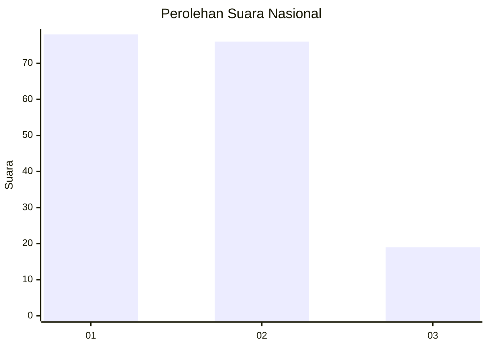
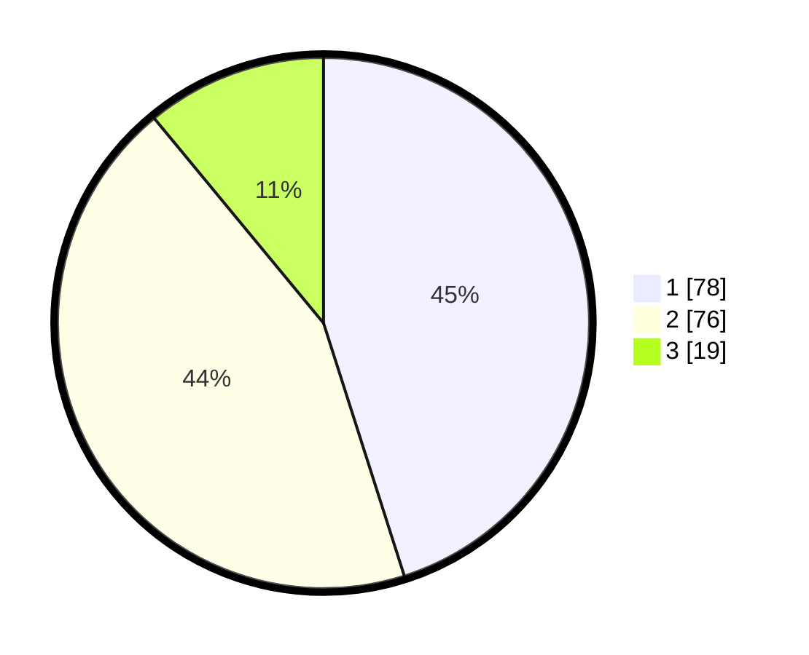

# Hasil

## Grafik

## Tabel

| No.    | Nama Paslon    | Suara | Suara (raw) | Persentase |
|:------ |:-------------- | -----:| -----------:| ----------:|
| 100025 | ANIES MUHAIMIN | 78    | [78][p-1]   | 45,09      |
| 100026 | PRABOWO GIBRAN | 76    | [76][p-2]   | 43,93      |
| 100027 | GANJAR MAHFUD  | 19    | [19][p-3]   | 10,98      |

[p-1]: https://github.com/gigit-pemilu/pemilu-2024/blob/main/pilpres/hitung-suara/sub/31-dki-jakarta/sub/75-jakarta-timur/sub/06-cakung/sub/1005-pulo-gebang/sub/263-tps/sub/paslon-1.txt
[p-2]: https://github.com/gigit-pemilu/pemilu-2024/blob/main/pilpres/hitung-suara/sub/31-dki-jakarta/sub/75-jakarta-timur/sub/06-cakung/sub/1005-pulo-gebang/sub/263-tps/sub/paslon-2.txt
[p-3]: https://github.com/gigit-pemilu/pemilu-2024/blob/main/pilpres/hitung-suara/sub/31-dki-jakarta/sub/75-jakarta-timur/sub/06-cakung/sub/1005-pulo-gebang/sub/263-tps/sub/paslon-3.txt

## Foto C Plano

https://sirekap-obj-formc.kpu.go.id/ac15/pemilu/ppwp/31/75/06/10/05/3175061005263-20240215-002207--61c50a3f-316f-4957-926a-7a190b487d08.jpg

https://sirekap-obj-formc.kpu.go.id/ac15/pemilu/ppwp/31/75/06/10/05/3175061005263-20240215-002255--fc3d937f-16f1-4c0c-9e98-ab24669fff1d.jpg

https://sirekap-obj-formc.kpu.go.id/ac15/pemilu/ppwp/31/75/06/10/05/3175061005263-20240215-002332--a529c0b2-aeae-431f-9bde-fe4ff55bed1d.jpg

## Metadata

| Key        | Value               |
| ---------- | ------------------- |
| Time Stamp | 2024-02-24 22:31:28 |

