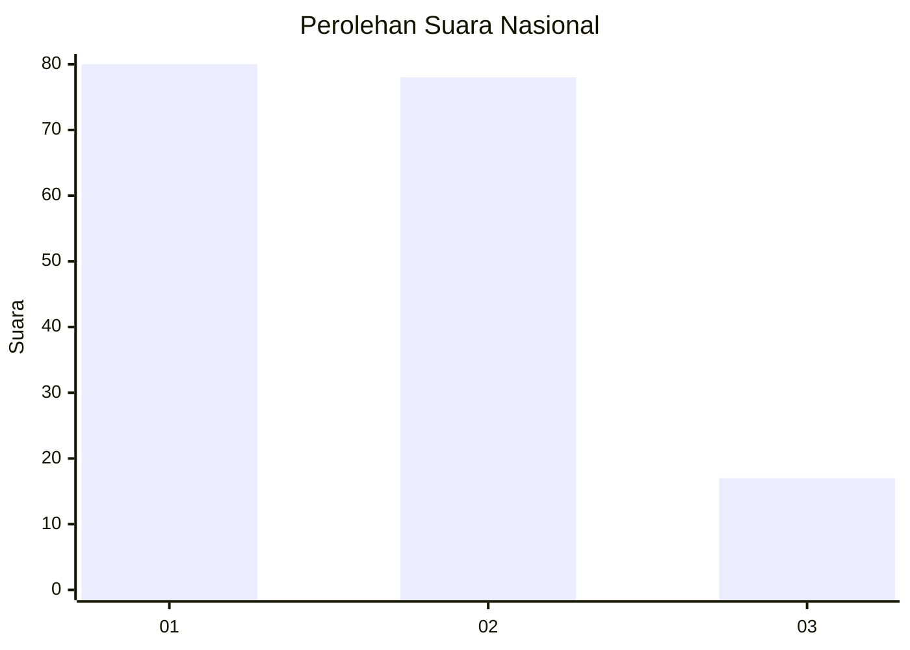
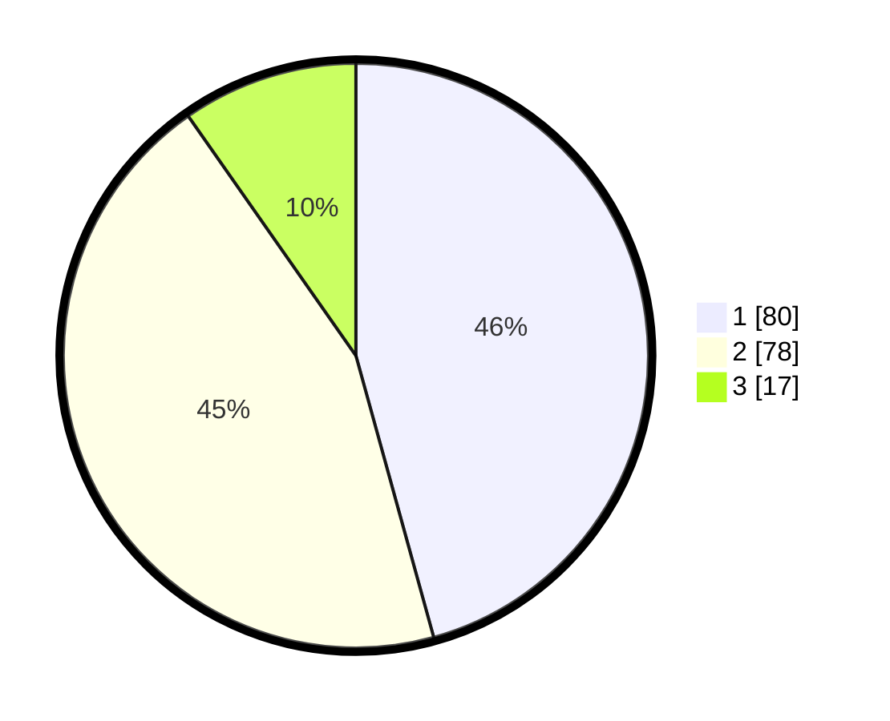

# Hasil

## Grafik

## Tabel

| No.    | Nama Paslon    | Suara | Suara (raw) | Persentase |
|:------ |:-------------- | -----:| -----------:| ----------:|
| 100025 | ANIES MUHAIMIN | 80    | [80][p-1]   | 45,71      |
| 100026 | PRABOWO GIBRAN | 78    | [78][p-2]   | 44,57      |
| 100027 | GANJAR MAHFUD  | 17    | [17][p-3]   | 9,71       |

[p-1]: https://github.com/gigit-pemilu/pemilu-2024/blob/main/pilpres/hitung-suara/sub/31-dki-jakarta/sub/75-jakarta-timur/sub/06-cakung/sub/1005-pulo-gebang/sub/264-tps/sub/paslon-1.txt
[p-2]: https://github.com/gigit-pemilu/pemilu-2024/blob/main/pilpres/hitung-suara/sub/31-dki-jakarta/sub/75-jakarta-timur/sub/06-cakung/sub/1005-pulo-gebang/sub/264-tps/sub/paslon-2.txt
[p-3]: https://github.com/gigit-pemilu/pemilu-2024/blob/main/pilpres/hitung-suara/sub/31-dki-jakarta/sub/75-jakarta-timur/sub/06-cakung/sub/1005-pulo-gebang/sub/264-tps/sub/paslon-3.txt

## Foto C Plano

https://sirekap-obj-formc.kpu.go.id/bb6b/pemilu/ppwp/31/75/06/10/05/3175061005264-20240214-215450--01a9dd10-07d1-4332-8bdf-b9463fd2d300.jpg

https://sirekap-obj-formc.kpu.go.id/bb6b/pemilu/ppwp/31/75/06/10/05/3175061005264-20240214-215759--7ec002a9-7377-4fb8-bc3b-f2d2dc096c69.jpg

https://sirekap-obj-formc.kpu.go.id/bb6b/pemilu/ppwp/31/75/06/10/05/3175061005264-20240214-215600--ec9a36ab-22e3-4687-9467-8e13446e02bc.jpg

## Metadata

| Key        | Value               |
| ---------- | ------------------- |
| Time Stamp | 2024-02-19 15:00:00 |

