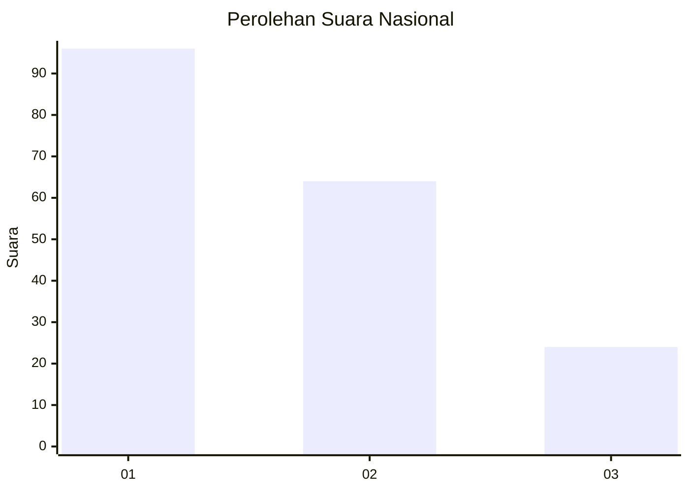
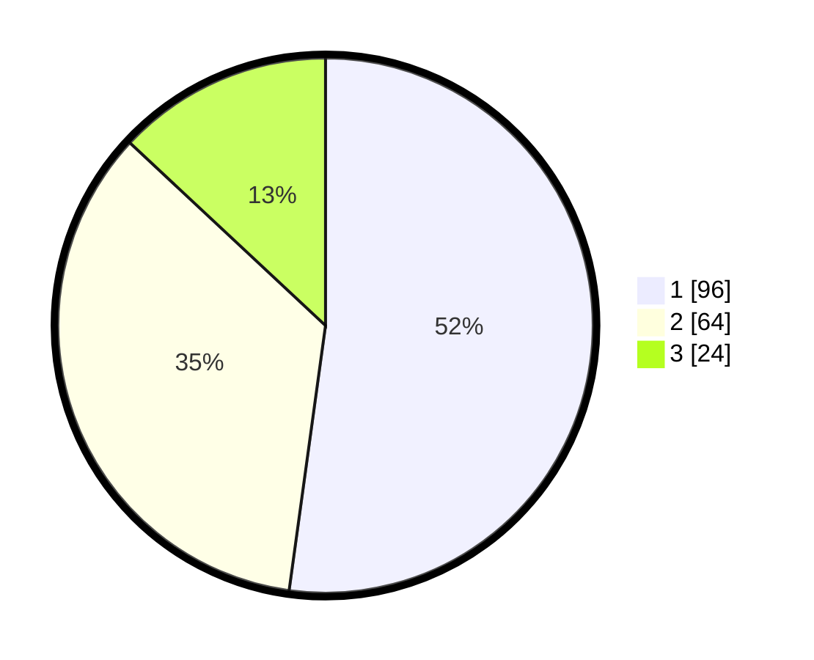

# Hasil

## Grafik

## Tabel

| No.    | Nama Paslon    | Suara | Suara (raw) | Persentase |
|:------ |:-------------- | -----:| -----------:| ----------:|
| 100025 | ANIES MUHAIMIN | 96    | [96][p-1]   | 52,17      |
| 100026 | PRABOWO GIBRAN | 64    | [64][p-2]   | 34,78      |
| 100027 | GANJAR MAHFUD  | 24    | [24][p-3]   | 13,04      |

[p-1]: https://github.com/gigit-pemilu/pemilu-2024/blob/main/pilpres/hitung-suara/sub/31-dki-jakarta/sub/75-jakarta-timur/sub/06-cakung/sub/1005-pulo-gebang/sub/270-tps/sub/paslon-1.txt
[p-2]: https://github.com/gigit-pemilu/pemilu-2024/blob/main/pilpres/hitung-suara/sub/31-dki-jakarta/sub/75-jakarta-timur/sub/06-cakung/sub/1005-pulo-gebang/sub/270-tps/sub/paslon-2.txt
[p-3]: https://github.com/gigit-pemilu/pemilu-2024/blob/main/pilpres/hitung-suara/sub/31-dki-jakarta/sub/75-jakarta-timur/sub/06-cakung/sub/1005-pulo-gebang/sub/270-tps/sub/paslon-3.txt

## Foto C Plano

https://sirekap-obj-formc.kpu.go.id/84cc/pemilu/ppwp/31/75/06/10/05/3175061005270-20240214-205414--c466aed7-55aa-4e42-903f-7bab46b39ea1.jpg

https://sirekap-obj-formc.kpu.go.id/84cc/pemilu/ppwp/31/75/06/10/05/3175061005270-20240214-204042--592258ba-404c-467a-b921-ca967764b3f8.jpg

https://sirekap-obj-formc.kpu.go.id/84cc/pemilu/ppwp/31/75/06/10/05/3175061005270-20240214-202316--3d0bd257-bf06-496e-a318-51ef0882a4ff.jpg

## Metadata

| Key        | Value               |
| ---------- | ------------------- |
| Time Stamp | 2024-02-27 11:00:00 |

