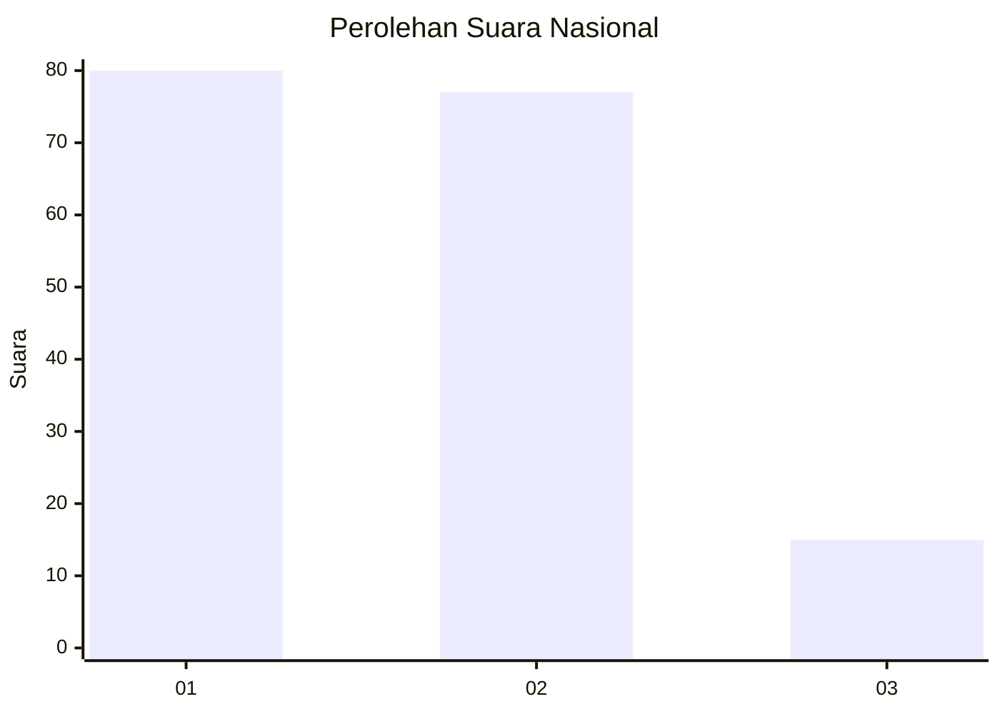
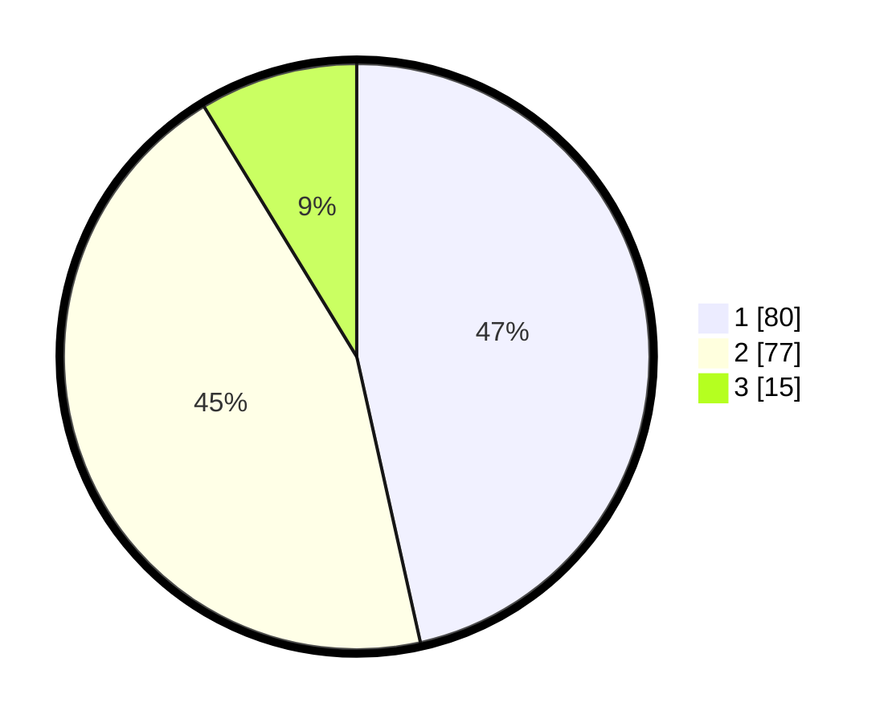

# Hasil

## Grafik

## Tabel

| No.    | Nama Paslon    | Suara | Suara (raw) | Persentase |
|:------ |:-------------- | -----:| -----------:| ----------:|
| 100025 | ANIES MUHAIMIN | 80    | [80][p-1]   | 46,51      |
| 100026 | PRABOWO GIBRAN | 77    | [77][p-2]   | 44,77      |
| 100027 | GANJAR MAHFUD  | 15    | [15][p-3]   | 8,72       |

[p-1]: https://github.com/gigit-pemilu/pemilu-2024/blob/main/pilpres/hitung-suara/sub/31-dki-jakarta/sub/75-jakarta-timur/sub/06-cakung/sub/1005-pulo-gebang/sub/275-tps/sub/paslon-1.txt
[p-2]: https://github.com/gigit-pemilu/pemilu-2024/blob/main/pilpres/hitung-suara/sub/31-dki-jakarta/sub/75-jakarta-timur/sub/06-cakung/sub/1005-pulo-gebang/sub/275-tps/sub/paslon-2.txt
[p-3]: https://github.com/gigit-pemilu/pemilu-2024/blob/main/pilpres/hitung-suara/sub/31-dki-jakarta/sub/75-jakarta-timur/sub/06-cakung/sub/1005-pulo-gebang/sub/275-tps/sub/paslon-3.txt

## Foto C Plano

https://sirekap-obj-formc.kpu.go.id/e14b/pemilu/ppwp/31/75/06/10/05/3175061005275-20240214-203045--97f186e0-abfb-4dba-9fc6-af4930a2f4d7.jpg

https://sirekap-obj-formc.kpu.go.id/e14b/pemilu/ppwp/31/75/06/10/05/3175061005275-20240214-203150--7099cb02-db56-4cf9-b5f1-3d439ca30f45.jpg

https://sirekap-obj-formc.kpu.go.id/e14b/pemilu/ppwp/31/75/06/10/05/3175061005275-20240214-203240--f5d3ab79-dbc8-4562-bd6d-09ee2a1e0558.jpg

## Metadata

| Key        | Value               |
| ---------- | ------------------- |
| Time Stamp | 2024-02-15 07:00:44 |

