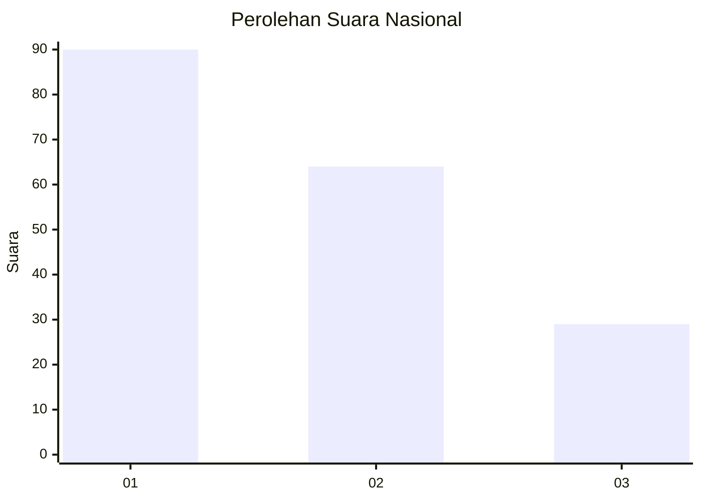
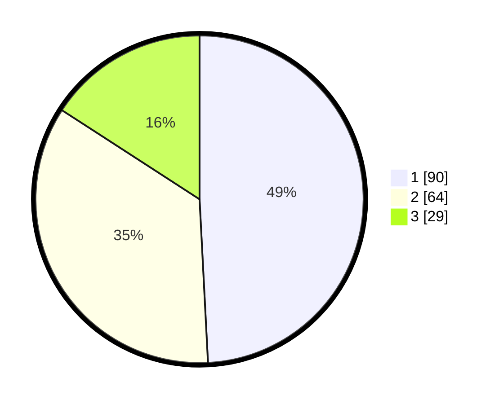

# Hasil

## Grafik

## Tabel

| No.    | Nama Paslon    | Suara | Suara (raw) | Persentase |
|:------ |:-------------- | -----:| -----------:| ----------:|
| 100025 | ANIES MUHAIMIN | 90    | [90][p-1]   | 49,18      |
| 100026 | PRABOWO GIBRAN | 64    | [64][p-2]   | 34,97      |
| 100027 | GANJAR MAHFUD  | 29    | [29][p-3]   | 15,85      |

[p-1]: https://github.com/gigit-pemilu/pemilu-2024/blob/main/pilpres/hitung-suara/sub/31-dki-jakarta/sub/75-jakarta-timur/sub/06-cakung/sub/1005-pulo-gebang/sub/282-tps/sub/paslon-1.txt
[p-2]: https://github.com/gigit-pemilu/pemilu-2024/blob/main/pilpres/hitung-suara/sub/31-dki-jakarta/sub/75-jakarta-timur/sub/06-cakung/sub/1005-pulo-gebang/sub/282-tps/sub/paslon-2.txt
[p-3]: https://github.com/gigit-pemilu/pemilu-2024/blob/main/pilpres/hitung-suara/sub/31-dki-jakarta/sub/75-jakarta-timur/sub/06-cakung/sub/1005-pulo-gebang/sub/282-tps/sub/paslon-3.txt

## Foto C Plano

https://sirekap-obj-formc.kpu.go.id/bc27/pemilu/ppwp/31/75/06/10/05/3175061005282-20240214-155314--5f71457a-0630-446f-81f9-d8bd99be97c0.jpg

https://sirekap-obj-formc.kpu.go.id/bc27/pemilu/ppwp/31/75/06/10/05/3175061005282-20240214-155745--d94dc429-ce85-43bc-8dcf-2d086a60da58.jpg

https://sirekap-obj-formc.kpu.go.id/bc27/pemilu/ppwp/31/75/06/10/05/3175061005282-20240214-160109--115cc24e-563e-42e4-8d6c-30cfadc00d2d.jpg

## Metadata

| Key        | Value               |
| ---------- | ------------------- |
| Time Stamp | 2024-02-24 22:31:28 |

