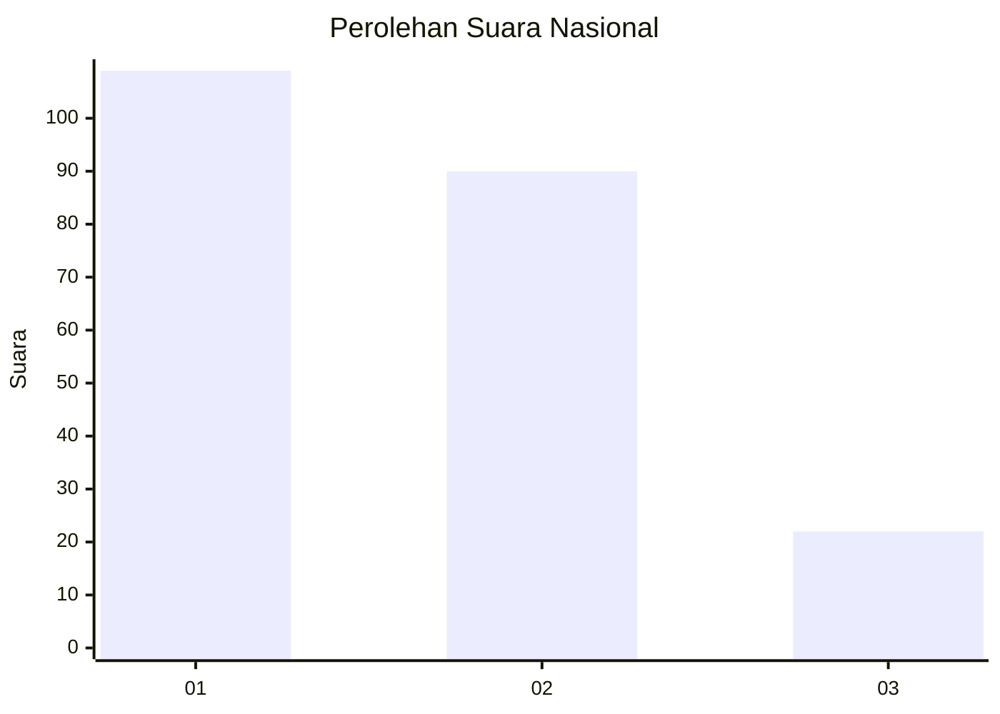
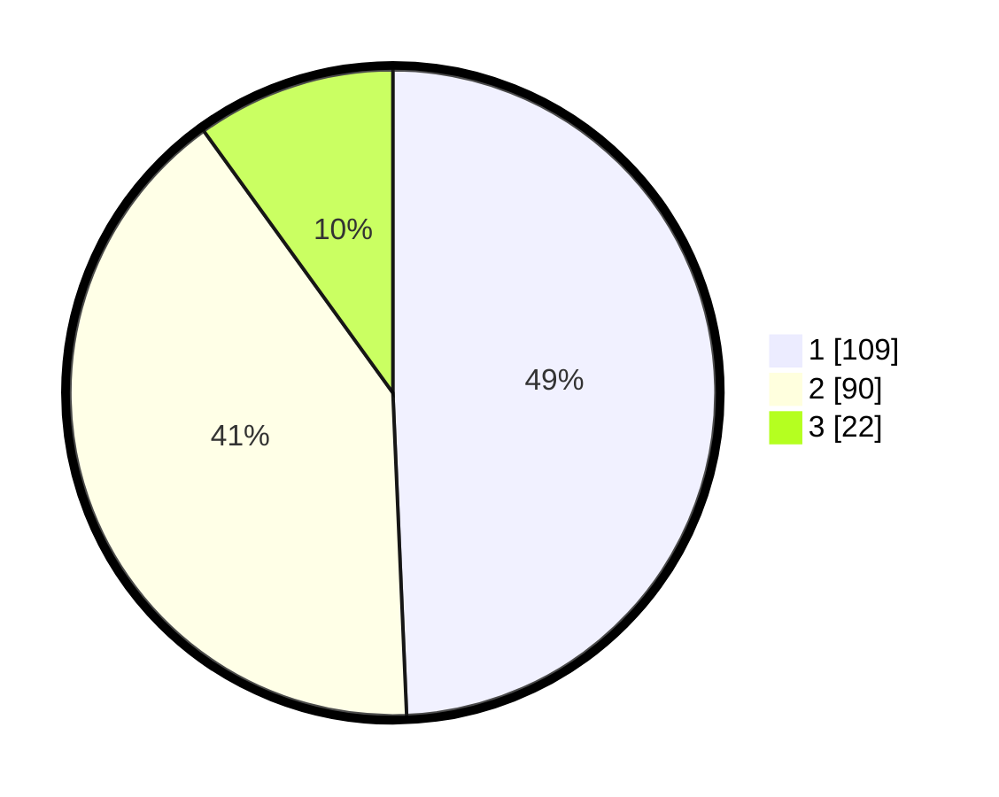

# Hasil

## Grafik

## Tabel

| No.    | Nama Paslon    | Suara | Suara (raw) | Persentase |
|:------ |:-------------- | -----:| -----------:| ----------:|
| 100025 | ANIES MUHAIMIN | 109   | [109][p-1]  | 49,32      |
| 100026 | PRABOWO GIBRAN | 90    | [90][p-2]   | 40,72      |
| 100027 | GANJAR MAHFUD  | 22    | [22][p-3]   | 9,95       |

[p-1]: https://github.com/gigit-pemilu/pemilu-2024/blob/main/pilpres/hitung-suara/sub/31-dki-jakarta/sub/75-jakarta-timur/sub/06-cakung/sub/1005-pulo-gebang/sub/293-tps/sub/paslon-1.txt
[p-2]: https://github.com/gigit-pemilu/pemilu-2024/blob/main/pilpres/hitung-suara/sub/31-dki-jakarta/sub/75-jakarta-timur/sub/06-cakung/sub/1005-pulo-gebang/sub/293-tps/sub/paslon-2.txt
[p-3]: https://github.com/gigit-pemilu/pemilu-2024/blob/main/pilpres/hitung-suara/sub/31-dki-jakarta/sub/75-jakarta-timur/sub/06-cakung/sub/1005-pulo-gebang/sub/293-tps/sub/paslon-3.txt

## Foto C Plano

https://sirekap-obj-formc.kpu.go.id/4315/pemilu/ppwp/31/75/06/10/05/3175061005293-20240214-224548--e38b2761-5cb6-4407-bd48-50edbb7dfdcf.jpg

https://sirekap-obj-formc.kpu.go.id/4315/pemilu/ppwp/31/75/06/10/05/3175061005293-20240214-221133--a145a1d2-385c-46fe-9706-5f1aed856fb0.jpg

https://sirekap-obj-formc.kpu.go.id/4315/pemilu/ppwp/31/75/06/10/05/3175061005293-20240214-230531--2a62a391-e210-426b-8341-7d403602733d.jpg

## Metadata

| Key        | Value               |
| ---------- | ------------------- |
| Time Stamp | 2024-02-20 11:00:00 |

